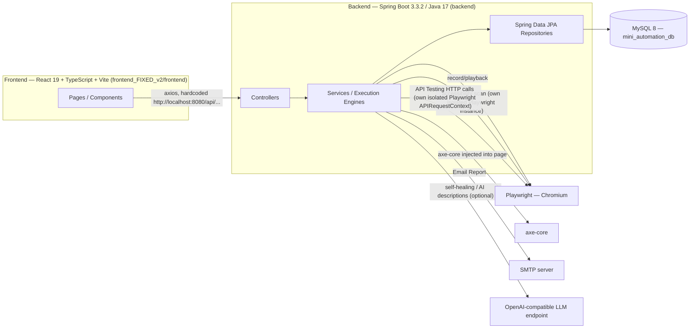
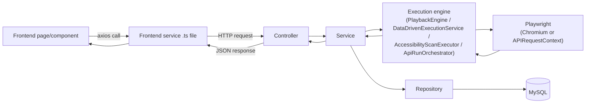
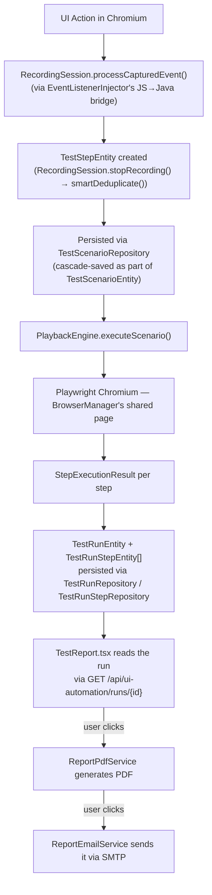

# 00 — Start Here: Master Overview

> Every statement in this document was verified by reading the actual source files listed. Where something could not be confirmed, it is explicitly marked **Not verified from source**.

## What Kortex is

Kortex (internal Maven artifact name still `backend` / `Mini Automation`, per `backend/pom.xml` — `<description>Mini Automation — AI-Driven UI Test Automation Platform</description>`; the product-facing brand "Kortex" appears in the frontend logo asset `frontend_FIXED_v2/frontend/kortex_logo.png` and backend resource `backend/src/main/resources/branding/kortex_logo_small.png`, used by the PDF report generator) is a browser-based test-automation platform with four distinct testing capabilities plus supporting reporting/dashboard infrastructure:

1. **UI Automation** — record a user's clicks/typing in a real Chromium browser, persist the recording as a reusable test, and play it back later (with selector self-healing).
2. **Data-Driven Testing** — replay a recorded UI Automation test once per row of an uploaded CSV/XLSX dataset, substituting each row's values into the recorded steps.
3. **Accessibility Scanning** — run an axe-core WCAG scan against a target URL/selector and report violations by severity.
4. **API Testing** — a Postman-like HTTP request tester/collection runner built on Playwright's `APIRequestContext` (not a browser — a lightweight HTTP client), with variables, auth, assertions, extraction/chaining, and a Collection Runner.

All four feed a shared **Dashboard** and **Execution History**, and all four can generate a **PDF report** and optionally **email** it.

Two backend-only capabilities exist with **no current frontend entry point** (verified by grepping the frontend `src/` tree for callers — none found):
- **Crawler** (`CrawlerController` → `CrawlerService`/`DomAnalyzer`/`FormFiller`/`HtmlFetcher`/`PageScanner`, single endpoint `GET /api/crawler/scan`) — a page-structure scanner (forms, buttons, links, tables) returning a `PageInfo` DTO. Reachable by direct HTTP call, but nothing in `frontend_FIXED_v2/frontend/src` calls it.
- **Playwright script export** (`ScriptExportService.generatePlaywrightScript()`, wired to `UIAutomationController.exportScript(id)`) — converts a recorded `TestScenarioEntity` into a standalone runnable Playwright Java test class (string-built). The endpoint exists and is wired to a service, but `uiAutomationApi.ts` has no call to it either.

Both are real, compiling, injectable Spring components — not dead code in the sense of being unreachable — but **not part of any user-facing flow today**. Treat them as "backend capability, UI not built" rather than as active features.

## High-level architecture



This is a classic layered monolith, not microservices: one Spring Boot process, one React SPA, one MySQL database. There is no API gateway, no message queue, no separate worker process — asynchronous execution (test runs, data-driven runs, API collection runs) is handled by Spring's `@Async` on named thread pools inside the same JVM (see `backend/src/main/java/com/miniautomation/backend/config/AsyncConfig.java`).

## Frontend stack

Verified from `frontend_FIXED_v2/frontend/package.json`:
- React `^19.2.8`, ReactDOM `^19.2.8`
- TypeScript `~6.0.2` (built via `tsc -b && vite build`)
- Vite `^8.2.0` (dev server + build tool), `@vitejs/plugin-react`
- `react-router-dom` `^7.18.2` — client-side routing (all routes defined in `frontend_FIXED_v2/frontend/src/App.tsx`)
- `axios` `^1.19.0` — the only HTTP client used against the backend
- `lucide-react` `^1.31.0` — icon set
- `oxlint` for linting

No state-management library (no Redux/Zustand/etc.) — components use React's own `useState`/`useEffect`. No CSS framework — a single hand-written `frontend_FIXED_v2/frontend/src/index.css`. No test runner is configured in `package.json` scripts and no `*.test.*`/`*.spec.*` files exist anywhere under `frontend_FIXED_v2/frontend/src` (verified by search) — **the frontend has no automated test suite**.

Vite config (`frontend_FIXED_v2/frontend/vite.config.ts`) is the framework default (just the React plugin) — **no dev-server proxy is configured**. Every frontend service file instead hardcodes the backend's absolute base URL, e.g. `frontend_FIXED_v2/frontend/src/services/uiAutomationApi.ts:8` — `export const API_BASE_URL = 'http://localhost:8080/api/ui-automation';`. This means frontend and backend are only wired together correctly when the backend actually listens on `localhost:8080` (Spring Boot's default port, not overridden anywhere in `application.properties`).

## Backend stack

Verified from `backend/pom.xml`:
- Spring Boot **3.3.2**, Java **17**
- `spring-boot-starter-web` (REST controllers), `spring-boot-starter-actuator` (health/info endpoints only, per `application.properties`: `management.endpoints.web.exposure.include=health,info`)
- `spring-boot-starter-data-jpa` + `mysql-connector-j` — persistence
- `com.microsoft.playwright:playwright:1.45.0` — browser automation AND API-Testing's HTTP execution engine
- `com.deque.html.axe-core:playwright:4.10.1` — accessibility scanning (axe-core's official Playwright Java binding)
- `org.jsoup:jsoup:1.17.2` — DOM structural analysis (used by the Crawler module)
- `org.apache.poi:poi-ooxml:5.2.5` + `com.opencsv:opencsv:5.9` — XLSX and CSV parsing for Data-Driven datasets
- `spring-boot-starter-mail` — Email Report delivery
- `io.github.openhtmltopdf:openhtmltopdf-pdfbox:1.1.73` — server-side HTML→PDF rendering for reports
- `com.jayway.jsonpath:json-path:2.9.0` — JSONPath evaluation for API Testing assertions/extraction (the only JSONPath capability in the codebase)
- `spring-boot-starter-test` (test scope) — JUnit 5 + Mockito + AssertJ (AssertJ usage confirmed via `assertThat` imports across the test suite)

No Flyway/Liquibase dependency exists — schema is managed entirely by Hibernate's `ddl-auto=update` (see Database section below). No Spring Security dependency — **there is no authentication/authorization anywhere in this backend**; every controller is open (Not verified: whether any reverse proxy/hosting layer adds auth in front of it — nothing in this repo does).

## Database

MySQL 8, per `backend/src/main/resources/application.properties`:
```
spring.datasource.url=jdbc:mysql://localhost:3306/mini_automation_db?createDatabaseIfNotExist=true&serverTimezone=UTC
spring.jpa.hibernate.ddl-auto=update
spring.jpa.open-in-view=false
```
The database is auto-created on first connection (`createDatabaseIfNotExist=true`) and the schema is auto-migrated by Hibernate on every startup (`ddl-auto=update`) — there is no versioned migration history. `spring.jpa.open-in-view=false` is architecturally significant: it closes the Hibernate session at the end of each transaction rather than keeping it open for the whole HTTP request, which means any `LAZY` JPA relationship touched during JSON serialization (outside that transaction) throws `LazyInitializationException`. Several entities work around this by using `FetchType.EAGER` plus `@JsonIgnoreProperties` to trim back-references — see `10-DATABASE.md` for the entity-by-entity detail. Full entity list is in that document; 14 `@Entity` classes exist under `backend/src/main/java/com/miniautomation/backend/entity/`.

## Browser automation stack

Playwright Java 1.45.0 is used in **three separate, isolated ways** — this was a deliberate architectural choice, documented directly in the source comments of the classes involved (not inferred):

1. **`backend/src/main/java/com/miniautomation/backend/browser/BrowserManager.java`** — a Spring `@Component` singleton holding exactly **one** persistent, headed (`setHeadless(false)`) Chromium `Browser`/`Page` for the entire application, driven from exactly one pinned JVM thread (`runOnPlaywrightThread`, because Playwright Java objects are not thread-safe). This is the browser the user actually watches during Recording and Playback (UI Automation and Data-Driven). Launch args (as of this session) include `--disable-gpu --disable-gpu-compositing` (see the in-line comment for why). One playback/recording session at a time — a `beginPlayback()`/`endPlayback()` guard prevents a recording from tearing down the browser mid-playback.
2. **`backend/src/main/java/com/miniautomation/backend/accessibility/AccessibilityScanExecutor.java`** — creates its **own fully isolated** `Playwright.create()` instance per scan, headless (`setHeadless(true)`), launched and torn down within `executeScan()`. Its own class-level Javadoc states explicitly why it does not reuse `BrowserManager`: reusing the shared session could navigate the browser out from under an in-progress recording/playback.
3. **`backend/src/main/java/com/miniautomation/backend/apitesting/ApiHttpExecutor.java`** — creates its **own fully isolated** `Playwright.create()` instance per run via `openSession()`, but launches **no browser at all** — it uses `playwright.request().newContext(...)`, Playwright's lightweight `APIRequestContext` HTTP client, for the same isolation reasons as #2 (its own Javadoc says so explicitly) plus speed (no Chromium process needed for a single HTTP "Send").

So: one shared, visible, stateful browser for record/playback; two other independent, short-lived, isolated Playwright instances for accessibility and API Testing. **These three never share state or a browser process.**

Accessibility scanning additionally uses `com.deque.html.axecore.playwright.AxeBuilder` (the axe-core Java/Playwright binding) injected into the isolated `AccessibilityScanExecutor` page.

## Major modules/features

| Module | Primary backend package(s) | Primary frontend pages |
|---|---|---|
| UI Automation (record & playback) | `recording/`, `playback/`, `browser/`, `service/AutomationService.java`, `service/TestRunAsyncExecutor.java` | `UIAutomationDashboard.tsx`, `RecordingWorkspace.tsx`, `TestDetails.tsx`, `TestReport.tsx` |
| Data-Driven Testing | `datadriven/` | `DataDrivenDashboard.tsx`, `NewDataDrivenTest.tsx`, `DataDrivenPanel.tsx` (component), `DataDrivenReport.tsx` |
| Accessibility Scanning | `accessibility/` | `AccessibilityDashboard.tsx`, `NewAccessibilityScan.tsx`, `AccessibilityReport.tsx`, `AccessibilityScanTrend.tsx` |
| API Testing | `apitesting/` | `ApiTestingDashboard.tsx`, `ApiPlayground.tsx`, `ApiWorkspace.tsx`, `ApiEnvironmentManager.tsx`, `ApiRunReport.tsx` |
| Reporting (PDF/Email) | `report/` | `EmailReportButton.tsx`, `EmailReportDialog.tsx` (used across all report pages) |
| Dashboard / Execution History | `service/DashboardService.java`, `controller/DashboardController.java` | `Dashboard.tsx`, `ExecutionHistory.tsx` |
| Crawler (backend-only, no UI) | `crawler/`, `controller/CrawlerController.java`, `model/` | none |
| Script Export (backend-only, no UI caller) | `service/ScriptExportService.java` (endpoint on `UIAutomationController`) | none |

## How frontend/backend communicate

Plain REST over HTTP/JSON, via `axios`, no WebSocket/SSE anywhere (verified: no `EventSource`/`WebSocket` usage found in `frontend_FIXED_v2/frontend/src`). Four hardcoded base URLs, one per frontend service file, all pointing at `http://localhost:8080`:

| Frontend service file | Base URL | Backend controllers it talks to |
|---|---|---|
| `services/uiAutomationApi.ts` | `http://localhost:8080/api/ui-automation` | `UIAutomationController`, `DataDrivenController`, `DashboardController` (all three are `@RequestMapping("/api/ui-automation")`) |
| `services/accessibilityApi.ts` | `http://localhost:8080/api/accessibility` | `AccessibilityController` |
| `services/apiTestingApi.ts` | `http://localhost:8080/api/api-testing` | `ApiCollectionController`, `ApiEnvironmentController`, `ApiExecutionController` |
| `services/reportEmailApi.ts` | `http://localhost:8080/api/reports` | `ReportEmailController` |

The frontend's "live browser preview" during recording (see `RecordingWorkspace.tsx`) is **not a video stream** — it's a polled JPEG screenshot endpoint (`recordingScreenshotUrl()` in `uiAutomationApi.ts`, backed by `BrowserManager.takeScreenshot()`), refreshed on a `setInterval`. See `03-FRONTEND-FLOWS.md` for the exact interval.

One-way data only travels as JSON request/response bodies and `multipart/form-data` (for dataset/Postman/OpenAPI file uploads — `spring.servlet.multipart.max-file-size=50MB`). Full endpoint-by-endpoint reference is in `11-API-ENDPOINTS.md`.

## Where the application starts

- **Backend:** `backend/src/main/java/com/miniautomation/backend/BackendApplication.java` — a plain `@SpringBootApplication` with a `main()` calling `SpringApplication.run()`. `@EnableAsync` is NOT here — it lives on `config/AsyncConfig.java` alongside the named `ddTaskExecutor` bean (see below).
- **Frontend:** `frontend_FIXED_v2/frontend/src/main.tsx` mounts `<App />` (from `App.tsx`) into `#root` inside `<StrictMode>`. `App.tsx` wraps everything in a `ToastProvider` (`components/Toast.tsx`) and a `react-router-dom` `<Router>`, rendering a persistent `<Sidebar />` + `<Topbar />` shell around a `<Routes>` block. All 19 routes are declared directly in `App.tsx` — see `03-FRONTEND-FLOWS.md` for the full route table.

## Main runtime components

- **`BrowserManager`** (singleton bean) — the one shared Playwright/Chromium session for record & playback, pinned to one dedicated thread.
- **`AsyncConfig.ddTaskExecutor`** (bean name `"ddTaskExecutor"`) — a bounded `ThreadPoolTaskExecutor` (core 2 / max 4 / queue 50, thread prefix `dd-async-`) used by `@Async`-annotated methods in `TestRunAsyncExecutor`, `DataDrivenAsyncExecutor`, and `ApiRunAsyncExecutor` to let an HTTP "start run" request return immediately while the actual browser/HTTP work happens in the background. Its own Javadoc is explicit that this pool does **not** control the Playwright thread itself — that's still `BrowserManager`'s single pinned thread; this pool only runs the "kick off the async run and let the request return" bookkeeping.
- **`GlobalExceptionHandler`** (`@RestControllerAdvice`, in `controller/`) — the one shared error-translation layer for the whole backend. Maps `DataDrivenException`/`AccessibilityException`/`ApiTestingException`/`ReportEmailException` → HTTP 400, `IllegalStateException` (e.g. `BrowserManager`'s playback/recording collision guard) → HTTP 409, and any other `RuntimeException` → HTTP 500. Full detail in `14-ERROR-HANDLING.md`.

## Major persistence components

14 JPA entities under `backend/src/main/java/com/miniautomation/backend/entity/`, each with a matching Spring Data `JpaRepository` under `backend/src/main/java/com/miniautomation/backend/repository/`. Full table-by-table documentation, relationships, and an ER diagram are in `10-DATABASE.md` — not duplicated here.

## Major external integrations

| Integration | Required? | Configuration | Verified source |
|---|---|---|---|
| MySQL 8 | Required — app cannot start without a reachable DB (JPA fails fast) | `application.properties` datasource block | `application.properties:6-9` |
| SMTP (Email Report) | Optional — feature-gated | `spring.mail.*`, all sourced from env vars `MINI_AUTOMATION_MAIL_HOST/PORT/USERNAME/PASSWORD/FROM`, empty by default | `application.properties:52-60`, `ReportEmailService` |
| OpenAI-compatible LLM endpoint (self-healing / AI descriptions) | Optional — feature-gated, defaults to a non-LLM heuristic fallback when the key is blank | `mini.automation.llm.api-key` (env `MINI_AUTOMATION_LLM_API_KEY`), `mini.automation.llm.endpoint` (defaults to `https://api.openai.com/v1/chat/completions`), `mini.automation.llm.model` (defaults to `gpt-4o-mini`) | `application.properties:26-31`, `ai/LlmClient.java` |
| Playwright's bundled Chromium download | Required at first run (Playwright downloads its own browser binary) | none — automatic | `HOW_TO_RUN.md`, `pom.xml` Playwright dependency |

No other third-party service integrations exist (no cloud storage, no external auth provider, no analytics/telemetry — verified by dependency list in `pom.xml` and `package.json`).

## Overall request → execution → persistence → reporting lifecycle

Generic layered flow, verified against every controller in `backend/src/main/java/com/miniautomation/backend/controller/`:



The UI-Automation-specific record→play→report lifecycle (the user's second example diagram), verified against `RecordingSession.java`, `PlaybackEngine.java`, `TestRunAsyncExecutor.java`, `ReportPdfService.java`, `ReportEmailService.java`:



Data-Driven, Accessibility, and API Testing each have an analogous but distinct lifecycle — see `07-DATA-DRIVEN.md`, `08-ACCESSIBILITY.md`, `09-API-TESTING.md` respectively; they are NOT identical to the UI Automation one (different entities, different async executors, different report generators), and this document does not claim otherwise.

## Where to go next

Read `README.md` for the full documentation map and recommended reading order. For architecture detail beyond this overview, go to `02-ARCHITECTURE.md`; for a directory-by-directory map, go to `01-PROJECT-STRUCTURE.md`.
