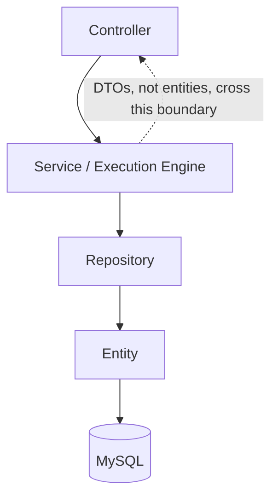

# 02 — Architecture & Dependency Map

## Frontend architecture

React 19 SPA, `react-router-dom` v7 client-side routing, no server-side rendering (Vite build produces a static `dist/` bundle — verified: `package.json`'s `build` script is `tsc -b && vite build`, no SSR framework present).

**Shell + routes pattern.** `App.tsx` renders a fixed shell — `<Sidebar />` + `<Topbar />` — exactly once, outside `<Routes>`, so navigation never remounts them:

```tsx
<ToastProvider>
  <Router>
    <div className="app-shell">
      <Sidebar />
      <div className="app-shell-body">
        <Topbar />
        <main className="app-shell-main">
          <Routes>...19 <Route> entries...</Routes>
        </main>
      </div>
    </div>
  </Router>
</ToastProvider>
```
(`frontend_FIXED_v2/frontend/src/App.tsx`, verified in full.)

**Component layering.** `pages/*.tsx` are route targets — each owns its own data fetching (via `useEffect` + a `services/*Api.ts` call) and local state; there is no global store. `components/*.tsx` are either (a) shared presentational primitives (`StatCard`, `Skeleton`, `EmptyState`, `StatusBadge`, `PageHeader`, `DonutChart`, `SegmentedBar`, `CircularProgress`) reused across unrelated pages, or (b) feature-specific composite widgets owned by one feature's pages (`DataDrivenPanel`, `ManualChecklist`, the API-Testing request-editor components, `EmailReportButton`/`EmailReportDialog`).

**API layer.** Each `services/*Api.ts` file exports a plain object of `async` functions, one per backend endpoint, each doing exactly one `axios.<method>(url, ...)` call and returning `response.data`. No shared axios instance, no interceptors, no centralized error handling — each caller is responsible for its own `try/catch` (verified: no `axios.create()`, no `axios.interceptors` usage anywhere in `src/services`). Errors surface to the UI as thrown promise rejections, generally caught at the calling page and shown via `useToast()` (`components/Toast.tsx`).

**Types.** `src/types/index.ts` hand-mirrors backend DTO/entity JSON shapes as TypeScript interfaces. There is no code generation from the backend (no OpenAPI schema, no shared package) — so a backend response-shape change requires a **manual, matching edit** to this file, and the two can silently drift. This is a structural risk, not a bug — flagged here and in `22-LIMITATIONS.md`.

## Backend architecture

Standard Spring Boot layering, **strictly one-directional**: `controller → service/engine → repository → entity`, verified by reading every controller's constructor injection list — no controller in the codebase injects a `Repository` directly.



**Controllers are thin.** They deserialize the request, call exactly one service method, and wrap the result — no business logic, no direct Playwright/browser calls in any controller (verified by import lists — no controller imports `com.microsoft.playwright.*`).

**Services fall into two shapes:**
1. **CRUD/orchestration services** — thin wrappers over one or more repositories (`TestScenarioService`, `ApiCollectionService`, `ApiEnvironmentService`, `AccessibilityScanService`'s CRUD paths).
2. **Execution engines** — the actual browser/HTTP/scan drivers, each with its own async wrapper:

| Feature | Sync entry point | Async wrapper (`@Async` on `ddTaskExecutor`) | Actual driver |
|---|---|---|---|
| UI Automation playback | `AutomationService` (recording) | `TestRunAsyncExecutor` | `PlaybackEngine` → `BrowserManager` |
| Data-Driven | `DataDrivenService` (mapping/validation) | `DataDrivenAsyncExecutor` | `DataDrivenExecutionService` → `PlaybackEngine` → `BrowserManager` |
| Accessibility | `AccessibilityScanService` | `AccessibilityScanAsyncExecutor` | `AccessibilityScanExecutor` (own isolated Playwright) |
| API Testing (single Send) | `ApiExecutionService` | *(none — synchronous, per its own class role)* | `ApiRunOrchestrator` → `ApiHttpExecutor` (own isolated Playwright) |
| API Testing (Collection Runner) | `ApiCollectionService`/`ApiExecutionService` (start) | `ApiRunAsyncExecutor` | `ApiRunOrchestrator` → `ApiHttpExecutor` |

This table is the single most important architectural fact in the backend: **there are four independent execution engines, not one generic "test runner."** They share almost no code (`PlaybackEngine` is reused by both UI Automation and Data-Driven — that is the one real sharing relationship; Accessibility and API Testing are fully independent engines).

**Entities never leave the service layer as-is in most flows** — controllers largely return entities directly (verified: e.g. `UIAutomationController` returns `TestScenarioEntity`/`TestRunEntity` straight from `@GetMapping` methods) rather than mapping to response DTOs, **except** where a real bug forced a DTO (`DashboardService`'s `getAllRuns()` returns flat `StandardRunSummary`/`DataDrivenRunSummary` DTOs specifically because `DataDrivenRunEntity.scenario` lacks the `@JsonIgnoreProperties` trimming that `TestRunEntity.scenario` has — see `10-DATABASE.md`). This is a genuine inconsistency in the codebase (some endpoints return raw JPA entities serialized by Jackson, others return purpose-built DTOs) — flagged here per the cross-verification requirement, not silently smoothed over.

## `spring.jpa.open-in-view=false` and its architectural consequence

This one property (`application.properties:17`) shapes a recurring pattern across every entity. Because the Hibernate session closes at the end of the `@Transactional` service method (not at the end of the HTTP request), any `LAZY` `@ManyToOne`/`@OneToMany` relationship that Jackson tries to serialize afterward throws `LazyInitializationException`. The codebase's consistent fix, confirmed across multiple entities: switch the relation to `FetchType.EAGER` and add `@JsonIgnoreProperties({"hibernateLazyInitializer","handler",...})` to strip Hibernate's proxy fields and cut back-reference cycles, or `@JsonIgnore` the relation entirely if the response shape doesn't need it. `10-DATABASE.md` documents this per-entity.

## Shared infrastructure vs module-specific infrastructure

**Genuinely shared across all 4 feature areas:**
- `GlobalExceptionHandler` — one exception-translation layer for every controller.
- `AsyncConfig.ddTaskExecutor` — the one named thread pool backing `TestRunAsyncExecutor`, `DataDrivenAsyncExecutor`, and `ApiRunAsyncExecutor` (verified by grepping for `@Async` usages — `AccessibilityScanAsyncExecutor` also uses `@Async`; confirm its executor qualifier matches the same pool in `08-ACCESSIBILITY.md`, not assumed here).
- `report/ReportPdfService.java` + `report/ReportEmailService.java` — the one PDF/email pipeline, with one method per feature area inside each class (not 4 separate services).
- `@CrossOrigin(origins = "*")` — applied individually on every controller class (not a single global CORS `@Configuration` bean — verified: no `WebMvcConfigurer`/CORS `@Bean` exists anywhere in `backend/src/main/java`; each controller repeats the annotation itself).

**Explicitly NOT shared (each module owns its own):**
- Playwright instance/lifecycle — three separate strategies, see `00-START-HERE.md`.
- Execution/result entities — `TestRunEntity`+`TestRunStepEntity` (UI Automation), `DataDrivenRunEntity`+`DataDrivenRowResultEntity` (Data-Driven), `AccessibilityScanRunEntity` (Accessibility), `ApiRunEntity`+`ApiRequestRunResultEntity` (API Testing) are four independent entity families with no shared base class or common interface (verified: none of them extend a common superclass or implement a shared marker interface — no such type exists in `entity/`).
- Async executor *wrapper* classes — one per feature (`TestRunAsyncExecutor`, `DataDrivenAsyncExecutor`, `AccessibilityScanAsyncExecutor`, `ApiRunAsyncExecutor`), even though 3 of the 4 share the underlying `ddTaskExecutor` thread pool bean.

## Dependency chains (verified, actual names)

**Dashboard metric load:**
```
Dashboard.tsx
 → uiAutomationApi.ts (dashboardApi.getSummary())
 → GET /api/ui-automation/dashboard/summary
 → DashboardController.getSummary()
 → DashboardService.getSummary()
 → TestRunRepository / DataDrivenRunRepository / AccessibilityScanRunRepository / ApiRunRepository (findAll(), aggregated in-memory)
 → MySQL
```

**UI Automation "Run Test":**
```
TestDetails.tsx (Run button)
 → uiAutomationApi.ts (runTest())
 → POST /api/ui-automation/tests/{id}/run
 → UIAutomationController.runTest()
 → TestRunAsyncExecutor (@Async, ddTaskExecutor)
 → PlaybackEngine.executeScenario()
 → BrowserManager (shared Playwright/Chromium)
 → TestRunEntity + TestRunStepEntity[] persisted via TestRunRepository/TestRunStepRepository
```

**Data-Driven run start:**
```
NewDataDrivenTest.tsx / DataDrivenPanel.tsx
 → uiAutomationApi.ts (dataDrivenApi.startRun())
 → POST /api/ui-automation/tests/{testId}/data-driven/run
 → DataDrivenController.startRun()
 → DataDrivenService (validates mapping via FieldMappingService, parses dataset via DatasetParser)
 → DataDrivenAsyncExecutor (@Async, ddTaskExecutor)
 → DataDrivenExecutionService.executeRun()
 → PlaybackEngine.executeSingleStepWithOverride() per step, per row
 → DataDrivenRunEntity + DataDrivenRowResultEntity[] persisted via DataDrivenRunRepository
```

**Accessibility scan:**
```
NewAccessibilityScan.tsx
 → accessibilityApi.ts (createScan())
 → POST /api/accessibility/scans
 → AccessibilityController.createScan()
 → AccessibilityScanService
 → AccessibilityScanAsyncExecutor (@Async)
 → AccessibilityScanExecutor.executeScan() (own isolated headless Playwright + AxeBuilder)
 → AccessibilityResultMapper
 → AccessibilityScanRunEntity persisted via AccessibilityScanRunRepository
```

**API Testing ad-hoc Send:**
```
ApiPlayground.tsx / ApiWorkspace.tsx (Send button)
 → apiTestingApi.ts (execute())
 → POST /api/api-testing/execute (verify exact path in 11-API-ENDPOINTS.md)
 → ApiExecutionController
 → ApiExecutionService (synchronous)
 → ApiRunOrchestrator.executeOne() (VariableResolver → AuthResolver → ApiHttpExecutor → AssertionEngine)
 → ApiRunEntity + ApiRequestRunResultEntity persisted via ApiRunRepository
```

**PDF/Email (shared across all 4):**
```
<Any>Report.tsx (EmailReportButton.tsx / EmailReportDialog.tsx)
 → reportEmailApi.ts (sendReportEmail())
 → POST /api/reports/email
 → ReportEmailController
 → ReportEmailService (looks up the run via the feature-specific service/repository, calls ReportPdfService for that report kind, sends via spring-boot-starter-mail)
```

Every chain above was cross-checked frontend service file → controller `@RequestMapping`/`@*Mapping` → injected service → repository/entity, per the documentation's cross-verification requirement. Exact HTTP methods/paths for every endpoint are in `11-API-ENDPOINTS.md` (this document intentionally does not duplicate that full table).

## Entity relationship summary (see `10-DATABASE.md` for the full ER diagram)

Two independent object graphs exist:
1. **UI Automation graph:** `TestScenarioEntity` (1) → `TestStepEntity` (many, recorded steps) and `TestScenarioEntity` (1) → `TestRunEntity` (many, playback runs) → `TestRunStepEntity` (many, per-run per-step results). `DataDrivenRunEntity` also references a `TestScenarioEntity` (it replays that scenario's steps) and owns `DataDrivenRowResultEntity` (many, one per dataset row).
2. **API Testing graph:** `ApiCollectionEntity` (1) → `ApiFolderEntity` (many, one level deep) and `ApiCollectionEntity`/`ApiFolderEntity` → `ApiRequestEntity` (many). `ApiEnvironmentEntity` is independent (referenced by id at run time, not a JPA relation to requests). `ApiRunEntity` optionally references a collection (nullable, for ad-hoc sends) and owns `ApiRequestRunResultEntity` (many, one per request per iteration).

`AccessibilityScanEntity` → `AccessibilityScanRunEntity` (1-to-many, one scan definition can be rerun) is a third, fully independent graph with no foreign key into either of the above.

**No cross-graph foreign keys exist** — e.g. a `DataDrivenRunEntity` does not reference an `ApiRunEntity`, and nothing in `ApiCollectionEntity` references a `TestScenarioEntity`. The only place these 4 graphs are combined is in-memory, at read time, inside `DashboardService` (for summary counts) and the `ExecutionHistory.tsx` frontend page (which merges 4 separately-fetched lists client-side — verify in `13-DASHBOARD-HISTORY.md`).
