# UI Automation — Complete Lifecycle

This document traces the "record a browser flow, then play it back" feature end-to-end: every file, class, and method a user action passes through, from the "Create Test" button to a persisted, viewable report. It is the parent overview for the two deep-dive documents [`05-RECORDING-ENGINE.md`](05-RECORDING-ENGINE.md) and [`06-PLAYBACK-ENGINE.md`](06-PLAYBACK-ENGINE.md), which go step-by-step through recording and playback internals respectively.

All file paths are relative to the repo root. Backend package root: `backend/src/main/java/com/miniautomation/backend/`. Frontend source root: `frontend_FIXED_v2/frontend/src/`.

## 1. The lifecycle at a glance

```mermaid
flowchart TD
    A["User clicks 'New Test'\nCreateTestDialog.tsx"] -->|"POST /api/ui-automation/tests"| B[UIAutomationController.createTest]
    B --> C[TestScenarioService.createScenario]
    C --> D[("TestScenarioEntity\nsaved, no steps yet")]
    D --> E["navigate to /ui-automation/recording/:id\nRecordingWorkspace.tsx"]
    E -->|"Start Recording click\nPOST .../record/start"| F[UIAutomationController.startRecording]
    F --> G[TestScenarioService.startRecording]
    G --> H[AutomationService.startRecording]
    H --> I[BrowserManager.resetAndGetBlankPage]
    I --> J[EventListenerInjector.injectListeners]
    J --> K[RecordingSession.startRecording → browserManager.navigateTo]
    K --> L["User interacts with the real\nChromium popup window"]
    L --> M["JS listeners fire → __miniAutoOnEvent bridge\n→ RecordingSession.processCapturedEvent"]
    M -->|"Stop & Save click\nPOST .../record/stop"| N[UIAutomationController.stopRecording]
    N --> O[TestScenarioService.stopRecordingAndSave]
    O --> P[AutomationService.stopRecording]
    P --> Q["RecordingSession.stopRecording\nsmartDeduplicate → build TestStepEntity list"]
    Q --> R[("TestScenarioEntity.steps\npersisted via TestScenarioRepository")]
    R --> S["TestDetails.tsx shows Recorded Steps"]
    S -->|"Run Test click\nPOST .../tests/:id/run"| T[UIAutomationController.runTest]
    T --> U[TestScenarioService.runScenario]
    U --> V[("TestRunEntity\nstatus=RUNNING, saved immediately")]
    V --> W["TestRunAsyncExecutor.executeScenarioAsync\n(@Async background thread)"]
    W --> X[AutomationService.runScenario]
    X --> Y[PlaybackEngine.executeScenario → runScenario]
    Y --> Z["Playwright executes each TestStepEntity\nvia the same Chromium session"]
    Z --> AA[("TestRunEntity updated:\nstatus, durations, TestRunStepEntity rows")]
    AA --> AB["TestReport.tsx polls GET /runs/:id every 3s\nuntil status != RUNNING"]
```

## 2. Create Test

- **UI**: `CreateTestDialog.tsx` — a modal with Name + URL fields. On submit it prefixes `https://` if the URL has no scheme, then calls `uiAutomationApi.createTest({ name, targetUrl })` (`services/uiAutomationApi.ts:35`).
- **API**: `POST /api/ui-automation/tests`, body `{ name, targetUrl }` → `UIAutomationController.createTest` (`controller/UIAutomationController.java:47-50`), which delegates to `TestScenarioService.createScenario(name, targetUrl)`.
- **Service**: `TestScenarioService.createScenario` (`service/TestScenarioService.java:37-40`) constructs a `new TestScenarioEntity(name, targetUrl)` and saves it via `TestScenarioRepository` — **immediately, with zero steps**. Recording is a *separate* later step, not part of creation.
- **DB**: one row in `test_scenarios` (table name from `@Table(name = "test_scenarios")` on `TestScenarioEntity`).
- **Response → UI**: `CreateTestDialog` receives the new `TestScenario` (with its DB `id`) and calls `navigate('/ui-automation/recording/${newTest.id}')` — landing directly on the Recording Workspace. The user must still explicitly click "Start Recording"; nothing records automatically.

## 3. Recording

Full internals are in [`05-RECORDING-ENGINE.md`](05-RECORDING-ENGINE.md). Summary of the object chain:

`RecordingWorkspace.tsx` (Start Recording button) → `uiAutomationApi.startRecording(id)` → `POST /api/ui-automation/tests/:id/record/start` → `UIAutomationController.startRecording` → `TestScenarioService.startRecording(scenarioId)` (looks the scenario up only to read its `name`/`targetUrl` — the recording session itself does **not** track a scenario ID) → `AutomationService.startRecording(name, url)` → three steps, all pinned to `BrowserManager`'s dedicated Playwright thread:

1. `BrowserManager.resetAndGetBlankPage()` — tears down any previous session and opens a fresh headed Chromium window (`browser/BrowserManager.java:232-247`).
2. `EventListenerInjector.injectListeners(page, recordingSession::processCapturedEvent)` — registers the `__miniAutoOnEvent` JS↔Java bridge and injects the DOM-listener script (`recording/EventListenerInjector.java`).
3. `RecordingSession.startRecording` navigates the instrumented page to the target URL (`browserManager.navigateTo(targetUrl)`), so the init-script is already live before the first paint.

Every real DOM interaction (click, typed character, Enter key) the user performs in the **separate Chromium popup window** is captured client-side by the injected JS, sent through the exposed Java function, and appended to an in-memory `rawEvents` list inside `RecordingSession` (`recording/RecordingSession.java:107-116`). Nothing is written to the database yet.

The Recording Workspace UI does **not** stream these events back live — its "Recorded Steps" side panel is a static placeholder that literally states *"Steps will be displayed here once saved, as real-time WS streaming is not yet enabled"* (`pages/RecordingWorkspace.tsx:254-256`). What the user *does* see live is a periodically-polled JPEG screenshot of the real window (`GET /api/ui-automation/recording/screenshot`, polled every 1.5s) plus the live current URL (`GET /api/ui-automation/recording/status`, polled every 2s) — both backed by `BrowserManager.takeScreenshot()` / `getCurrentUrl()`.

## 4. Stop Recording → persistence

"Stop & Save" → `uiAutomationApi.stopRecording(id)` → `POST /api/ui-automation/tests/:id/record/stop` → `UIAutomationController.stopRecording` → `TestScenarioService.stopRecordingAndSave(scenarioId)`:

1. Looks up the **existing** `TestScenarioEntity` by id (the one created in step 2).
2. Calls `AutomationService.stopRecording()` → `RecordingSession.stopRecording()`, which deduplicates the raw event stream (`smartDeduplicate`, 7 rules — see recording doc) into an ordered list of `TestStepEntity` objects and persists them onto a **freshly-built, not-yet-saved** `TestScenarioEntity` (`recordingSession.currentScenario`, created fresh in `startRecording`).
3. Back in `TestScenarioService.stopRecordingAndSave`: `scenario.getSteps().clear(); recorded.getSteps().forEach(scenario::addStep);` — the **existing, correctly-ID'd** scenario's step list is cleared and repopulated from the freshly-recorded one, then saved. This is why re-recording an existing test replaces its steps rather than creating a duplicate scenario.
4. DB effect: `test_steps` rows are deleted (orphan removal, since `TestScenarioEntity.steps` is `@OneToMany(..., orphanRemoval = true, cascade = CascadeType.ALL)`) and re-inserted for this `scenario_id`.

`RecordingSession` also guards against being called twice for the same session (`stopAlreadyCalled` flag) — a defensive fix for a real observed bug where a dropped HTTP response caused the frontend to retry the stop call and double the step count (`recording/RecordingSession.java:44-58`).

## 5. Viewing a recorded test

`TestDetails.tsx` (`GET /api/ui-automation/tests/:id`) shows four tabs:
- **Recorded Steps** — a raw table of `test.steps` (stepOrder, actionType, primarySelector, inputValue).
- **Execution History** — a *unified* list merging standard `TestRun`s (`GET /tests/:id/runs`) and Data-Driven runs (`dataDrivenApi.getRunsForScenario`), sorted by `startedAt` descending, each row linking to its own report page. See [`13-DASHBOARD-HISTORY.md`](13-DASHBOARD-HISTORY.md) for the equivalent *global* history page.
- **Test Script** — `GET /api/ui-automation/tests/:id/export`, served by `ScriptExportService.generatePlaywrightScript(scenario)` as a downloadable `.java` file (not covered further here — `service/ScriptExportService.java`; "Not verified from source" beyond confirming the endpoint and its controller wiring, since a full read of the generator was out of scope for this document).
- **Data-Driven** — renders `<DataDrivenPanel test={test} />`; see [`07-DATA-DRIVEN.md`](07-DATA-DRIVEN.md).

## 6. Run Test (standard, non-data-driven playback)

"Run Test" → `uiAutomationApi.runTest(id)` → `POST /api/ui-automation/tests/:id/run` → `UIAutomationController.runTest` → `TestScenarioService.runScenario(scenarioId)`:

1. Creates a `TestRunEntity` with `status = "RUNNING"`, `scenario` set, and saves it **immediately** — the controller returns this RUNNING row to the frontend right away (`service/TestScenarioService.java:62-75`).
2. Fires `TestRunAsyncExecutor.executeScenarioAsync(testRun.getId(), scenario)` — annotated `@Async(AsyncConfig.DD_TASK_EXECUTOR)` on a **separate Spring bean** (`service/TestRunAsyncExecutor.java`). The class-level comment explains why it's a separate bean: calling an `@Async` method via `this.` self-invocation silently bypasses Spring's AOP proxy and would run synchronously on the HTTP thread instead.

Frontend immediately navigates to `/ui-automation/runs/${run.id}` (`TestDetails.tsx:117`), which is `TestReport.tsx`. It polls `GET /api/ui-automation/runs/:id` every 3 seconds until `status !== 'RUNNING'` (`pages/TestReport.tsx:38-45`).

Inside the async executor: `AutomationService.runScenario(scenario)` → `browserManager.runOnPlaywrightThread(() -> playbackEngine.executeScenario(scenario))` — the entire playback run is pinned to `BrowserManager`'s single dedicated Playwright thread, for the same single-thread-confinement reason as recording. `PlaybackEngine.executeScenario` engages `BrowserManager`'s **playback guard** (`beginPlayback()`/`endPlayback()` in a finally block) so a concurrently-started recording cannot tear down the shared browser mid-run (`browser/BrowserManager.java:192-220`; the guard is what produces the `"Cannot reset the browser: a playback is currently running"` error surfaced verbatim to the UI in `RecordingWorkspace.tsx:78-84`).

`PlaybackEngine.runScenario` (the private method executing the actual per-step loop) is documented exhaustively in [`06-PLAYBACK-ENGINE.md`](06-PLAYBACK-ENGINE.md). At a high level, for each `TestStepEntity` in `scenario.getSteps()` order: resolve a Playwright `Locator` (primary selector → fallbacks → AI/heuristic self-healing), execute the action (click/type/keydown/select/scroll), wait for stability (navigation-aware), and record a `StepExecutionResult`.

When the loop finishes, `TestRunAsyncExecutor.executeScenarioAsync` (`service/TestRunAsyncExecutor.java:42-87`) copies the `ScenarioExecutionReport` onto the `TestRunEntity`: `status` (`PASSED`/`FAILED`), `completedAt`, `totalDurationMs`, `totalSteps`, `passedSteps`, `failedSteps`, `healedByAiSteps`, and — for a failed run — `errorMessage` set to the **first** failing step's detail. Each `StepExecutionResult` becomes one `TestRunStepEntity` row (`entity/TestRunStepEntity.java`, table `test_run_steps`), added via `testRun.addStepResult(...)` and persisted together with the parent `TestRunEntity` (cascade `ALL`, `orphanRemoval = true` on `TestRunEntity.stepResults`).

## 7. Report → PDF/email

`TestReport.tsx` renders `run.stepResults` as a timeline (icon per `StepStatus`, selector + input value, error text on failure, an explanatory note on `HEALED_BY_AI`), plus a "Jump to failure" scroll-to button when `failedSteps > 0`. An `<EmailReportButton reportType="STANDARD" runId={run.id} />` is shown once the run is no longer `RUNNING`. PDF generation and email delivery for this run type are covered in [`12-REPORT-PDF-EMAIL.md`](12-REPORT-PDF-EMAIL.md) — not re-derived here to avoid duplicating that document's own source verification.

## 8. Data flow summary table

| Stage | Frontend | Endpoint | Controller method | Service/engine | Entity written |
|---|---|---|---|---|---|
| Create | `CreateTestDialog.tsx` | `POST /tests` | `createTest` | `TestScenarioService.createScenario` | `TestScenarioEntity` |
| Start recording | `RecordingWorkspace.tsx` | `POST /tests/{id}/record/start` | `startRecording` | `TestScenarioService.startRecording` → `AutomationService` → `RecordingSession` | — (in-memory only) |
| Stop recording | `RecordingWorkspace.tsx` | `POST /tests/{id}/record/stop` | `stopRecording` | `TestScenarioService.stopRecordingAndSave` → `RecordingSession.stopRecording` | `TestStepEntity` (replaces prior set) |
| Run test | `TestDetails.tsx` | `POST /tests/{id}/run` | `runTest` | `TestScenarioService.runScenario` → `TestRunAsyncExecutor` → `PlaybackEngine` | `TestRunEntity` + `TestRunStepEntity` |
| View report | `TestReport.tsx` | `GET /runs/{id}` | `getTestRun` | `TestScenarioService.getTestRun` | (read only) |

## 9. Cross-verified inconsistencies worth knowing about

⚠️ **Two separate, partially-duplicated per-step execution loops.** Standard playback (`PlaybackEngine.runScenario`, `playback/PlaybackEngine.java:559-722`) and data-driven per-step execution (`PlaybackEngine.executeSingleStepInternal`, same file `:247-422`) are two **independently-written** methods that both do locator resolution → action → post-action wait → status/error capture, sharing only the lower-level helpers (`resolveLocatorWithMfaSupport`, `tryResolveLocator`, `executeAction`, `isDropdownOverlayOpen`, `waitForStability`). They are not unified into one shared per-step loop. See [`06-PLAYBACK-ENGINE.md §9`](06-PLAYBACK-ENGINE.md) for the concrete behavioral difference this causes (MFA detection is a dedicated up-front check in one path and only an indirect fallback-path check in the other).

⚠️ **`HEALED_BY_AI` is a misleading status name.** It fires whenever *any* of `AiElementResolver`'s seven fallback strategies succeeds — including purely deterministic ones (testId match, id/name attribute match, label text match) that never call an LLM at all. A run reporting "AI healed" steps very often used zero LLM calls. See [`06-PLAYBACK-ENGINE.md §7`](06-PLAYBACK-ENGINE.md) for the exact resolution order and which of the seven strategies are deterministic vs. LLM-based.

⚠️ **`executeAction` supports a `"scroll"` action type** (`playback/PlaybackEngine.java:1384-1386`, `locator.scrollIntoViewIfNeeded()`) **but recording never produces one** — `EventListenerInjector` only attaches `click`/`change`/`input`/`keydown` (Enter-only) DOM listeners (`recording/EventListenerInjector.java:308-336`); there is no `scroll` event listener. A `"scroll"` step can only ever appear in a `TestScenarioEntity` if inserted by something other than the recorder (e.g. manual DB edit, a future feature, or Data-Driven-specific tooling not covered by this document) — **not verified from source that anything currently produces one.**
