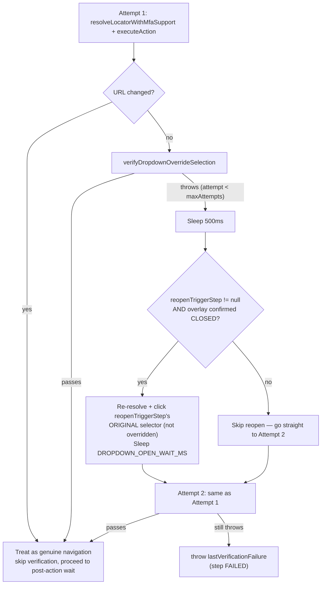

# Playback Engine Deep Dive

Everything below is verified against the current content of `backend/src/main/java/com/miniautomation/backend/playback/PlaybackEngine.java` (1665 lines) plus its direct collaborators: `AiElementResolver.java`, `ai/LlmClient.java`, `CaptchaPauseDetector.java`, `MfaPauseDetector.java`, `StepExecutionResult.java`, `ScenarioExecutionReport.java`, and `entity/TestStepEntity.java`. Line numbers cited are exact as of this documentation pass; re-check them if the file has been edited since.

## 1. Two entry points, one engine

`PlaybackEngine` is used from two different callers with two different public surfaces:

| Entry point | Caller | Used for |
|---|---|---|
| `executeScenario(TestScenarioEntity)` → private `runScenario(...)` | `AutomationService.runScenario` (standard "Run Test") | The full recorded step list, in one linear pass, once. |
| `executeSingleStep` / `executeSingleStepForReset` / `executeSingleStepWithOverride(...)` → private `executeSingleStepInternal(...)` | `DataDrivenExecutionService` (see [`07-DATA-DRIVEN.md`](07-DATA-DRIVEN.md)) | One step at a time, across pre-loop, per-row-loop (with a dataset value override), post-loop, and between-row reset replay. |

Both entry points share the same lower-level machinery — `resolveLocatorWithMfaSupport`, `tryResolveLocator`, `executeAction`, `isDropdownOverlayOpen`/`waitForDropdownOverlayToClose`, `waitForStability`, `scopedLocator`, `cssText`/`cssQuote` — but the **outer per-step loop and its CAPTCHA/MFA/status/logging logic are two separate, independently-written implementations** (`runScenario` at lines 559-722; `executeSingleStepInternal` at lines 247-422). This is flagged as a real, current inconsistency in §9.

## 2. Locator resolution priority chain (deterministic first, heuristic later)

```mermaid
flowchart TD
    A[TestStepEntity] --> B{Selector shape check}
    B -->|"elementId matches ui-id-\\d+ AND has recorded text"| C["findVisibleTextCandidate\n(jQuery UI autocomplete ids are volatile\nacross sessions)"]
    C -->|found| Z[Return Locator, usedHealing=true]
    C -->|not found| D
    B -->|otherwise| D["scopedLocator(page, step, primarySelector)\n(main frame, or frameLocator if frameSelector set)"]
    D --> E{count == 0?}
    E -->|"yes"| F["Wait up to SELECTOR_APPEAR_WAIT_MS\n(15s attended / 1.5s unattended reset)\nfor ATTACHED state"]
    F --> E
    E -->|"count > 0"| G{"Native radio/checkbox?"}
    G -->|yes| H[Return base.first() via DOM click path, usedHealing=false]
    G -->|no| I{count > 1?}
    I -->|yes| J["Phase 1a: exact text match (visible)\nPhase 1b: contains text match (visible)\nPhase 2: first visible candidate"]
    I -->|no| K[base.first()]
    J --> L[Courtesy visibility wait, ELEMENT_WAIT_MS=2s — NOT a gate]
    K --> L
    L --> Z2[Return Locator, usedHealing=false — SELECTOR MATCHED, this is PASSED not healed]
    E -->|"still 0 after wait"| M{"Native toggle with elementId?"}
    M -->|yes, label[for] visible| N[Return label Locator, usedHealing=true]
    M -->|no / not found| O{"step.type set?"}
    O -->|yes| P["input[type=...] (+name or existing placeholder selector)"]
    P -->|found & visible| Q[Return Locator, usedHealing=true]
    P -->|not found| R
    O -->|no| R["AiElementResolver.resolveSelfHealedLocator\n(see §7)"]
    Q --> Z
    R -->|found| Z
    R -->|null| S["tryResolveLocator returns null"]
    S --> T{"URL drifted OR isMfaPage(page)?"}
    T -->|yes, allowMfaPause| U["MfaPauseDetector.waitForMfaCompletion\n(hard pause, up to 5 min)"]
    U -->|resumed| D
    U -->|timeout| V["throw IllegalStateException\n'MFA wait timed out'"]
    T -->|no| W["throw IllegalStateException\nbuildResolutionFailureMessage(...)"]
```

Key rule, stated explicitly in the class Javadoc (`playback/PlaybackEngine.java:16-28`): **if the primary CSS selector matches ≥1 element in the DOM, it is *always* accepted** — self-healing is never triggered just because the matched element is momentarily invisible or still animating. A courtesy visibility wait (`ELEMENT_WAIT_MS = 2_000`ms) is attempted, but its timeout is *not* a gate; the resolved locator is handed to `executeAction`'s own resilient click cascade (§6) to deal with timing. Self-healing (`AiElementResolver`) is reserved strictly for the case where the primary selector matches **nothing** (`count() == 0`) after waiting up to `SELECTOR_APPEAR_WAIT_MS` for it to attach.

### Multi-match disambiguation (`tryResolveLocator`, lines 843-948)

When the primary selector matches more than one element (common on responsive sites rendering both a desktop and mobile nav duplicate, or PrimeNG pages with multiple identical-shaped components in different table cells):
1. **Phase 1a** — exact, case-insensitive, trimmed match of the candidate's `innerText` against the step's recorded `text`, **and** the candidate must be currently visible. Exact matching first specifically avoids a `contains("3")` check latching onto `"30"` in a rendered calendar day-picker (PrimeNG renders previous-month days like "30"/"31" before the target day "3" in DOM order).
2. **Phase 1b** — falls back to a `contains` match (still visibility-gated) if no exact match was found — handles a label that got DOM-truncated (e.g. `"Select Transaction Type"` rendered as `"Select Transacti…"`).
3. **Phase 2** — if neither text phase found anything, picks the first currently-visible candidate by index — preserves old behavior for icon-only buttons with no useful text.
4. If still nothing, falls through to `base.first()` regardless of visibility.

### Constants governing all of the above

| Constant | Value | Purpose | Source location |
|---|---|---|---|
| `ELEMENT_WAIT_MS` | 2,000 ms | Courtesy visibility settle wait after a selector match — not a gate. | `PlaybackEngine.java:82` |
| `POST_NAV_WAIT_MS` | 8,000 ms | Extended stabilisation wait after a detected page navigation. | `:87` |
| `INTER_STEP_WAIT_MS` | 800 ms | Fixed sleep between ordinary (non-nav, non-dropdown) steps — replaced a full 5s NETWORKIDLE wait for responsiveness. | `:97` |
| `DROPDOWN_OPEN_WAIT_MS` | 800 ms | Fixed wait after a click that opens a dropdown/autocomplete overlay, long enough for the CSS open-transition, short enough to avoid focus-loss auto-close. | `:105` |
| `SELECTOR_APPEAR_WAIT_MS` | 15,000 ms | How long to wait for a *missing* selector to attach before treating it as genuinely absent (attended playback / data-driven row execution). Raised from an earlier 8,000ms after a real run showed a slow first-render row needing more margin — see the constant's own multi-paragraph history comment at `:107-128`. | `:128` |
| `SELECTOR_APPEAR_WAIT_MS_RESET` | 1,500 ms | Same purpose but for the **unattended** data-driven between-row reset replay only. Has its own long documented history (originally 1.2s → briefly unified with the 15s value, which caused a measured ~200s regression → restored to 3s → reduced to 1.5s "per user request to shorten data-driven loop time"). | `:170` |

## 3. `executeSingleStep` family — the data-driven entry points

```java
executeSingleStep(page, step, rowData)              // pre-loop / post-loop steps, MFA pause allowed
executeSingleStepForReset(page, step)                // unattended between-row reset replay, MFA pause DISALLOWED
executeSingleStepWithOverride(page, step, value)               // per-row loop step, no reopen context
executeSingleStepWithOverride(page, step, value, reopenStep)   // per-row loop step, WITH reopen context (current)
```

All four converge on the private `executeSingleStepInternal(page, step, valueOverride, allowMfaPause, reopenTriggerStep)` (lines 247-422). `executeSingleStepForReset` passes `allowMfaPause = false` specifically because the unattended reset replay has nobody watching to complete a manual MFA challenge — the Javadoc explains this was directly observed wasting minutes per reset when a URL drift (landing somewhere the step's selector genuinely doesn't apply, e.g. a login field when the session is still valid) was mistaken for a real MFA prompt and hard-blocked for up to 5 minutes.

### Blank-override short-circuit (lines 270-280)

A **non-null but blank** `valueOverride` means the caller (`DataDrivenExecutionService`) mapped this step to a dataset column, but this row's value for that column is empty. The step is **not executed at all** — it's marked `SKIPPED` immediately, before any locator resolution. The comment is explicit about why: previously a blank override fell through to normal execution, which either replayed the *originally recorded* value (for a dropdown click) or silently left whatever was already typed in a field, in both cases touching the DOM with stale/wrong data instead of honestly reflecting "this row supplied nothing here." `null` (as opposed to `""`) still means "not mapped at all" and runs normally with the recorded value.

## 4. Dropdown-option override handling (`cloneWithOverride` + verification + retry)

This is the single most heavily-engineered part of the file, and directly implements the data-driven "pick the row's mapped dropdown option instead of the recorded one" behavior. See [`07-DATA-DRIVEN.md`](07-DATA-DRIVEN.md) for how a step gets *classified* as a mappable dropdown option in the first place (that's `FieldMappingService`, a different file) — this section is purely about what `PlaybackEngine` does once it has been told "click step X, but with value Y instead of the recorded option."

### `cloneWithOverride(original, newValue)` (lines 424-496)

Builds a shallow clone of the `TestStepEntity` carrying every recorded field over unchanged, **except**: `inputValue` is set to `newValue`, and — only when `actionType == "click"` and `newValue` is non-blank — `primarySelector` is **rewritten** to a comma-joined Playwright selector list scoped to the new value's visible text, covering every dropdown-option shape the codebase currently recognizes:

```
li:has-text("VALUE"), mat-option:has-text("VALUE"), .dropdown-item:has-text("VALUE"),
[role='option']:has-text("VALUE"), .p-dropdown-item:has-text("VALUE"),
span:has-text("VALUE"), option:has-text("VALUE")
```

`text`, `labelText`, and `aiDescription` on the clone are also repointed to the new value. The comment explains why: if this rewritten selector matches nothing, resolution falls through to `AiElementResolver`'s self-healing chain, which reads `label`/`text`/`aiDescription` off *this clone* — leaving them at the old recorded option's values would let self-healing coincidentally re-match the OLD option, exactly the "kept selecting the wrong option every row" failure this whole mechanism exists to prevent.

### `verifyDropdownOverrideSelection(page, step, overrideValue)` (lines 517-537)

A click resolving and firing successfully is **not proof the correct option was actually selected** — this method exists specifically to catch that gap, via two checks:
1. `waitForDropdownOverlayToClose(page, 1000)` — the option overlay must actually close within 1s. Still open ⇒ throws (`"...does not appear to have registered — the option list is still open after clicking"`).
2. `page.getByText(overrideValue, exact=false).first().isVisible(timeout=2000)` — the override value must now be visible **somewhere** on the page (the dropdown's settled selected-value display). Not visible ⇒ throws (`"...closed the option list, but \"VALUE\" is not visible anywhere on the page afterwards — the click most likely landed on the wrong option..."`). The comment cites a real government-portal run where this exact scenario occurred because the option list hadn't finished rendering its real options when the click fired.

### Retry-with-reopen (lines 307-391, added this session)



`maxAttempts = 2`. `reopenTriggerStep` is the step immediately preceding the option step in the loop range (the caller, `DataDrivenExecutionService.executeLoopRow`, passes the previous step in its iteration — the same "immediate preceding step is the dropdown's own trigger" convention `FieldMappingService` uses for candidate-detection, documented in [`07-DATA-DRIVEN.md`](07-DATA-DRIVEN.md)).

**Why the reopen check exists**: a wrong click closes a single-select dropdown exactly like a right one. Before this fix, the retry simply re-resolved the *same* rewritten option selector — but if attempt 1 already closed the list (right or wrong outcome), that selector is guaranteed to find nothing on attempt 2, since the list it's searching for no longer exists in the DOM. The reopen step is **only** attempted when `!isDropdownOverlayOpen(page)` is confirmed true — if the overlay is still open (the *other* verification failure mode — "click didn't register at all"), reopening isn't needed and could even toggle the trigger closed instead of open. A reopen failure itself is caught and logged, not fatal — attempt 2 simply proceeds and fails the same way it would have without this recovery step.

## 5. CAPTCHA and MFA handling

Both are detected **purely from recorded field metadata** — never a hardcoded site or selector (explicit design constraint per the class Javadoc, lines 56-68).

- **`isManualCaptchaStep(step)`** (lines 1092-1104) — only for typing-action steps (`input`/`change`/`type`/`fill`); true if `name`/`elementId`/`labelText`/`placeholder`/`primarySelector`/`role` combined (lowercased) matches `.*captcha.*`.
- **`isManualMfaStep(step)`** (lines 1079-1084) — true if the same combined metadata matches `.*(otp|mfa|one[- ]?time|verification|security[- ]?code|auth[- ]?code).*`.
- **`isMfaPage(page)`** (lines 1057-1076) — a live, generic, site-agnostic in-page JS check: does the page's visible body text contain any of a fixed phrase list (`"one time password"`, `"otp"`, `"verification code"`, `"two factor"`, `"mfa"`, etc.), OR does any non-hidden `<input>`'s id/name/placeholder/aria-label/autocomplete/inputmode attributes match an OTP/MFA-shaped regex, OR does any input have `autocomplete="one-time-code"`.

**CAPTCHA flow** (both `runScenario` and `executeSingleStepInternal`, each with their own copy of this logic): resolve the field locator as usual, scroll it into view, then **hard-block** via `CaptchaPauseDetector.waitForManualCaptchaEntry(page, locator)` — up to 5 minutes (`MAX_WAIT_MS`), polling every 2s (`POLL_INTERVAL_MS`), requiring 2 consecutive stable polls with no keystroke change (`REQUIRED_STABLE_TICKS`) before resuming. **The recorded CAPTCHA value is never replayed** — a fresh CAPTCHA image/text regenerates on every page load, so the recorded value is guaranteed stale by playback time.

**MFA flow**: in `runScenario`, `isManualMfaStep(step) && isMfaPage(page)` is checked as a dedicated up-front branch before locator resolution, hard-pausing via `MfaPauseDetector.waitForManualMfaCompletion(page, lastKnownUrl)` (same 5-minute budget, 2s poll). Separately — and this applies to **both** entry points — `resolveLocatorWithMfaSupport` itself pauses via `MfaPauseDetector.waitForMfaCompletion(page, step, pauseUrl)` whenever the primary locator resolution fails **and** either the page URL has drifted from `lastKnownUrl` or `isMfaPage(page)` is true; on resume it retries locator resolution once more before giving up.

## 6. Action execution (`executeAction`, lines 1221-1396)

Every action first attempts `locator.scrollIntoViewIfNeeded(timeout=3000)` (failure ignored — best-effort only), then dispatches on `step.getActionType()`:

- **`click`** — a layered cascade, most specific handling first:
  1. Native radio/checkbox (`isNativeToggle`) → JS `el.click()` directly (bypasses viewport/visibility actionability checks that frequently fail on visually-hidden styled toggles), falling back to a forced Playwright click on any exception.
  2. Element confirmed inside a dropdown/autocomplete overlay (`isInsideDropdownOverlay`, §8) → straight to `click(force=true, timeout=4000)`, then a raw JS `el.click()` as a last resort — overlay items are often mid-CSS-animation and would fail Playwright's normal stability checks before detaching from the DOM.
  3. If the target isn't currently visible, attempts to reveal it via `revealViaAncestorHover` (§8) before clicking — compensates for the recorder's inability to capture hover-driven mega-menu reveals.
  4. Otherwise, a 4-step fallback cascade: regular `click(timeout=2000)` → JS click via `(el.closest('button, [role="button"]') || el).click()` → forced Playwright click (`force=true, timeout=5000`) → raw `dispatchEvent('click')` — each tried only if the previous one throws. The *force-click* failure (not the dispatch failure) is what's re-thrown if every strategy fails, since it's judged the more diagnostic error.
- **`input` / `change` / `type`** — if `step.getTag()` is `"select"`, routes to `selectDropdownOption` (below) instead of typing. Otherwise: checks the element is enabled (`isEnabled(timeout=5000)`, throwing a clear "prerequisite UI selection did not activate it" error if not), clicks to focus, then `locator.fill("")` (clear) + `locator.pressSequentially(value, delay=60ms, timeout=8000)`; on exception, falls back to a plain bounded `locator.fill(value, timeout=5000)`.
- **`keydown`** — `locator.press(step.getKey() ?? "Enter", timeout=5000)` — a real keyboard event (not synthesizable via click), needed for native form-submit/`onKeyDown` handlers.
- **`scroll`** — `locator.scrollIntoViewIfNeeded()`. (Recording never produces this action type — see [`05-RECORDING-ENGINE.md §2`](05-RECORDING-ENGINE.md).)
- **default** (unrecognized action type) — plain click, falling back to a forced click.

### `selectDropdownOption(locator, value, step)` (lines 1464-1489)

For a native `<select>`: tries `selectOption(value)` (matches by the option's `value` attribute, exactly what recording captured) first; if that returns nothing selected, retries via `selectOption(SelectOption().setLabel(value))` (matches by visible label text — covers an option whose `value` attribute defaults to its own text, but differs in whitespace/case from what was recorded). Throws `IllegalStateException` naming the step if neither matches.

## 7. Self-healing (`AiElementResolver`) — the full deterministic → heuristic → LLM order

`AiElementResolver.resolveSelfHealedLocator(page, step)` (`playback/AiElementResolver.java:55-231`) is only called when `tryResolveLocator` has already confirmed the primary selector genuinely matches nothing. Its resolution order:

| # | Strategy | Deterministic or LLM? | Trigger condition |
|---|---|---|---|
| 0 | `data-testid`/`data-test`/`data-cy`/`data-qa` direct match | **Deterministic** | `step.getTestId()` non-blank |
| 0.5 | Semantic ARIA role + accessible name via real `page.getByRole()` | **Deterministic** | `step.getRole()` parses as a real `AriaRole` enum value (i.e. it's an actual ARIA role, not the bare-tag fallback most recorded steps carry — `EventListenerInjector` sets `role = attribute || tag`, so most steps will *not* qualify here) AND at least one of aria-label/labelText/text/placeholder is non-blank |
| 1 | LLM call with a truncated (≤4000 char) page DOM snippet | **LLM, only if configured** | `mini.automation.llm.api-key` set — otherwise `LlmClient.resolveSelfHealedLocator` returns `null` immediately, logging `"No LLM API key configured — skipping LLM self-healing for: ..."` |
| 2 | `id` attribute direct match | **Deterministic** | `step.getElementId()` non-blank |
| 3 | `name` attribute direct match | **Deterministic** | `step.getName()` non-blank |
| 4 | Label text: `getByLabel()` first for typing actions (resolves to the actual form control a `<label>` describes), then `getByText()` | **Deterministic** | `step.getLabelText()` non-blank |
| 5 | Role/tag + text extracted from `step.getAiDescription()`'s first quoted substring | **Deterministic** | `aiDescription` contains a `'...'` quoted fragment |
| 6 | Give up | — | Returns `null` |

**Every strategy above additionally filters through `pickVisibleCandidate(locator, requireEditable)`** (lines 279-297) — scans every DOM match a (possibly multi-match) locator produces and returns the first one that is actually **visible**, and, for typing actions (`input`/`change`/`type`/`fill`/`keydown`), also passes `looksEditable()` (a real `<input>` excluding non-text types, a `<textarea>`, or `contenteditable`). This exists because real pages commonly render more than one element matching the same id/name/label/text (a hidden responsive-layout twin, a duplicate pre-render) — blindly taking the first DOM match risks handing back something that will never become interactable.

**Critical correctness fix baked into this file**: neither `AiElementResolver` nor `LlmClient` are permitted to return the *original, already-failed* selector as if it were a "healed" one. Both explicitly return `null` when they have nothing new to offer — the class-level comment on `PlaybackEngine` states this was a genuine prior bug (a step could be reported `HEALED_BY_AI` while nothing was actually located or fixed).

### The `HEALED_BY_AI` status name is broader than "AI"

`StepExecutionResult.StepStatus.HEALED_BY_AI` (`playback/StepExecutionResult.java:5-11`) is set whenever `usedHealing[0]` is true — which is true for **any** successful fallback: the native-toggle-label fallback, the type-qualified `<input>` fallback, or *any* of `AiElementResolver`'s 7 strategies (including the fully deterministic ones — testId, id, name, label). The frontend's `TestReport.tsx` renders this with the caption *"AI Self-Healing: The original selector failed, but the AI successfully located the element using heuristics"* (`pages/TestReport.tsx:151-155`) — accurate in spirit (it does say "heuristics"), but the status name and its badge give the impression an LLM was involved far more often than one actually is. See the cross-verified note in [`04-UI-AUTOMATION.md §9`](04-UI-AUTOMATION.md).

## 8. Dropdown/overlay-specific helpers

- **`isDropdownOverlayOpen(page)`** (lines 1545-1573) — a single `page.evaluate()` call checking whether any of a fixed selector list is present **and visible** (`el.offsetParent !== null`): `p-multiselectitem`, `p-dropdownitem` (PrimeNG's actual custom element tag names — no hyphen, confirmed to matter for the Data-Driven field-mapping fix documented in [`07-DATA-DRIVEN.md`](07-DATA-DRIVEN.md)), `.p-multiselect-panel`, `.p-dropdown-panel`, `.p-autocomplete-panel`, `.p-select-panel`, `[role="listbox"]`, plus date-picker panels: `.flatpickr-calendar`, `.p-datepicker`, `.p-calendar-panel`, `.daterangepicker`, `[data-pc-name="datepickerpanel"]`. Used both to decide the post-action wait strategy (short fixed sleep instead of a long NETWORKIDLE wait that would let the overlay auto-close) and, in the override retry loop, to decide whether a reopen is warranted.
- **`waitForDropdownOverlayToClose(page, timeoutMs)`** (lines 1583-1595) — polls the above every 100ms until closed or timeout.
- **`isInsideDropdownOverlay(page, locator)`** (lines 1622-1665) — an ancestor-walk (up to 12 levels) checking ARIA roles (`listbox`/`option`/`menu`/`menuitem`) or class-name substrings that specifically denote **open overlay content** (`dropdown-panel`, `dropdown-item`/`dropdownitem`, `multiselect-panel`, `multiselect-item`/`multiselectitem`, `autocomplete-panel`/`autocomplete-item`, `select-panel`/`select-list`, `suggestion`, `typeahead`, `ui-autocomplete`, `ui-menu`). The in-code comment is explicit that this was tightened after a real regression: an earlier version matched on bare substrings like `"dropdown"`/`"p-multiselect"` which are present on a component's *closed trigger wrapper* too, so clicking an ordinary closed dropdown trigger was misclassified as "inside an overlay" and force-clicked — bypassing the trigger's own open-handler firing reliably, so the panel never actually opened.
- **`revealViaAncestorHover(target)`** (lines 1414-1452) — walks up to 4 ancestor levels via `xpath=..`, then hovers them **outermost-first** using Playwright's real `hover()` (which drives the actual mouse and lets the browser's native `:hover`/`mouseenter` engine run — a synthetic/dispatched event would only trigger the latter), checking visibility after each hover. Bounded and short-timeout so a non-menu target fails this fast with negligible latency.

## 9. Cross-verified inconsistency: the two per-step loops are not unified

Confirmed by direct comparison of `runScenario` (lines 559-722) and `executeSingleStepInternal` (lines 247-422):

| Behavior | `runScenario` (standard playback) | `executeSingleStepInternal` (data-driven) |
|---|---|---|
| CAPTCHA check | Dedicated up-front branch | Dedicated up-front branch (same logic) |
| MFA check | **Dedicated up-front branch**: `isManualMfaStep(step) && isMfaPage(page)` hard-pauses before any locator resolution is attempted | **No dedicated up-front branch** — MFA pausing only happens indirectly, inside `resolveLocatorWithMfaSupport`, and only after the primary locator has already failed to resolve |
| Logging prefix | `"[Playback Step N/Total] ..."` | `"[DD Step N] ..."` |
| Dropdown-overlay wait after action | Logs `"[PlaybackEngine] Dropdown overlay detected — using short wait to keep it open..."` | Same `Thread.sleep(DROPDOWN_OPEN_WAIT_MS)` behavior, but with **no log line** for this branch specifically |
| Delayed-navigation catch-up | Present (`urlAfterShortWait` re-check) | Present (identical logic, own copy) |

Both ultimately call the same `resolveLocatorWithMfaSupport`/`executeAction` helpers, so the *locator resolution and action execution* behavior is identical between the two paths — only the outer per-step orchestration (loop body, CAPTCHA/MFA pre-checks, logging, status bookkeeping) is duplicated rather than shared. This is worth knowing when debugging: a fix applied to one path's outer loop (e.g. an MFA check) does not automatically apply to the other.

## 10. Failure diagnostics

`buildResolutionFailureMessage(page, step)` (lines 1183-1201) constructs the final `IllegalStateException` message when every resolution strategy has failed, naming **every** locator signal recorded for the step (primary selector, testId, id, name, label, ariaLabel, frame selector — via `appendAttempted`, which silently skips any blank field) plus the current page URL, so a real failure is actionable from the message alone rather than a bare selector string. This is the message surfaced verbatim into `StepExecutionResult.errorMessage` → `TestRunStepEntity.errorMessage` / the Data-Driven equivalent → the report UI.
