# Data-Driven Testing — Complete Flow

> Verified against source in this pass. Every class/method named below was opened and read in full during this documentation pass (backend `FieldMappingService.java` and `DataDrivenExecutionService.java` were re-read in their CURRENT, post-fix state, not from memory).

## 1. What "Data-Driven" means in this codebase

There is **no separate "Data-Driven Test" entity**. A data-driven run always replays an existing recorded UI Automation test's steps (`TestScenarioEntity` / `TestStepEntity`), once per row of an uploaded CSV/XLSX dataset, substituting per-row values into a chosen sub-range of steps ("the loop"). This is stated explicitly in the frontend's own code comment (`frontend_FIXED_v2/frontend/src/pages/NewDataDrivenTest.tsx:11-23`) and confirmed by `DataDrivenRunEntity.scenario` (a `@ManyToOne` to `TestScenarioEntity`, not an independent record).

A scenario's steps are conceptually split into three ranges by `startStepOrder`/`endStepOrder`:

- **Pre-loop** — steps before `startStepOrder`, run once (e.g. login).
- **Data loop** — steps `[startStepOrder, endStepOrder]`, run once **per dataset row**, with mapped values substituted in.
- **Post-loop** — steps after `endStepOrder`, run once (e.g. logout).

## 2. End-to-end chain

```mermaid
flowchart TD
    A["User: Upload CSV/XLSX\n(DataDrivenPanel.tsx)"] --> B["POST /api/ui-automation/tests/{id}/data-driven/preview\n(dataDrivenApi.previewDataset)"]
    B --> C["DataDrivenController.previewDataset()"]
    C --> D["DataDrivenService.previewDataset()"]
    D --> E["DatasetParser.parse()\n(CSV via opencsv / XLSX via Apache POI)"]
    E --> F["DatasetPreview\n(headers, rowCount, first 5 rows)"]
    F --> G["User configures loop range\n(startStep / endStep)"]
    G --> H["POST .../data-driven/validate-mapping\n(dataDrivenApi.validateMapping)"]
    H --> I["DataDrivenController.validateMapping()"]
    I --> J["DataDrivenService.validateMapping()"]
    J --> K["FieldMappingService.resolveMapping()"]
    K --> L{"All fields resolved?"}
    L -- no --> G
    L -- yes --> M["User clicks START DATA-DRIVEN RUN\n(handleStartRun)"]
    M --> N["POST .../data-driven/run (multipart: file + config)\n(dataDrivenApi.startRun)"]
    N --> O["DataDrivenController.startRun()"]
    O --> P["DataDrivenService.startRun()"]
    P --> Q["DataDrivenRunEntity saved, status=RUNNING"]
    Q --> R["DataDrivenAsyncExecutor.executeAsync() [@Async]"]
    R --> S["DataDrivenExecutionService.executeRun()"]
    S --> T["Pre-loop / Data-loop (N rows) / Post-loop\nvia PlaybackEngine"]
    T --> U["DataDrivenExecutionReport"]
    U --> V["DataDrivenRunEntity + N DataDrivenRowResultEntity rows persisted"]
    V --> W["Frontend polls GET .../data-driven/runs/{runId}\nevery 3s (DataDrivenReport.tsx)"]
```

## 3. Dataset upload & preview

**Frontend:** `DataDrivenPanel.tsx` (`handleFile`) → `dataDrivenApi.previewDataset(testId, file)` (`frontend_FIXED_v2/frontend/src/services/uiAutomationApi.ts:80-89`) → `POST /api/ui-automation/tests/{id}/data-driven/preview` (multipart, field name `file`).

**Backend:** `DataDrivenController.previewDataset()` → `DataDrivenService.previewDataset(MultipartFile)` → `DatasetParser.parse(file)`.

`DatasetParser` (`backend/src/main/java/com/miniautomation/backend/datadriven/DatasetParser.java`) picks a parser by file extension:
- `.csv` → `parseCsv()` using `com.opencsv.CSVReader`. First row = headers; blank rows are skipped; missing trailing cells become `""`.
- `.xlsx` → `parseXlsx()` using Apache POI (`XSSFWorkbook`). First row = headers; a `FormulaEvaluator` resolves formula cells; `formatNumeric()` specifically avoids three real bugs it documents in comments: (1) date-formatted cells rendering as raw Excel serial numbers, (2) large non-whole numbers rendering in scientific notation, (3) 16+ digit integer IDs losing precision as a `double` — mitigated (not fully solved) by preferring the workbook's raw stored text for 16+ digit values via `XSSFCell.getRawValue()`.

Both paths call `validateHeaders()`, which rejects duplicate headers using `FieldMappingService.normaliseHeader()` (lowercase + strip non-alphanumerics) — the same normalisation the mapping engine itself uses, so two headers that would later collide during mapping (e.g. `"Phone No"` vs `"Phone-No"`) are caught at upload time, not silently later.

Unsupported extensions, empty files, a header row with no data rows, or zero columns all throw `DataDrivenException`, which `GlobalExceptionHandler`/the controller's own catch block turns into `400 Bad Request` with `{"error": "..."}`.

The result, `DatasetParser.ParsedDataset` (headers + `List<Map<String,String>>` rows), is wrapped into `DataDrivenService.DatasetPreview` (filename, rowCount, columnCount, headers, first 5 rows only) and returned to the frontend, which stores it in `preview` state and advances the wizard to the "Configure Loop" stage.

## 4. Field Mapping — the core matching engine

This is the most heavily fixed part of the module this session (see `backend/src/test/java/com/miniautomation/backend/datadriven/FieldMappingServiceTest.java`, which documents **four separate real production bug rounds** in its own comments — treat that test file as verified historical record of why the code looks the way it does).

### 4.1 Is a step "mappable" at all? — `isInputStep(TestStepEntity)`

Package-private in `FieldMappingService.java:489-534`. Returns `true` for:
1. `actionType` in `{input, change, type, fill}` — always.
2. `actionType == click` **and** one of:
   - `inputValue` is non-blank, or
   - `role == "option"` (the browser's own ARIA role at recording time — the strongest signal), or
   - `looksLikeDropdownOptionSelector(primarySelector)` returns true.

### 4.2 Structural fallback — `looksLikeDropdownOptionSelector(String)`

`FieldMappingService.java:563-573`. A click step with none of the stronger signals is checked against a fixed list of selector-shape substrings: `mat-option`, `dropdown-item`, `dropdownitem`, `p-multiselect-item`, `multiselectitem`, `selectitem`, `listboxitem`, `role='option'`/`role="option"`, `listbox`, `option[`, or a selector starting with `option:`.

**This session's fix**: PrimeNG renders each dropdown option as a `<p-dropdownitem>` **custom element tag** (no hyphen between "dropdown" and "item" — it's a component name, not a CSS class). The pre-existing hyphenated patterns (`dropdown-item`, `p-dropdown-item`) never matched this. The unhyphenated forms (`dropdownitem`, `multiselectitem`, `selectitem`, `listboxitem`) were added to cover PrimeNG's whole `p-<widget>item` family (Dropdown/MultiSelect/Listbox/SelectItem). Deliberately does **not** match bare `li[...]`/`li:has-text(...)` or bare `p-dropdown`/`p-multiselect` wrapper elements — those match an ordinary *fixed*-choice menu item just as readily as a real per-row option, which was a previously-fixed false positive (a 2-column dataset offered a bogus 3rd mapping slot).

### 4.3 Two broader fallback signals for steps `isInputStep` misses entirely

Because `isInputStep`'s role/selector checks can still miss a real dropdown option (e.g. the click lands on a plain `` with no role and no recognised class), `FieldMappingService.buildCandidateSteps()` (`:92-118`) widens the candidate set with two additional signals, used identically by both auto-resolution and manual-mapping validation:

- **`isColumnDrivenCandidate(step, allStepsInRange, datasetHeaders)`** (`:300-318`) — true only if the step is a `click`, is **not** already `isInputStep`, and its immediate-preceding-step context text (see 4.4) exactly or normalised-exactly matches one of the dataset's column headers (e.g. a trigger step whose own text reads `"Select Cancellation Reason"`).
- **`valueMatchedColumn(step, sampleRows, datasetHeaders)`** (`:340-363`) — true if the step's **own** recorded `text` matches an actual **cell value** somewhere in the sample rows for any column. This needs nothing from any other step, and is the only signal that survives when even the dropdown's own trigger has captured blank text.

`buildCandidateSteps()` exists specifically because two call sites (auto-resolve `resolveMapping()`, and `DataDrivenService.validateClientMappings()` at run-start) must use the **identical** expanded candidate set — the class's own comment (`:76-91`) documents a real bug where a step shown as mappable on the UI was rejected as "not an input step" the moment the user tried to run it, because the two call sites had diverged.

### 4.4 Context lookup — `findPrecedingDescriptiveText(step, allStepsInRange)` (this session's second fix)

`FieldMappingService.java:250-275`. Finds the **single immediately preceding step** (by `stepOrder`, unconditionally — not "the nearest step with non-blank text"). If that one step's own `text` is blank, its `labelText`, then `ariaLabel`, then `placeholder` are tried (still anchored to that same step). If all four are blank, returns `null`.

**Why this changed**: the previous version skipped any preceding step with blank text to find the *nearest* one with *some* non-blank text, however far back. On a real recording, a PrimeNG dropdown trigger's visible label is empty until a value is chosen (so its own recorded `text` is blank) — the old code walked straight past it to an unrelated, several-steps-earlier menu click (e.g. `"Cancellation / Surrender"`) and used *that* as context. The class's own comment states plainly: "wrong context is worse than no context" — it can either silently suppress a correct manual-mapping opportunity, or (on an unlucky dataset where the distant step's text happens to equal a real column name) produce a **wrong silent auto-match**. `FieldMappingServiceTest.isColumnDrivenCandidate_doesNotReachPastBlankImmediatePredecessor_toADistantUnrelatedMatch` is the regression test proving this.

### 4.5 Full match priority chain — `tryMatch()` / `resolveMapping()`

Inside `resolveMapping()` (`:163-215`), for each candidate step, in order:
0. **Manual override** (`manualOverrides` map, stepId → column name) — always wins if present and the column exists.
0.5. **`valueMatchedColumn`** — the step's own sample text equals an actual dataset cell value.
1. Exact match on `labelText`.
2. Exact match on `name`.
3. Exact match on `elementId`.
4. Exact match on `placeholder`.
5. Normalised (lowercase, non-alphanumeric stripped) comparison of 1–4.
6. Exact, then normalised, match of the **immediate-predecessor context text** (4.4) against a column header.

Priority 7 (matching the step's own `inputValue` as a last resort) is explicitly **not implemented** — the code comment calls it "too risky, prefer manual mapping." A step that resolves via none of the above is added to `unresolvedFields` — mapping is never silently skipped; the response's `valid` flag becomes `false` and the UI must show a manual selector for that field (see 4.6).

`buildFieldLabel()` (`:471-482`) produces the human-readable label shown in the mapping UI: prefers `labelText` → `placeholder` → `name` → `elementId` → (`contextualLabel` + sample text) → contextual label alone → sample text alone → a raw-selector fallback string.

### 4.6 Frontend mirror

`DataDrivenPanel.tsx` (`frontend_FIXED_v2/frontend/src/components/DataDrivenPanel.tsx:23-170`) contains its **own, independent TypeScript re-implementation** of `looksLikeDropdownOptionSelector`, `isDropdownOptionStep`, `findPrecedingDescriptiveText`, `isColumnDrivenCandidate`, `valueMatchedColumn`, and `normaliseHeader` — used purely to decide which steps to *display* as mappable rows before the backend has been asked. The file's own comments explicitly flag this as a duplication that "must stay in sync" with the backend, and note a real past bug where the two drifted (the frontend used to match any selector/label containing the word "select", which the backend never did).

> ⚠️ **INCONSISTENCY RISK (structural, not a live bug)**: `DataDrivenPanel.tsx`'s `looksLikeDropdownOptionSelector` (line 43-51) still only contains the **hyphenated** PrimeNG patterns (`dropdown-item`, `p-dropdown-item`, `p-multiselect-item`) — it does **not** include the unhyphenated `dropdownitem`/`multiselectitem`/`selectitem`/`listboxitem` forms that this session's backend fix added to `FieldMappingService.looksLikeDropdownOptionSelector`. This means: for a PrimeNG `<p-dropdownitem>`-shaped step, the **backend** will now correctly classify it as a candidate (via `isInputStep`), but the **frontend's own `inputSteps` filter** (`DataDrivenPanel.tsx:190-216`) may not surface that same step's row until `preview` data lets its `isColumnDrivenCandidate`/`valueMatchedColumn` fallbacks kick in — those fallbacks are present client-side, so many real cases still resolve correctly, but the client-side "is this even attempted" gate is out of sync with the backend gate. This should be fixed by mirroring the same four unhyphenated substrings into the frontend function, but that is a source-code change and is explicitly out of scope for this documentation pass — flagged here per the cross-verification requirement.

## 5. Mapping validation endpoint

`DataDrivenController.validateMapping()` → `DataDrivenService.validateMapping(scenarioId, startStepOrder, endStepOrder, sampleRows, datasetHeaders, manualMappings)` (`DataDrivenService.java:102-160`):
1. Loads the scenario, validates the step range exists (`validateStepRange`).
2. Builds `inputSteps` (`getInputStepsInRange` — filters `scenario.getSteps()` by `mappingService::isInputStep`) and `allSteps` (`getAllStepsInRange` — unfiltered, same range) for context lookups.
3. Calls `FieldMappingService.resolveMapping(inputSteps, allSteps, sampleRows, datasetHeaders, manualMappings)`.
4. Wraps the result into `MappingValidationResult` (`valid`, `resolvedMappings` as `MappingApiDto` list, `unresolvedFields`).

`sampleRows` here is the **frontend's already-fetched preview subset** (first 5 rows) — the dataset file itself is not re-uploaded for this call.

## 6. Starting a run

`DataDrivenPanel.handleStartRun()` builds a `config` object (`startStepOrder`, `endStepOrder`, `resolvedMappings` from the last validation, `manualMappings`) and calls `dataDrivenApi.startRun(testId, file, config)`, which sends the file **and** `config` as a `multipart/form-data` request with `config` appended as a **plain JSON string** (not a `Blob`) — matching the established fix from earlier in this codebase's history where a `Blob`-wrapped config broke Spring's `@RequestParam String` binding.

`DataDrivenController.startRun()` deserializes `configJson` via `ObjectMapper` into `DataDrivenConfig`, then calls `DataDrivenService.startRun(id, file, config)` (`DataDrivenService.java:166-355`):

1. Validates scenario/file/config presence and the step range.
2. Re-parses the dataset (`DatasetParser.parse(file)` — the file is genuinely re-uploaded here, unlike the validate-mapping call).
3. Re-computes `inputSteps`/`allSteps`.
4. **Re-resolves the mapping from scratch** — the code comment is explicit: *"Do NOT blindly trust mappings received from UI. Validate them again against the current scenario and current dataset."*
   - If the client sent `resolvedMappings` (the normal path, from a successful validate call): builds `validInputSteps` via `mappingService.buildCandidateSteps(...)` (the same expanded set `resolveMapping` itself would use) and calls the private `validateClientMappings()` (`:361-500`) — checks every mapping references a real candidate step id, a real dataset column, and that no step is double-mapped or left unmapped.
   - Otherwise: calls `resolveMapping()` directly using `config.getManualMappings()`.
5. If the result is invalid, throws `DataDrivenException` listing unresolved fields (→ `400`).
6. Creates and saves a `DataDrivenRunEntity` with `status="RUNNING"`, `startStepOrder`, `endStepOrder`, `datasetFilename`, `totalRows`.
7. Calls `DataDrivenAsyncExecutor.executeAsync(runId, scenario, dataset, config, resolvedMappings)` — **fire-and-forget**, via a genuinely separate Spring bean specifically so `@Async` actually takes effect (`DataDrivenAsyncExecutor`'s own class comment explains the self-invocation pitfall this avoids: calling `this.executeAsync()` from inside the same class bypasses the AOP proxy and would run synchronously on the HTTP thread).
8. Returns the `RUNNING` `DataDrivenRunEntity` immediately; the HTTP response does not wait for execution.

## 7. Execution engine — `DataDrivenExecutionService`

Entry point: `executeRun(scenario, dataset, config, mappings)` (`DataDrivenExecutionService.java:120-129`) — the **entire** run (pre-loop, every row, post-loop) is pinned to `BrowserManager`'s single dedicated Playwright thread via `browserManager.runOnPlaywrightThread(...)`, because this shares the same singleton browser session as Recording and standard Playback and must never be touched from an arbitrary async-executor or HTTP thread.

`runOnPinnedThread()` (`:131-284`):
1. Splits `scenario.getSteps()` into `preLoop` / `loopSteps` / `postLoop` by `stepOrder` vs. `config.getStartStepOrder()/getEndStepOrder()`.
2. `browserManager.beginPlayback()` (engages the playback guard — blocks a concurrent recording reset) → `browserManager.startPlayback(targetUrl)` navigates fresh.
3. **PRE-LOOP**: `executeStepRangePreLoop()` runs each pre-loop step via `PlaybackEngine.executeSingleStep(page, step, null)`. A `FAILED` step marked as a *critical browser failure* (see 7.3) stops the whole pre-loop and, in turn, the whole run.
4. Waits for the post-login URL to settle (`waitForUrlToSettle`, up to 6s) — guards against capturing the login page's own URL when the actual post-login redirect is still async in flight (this exact race was observed on a real LinkedIn run, per the code comment).
5. Captures `postPreLoopUrl` — the real "loop start" page (e.g. a post-login dashboard) — used later as the primary reset target instead of the raw entry URL, since a persistent-session site would just redirect straight past the login form.
6. **DATA LOOP**: for each dataset row, calls `executeLoopRow(page, loopSteps, rowResult, mappings, rowData)`, then (if not the last row) `tryResetPageState(...)` to prepare for the next row.
7. **POST-LOOP**: `executeStepRangePostLoop()`, same pattern as pre-loop but never aborts the row loop (it already finished).

### 7.1 One row's journey — `executeLoopRow()` (`:330-400`)

For each step in the loop range, in order:
1. `col = mappingService.getColumnForStep(step.getId(), mappings)` — looks the step up in the **already-resolved** mapping list (unconditional lookup — the code comment documents a real, now-fixed bug where this used to be gated behind `isInputStep(step)`, silently discarding a valid override for any step mapped only via the broader `isColumnDrivenCandidate`/`valueMatchedColumn` signals).
2. `valueOverride = rowData.get(col)` if `col` is non-null and the row actually contains that column; else `null`.
3. **This session's third fix**: `previousStep` (the immediately preceding step in `loopSteps`, tracked across the loop, `null` for the first step) is passed as a 4th argument to `PlaybackEngine.executeSingleStepWithOverride(page, step, valueOverride, previousStep)` — used only as a last-resort "reopen the dropdown" recovery step inside `PlaybackEngine` (see `06-PLAYBACK-ENGINE.md`) if this step turns out to be a dropdown-override click whose first click attempt closes the option list without actually selecting the mapped value. Harmless no-op for every other step type.
4. The `StepExecutionResult` is appended to `rowResult`. On `FAILED`:
   - `rowResult.failedAtStep`/`errorMessage` recorded (first failure only).
   - If `isCriticalBrowserFailure()` (7.3) — `rowResult.status = CRITICAL_FAILURE`, and `executeLoopRow` returns `false` immediately, aborting the rest of *this* row's steps (the caller then stops the *entire run*, not just the row — see 7.2).
   - Otherwise the row keeps executing its remaining steps (an ordinary validation-style failure doesn't stop the row's other steps from being attempted) but the row will ultimately be marked `FAILED`.
5. If every step passed, the row is `SUCCESS`.

### 7.2 Row status roll-up

Back in `runOnPinnedThread()`: a row that returned `false` from `executeLoopRow` is checked — if its status is `CRITICAL_FAILURE`, the report is marked `aborted=true` and the **entire data loop breaks** (no further rows attempted). Otherwise the row is marked `FAILED` and the loop **continues to the next row** — this is the documented design: *"Row-level failures... are classified as business failures and do NOT stop the entire run... Critical browser failures... stop the run immediately because the session cannot be recovered automatically."*

### 7.3 `isCriticalBrowserFailure()` (`:411-427`)

Narrow, deliberately: true only if the `Page` is null/closed (checked live via `page.isClosed()`), or the error message contains one of `"target closed"`, `"target page, context or browser has been closed"`, `"browser has been closed"`, `"connection closed"` (case-insensitive substring match). An ordinary form-validation error message never matches this, so it never wrongly aborts an entire multi-row run.

### 7.4 Between-rows reset — `tryResetPageState()` (`:468-527`)

A 5-tier fallback cascade, entirely generic (no site-specific logic hardcoded), invoked before every row except the last:
1. **Skip check**: if the previous row succeeded, `loopStateLooksReset()` (7.5) checks whether the loop's text-entry fields are already blank (form auto-cleared after submit) — if so, no reset action is taken at all. This check is **skipped entirely** if the previous row failed, since a partially-filled form from a failed row must never be mistaken for a clean slate.
2. `page.goBack()` (browser history), then re-check.
3. Navigate to `postPreLoopUrl` (preferred) or the raw `targetUrl`, then re-check.
4. **Replay pre-loop steps in place** (`replayPreLoopForReset()`) — using `PlaybackEngine.executeSingleStepForReset()`, a variant that skips the MFA-pause block (this replay is unattended) and fails fast rather than hard-blocking. Steps already learned "not applicable anymore" in `knownUnnecessaryPreLoopSteps` (a per-run `Set<Integer>` of step orders) are skipped outright on subsequent resets — this cache exists purely to avoid re-probing steps (e.g. login fields once already authenticated) on every single row of a multi-row dataset, which the code comment says previously turned a single reset into 100+ seconds of pure waste.
5. Only if step 3 used `postPreLoopUrl` (not the raw target URL): try the raw `targetUrl` once more, followed by another replay — covers a genuinely expired session needing a fresh login.

If every fallback fails, `tryResetPageState` returns `false`, and `runOnPinnedThread` sets `report.aborted = true` and stops the run — **rows are never executed against an unprimed session**.

### 7.5 `loopStateLooksReset()` (`:648-688`)

True only when **every** mapped, text-entry loop step's *current live field value* (`locator.inputValue()`) is blank — not merely "the selector exists in the DOM." Click-based steps (dropdown options, buttons) have no reliable "blank" signal and are skipped entirely. If the loop range contains *no* checkable text-entry field at all, this conservatively returns `false` (never optimistically assumes a reset happened). A field not yet attached to the DOM is given up to `LOOP_FIELD_ATTACH_WAIT_MS` (5000ms) to appear before being treated as evidence of "not reset."

### 7.6 Key tunable constants (all in `DataDrivenExecutionService.java`)

| Constant | Value | Purpose |
|---|---|---|
| `POST_PRE_LOOP_URL_SETTLE_MAX_WAIT_MS` | 6000 | Max wait for the URL to stop changing right after pre-loop, before trusting it as the reset target. |
| `POST_PRE_LOOP_URL_SETTLE_POLL_MS` | 500 | Poll interval for the above. |
| `LOOP_FIELD_ATTACH_WAIT_MS` | 5000 | Max wait for a loop field to attach to the DOM before `loopStateLooksReset` gives up. |
| `RESET_NAV_SETTLE_MAX_WAIT_MS` | 4000 | Max wait for `NETWORKIDLE` after a reset navigation, before replaying pre-loop steps against it. (Reduced from 8000ms "per user request to shorten data-driven loop time" — see the constant's own comment.) |

## 8. Async persistence — `DataDrivenAsyncExecutor`

`executeAsync()` (`backend/src/main/java/com/miniautomation/backend/datadriven/DataDrivenAsyncExecutor.java`), annotated `@Async(AsyncConfig.DD_TASK_EXECUTOR)`:
1. Loads the `DataDrivenRunEntity` by id (must already exist — created synchronously in `DataDrivenService.startRun` before this fires).
2. Calls `DataDrivenExecutionService.executeRun(...)` and maps the returned `DataDrivenExecutionReport` onto the entity: `status` (`"PASSED"`/`"FAILED"` from `report.isOverallSuccess()`), `completedAt`, `totalDurationMs`, `totalRows` (from `report.getExpectedTotalRows()` — the dataset's real row count, **not** merely how many rows were attempted, so a run stopped early still shows the true row count instead of a misleadingly-100%-looking partial result), `passedRows`, `failedRows`, `totalSteps`/`passedSteps`/`failedSteps`/`healedByAiSteps`.
3. Sets a human-readable `errorMessage` distinguishing three cases: pre-loop failure (names the first failed pre-loop step), an aborted run (names how many of the expected rows were actually attempted), or "N of M row(s) failed."
4. Converts each `RowExecutionResult` into a `DataDrivenRowResultEntity` (via `runEntity.addRowResult(...)`) — `rowDataJson` (the row's input values) and `stepResultsJson` (a compact per-step summary: stepOrder/actionType/status/durationMs/errorMessage) are both serialized with Jackson's `ObjectMapper`.
5. Any exception during execution is caught, and the run is persisted as `status="FAILED"` with `errorMessage` set to the exception message — the run record is **always** saved, even on a hard crash mid-execution.

## 9. Persistence — entities & repository

`DataDrivenRunEntity` (`backend/src/main/java/com/miniautomation/backend/entity/DataDrivenRunEntity.java`), table `data_driven_runs`:
- `@ManyToOne(EAGER) scenario` → `TestScenarioEntity` (not-null).
- `status` (RUNNING/PASSED/FAILED), `startStepOrder`, `endStepOrder`, `datasetFilename`, `totalRows`/`passedRows`/`failedRows`, `totalSteps`/`passedSteps`/`failedSteps`/`healedByAiSteps`, `totalDurationMs`, `errorMessage` (TEXT), `dryRun` (boolean, defaults `false`; **Not verified from source** whether any current code path ever sets this `true` — no caller found setting it during this pass), `startedAt`/`completedAt`.
- `@OneToMany(mappedBy="dataDrivenRun", cascade=ALL, orphanRemoval=true, EAGER) rowResults` → `List<DataDrivenRowResultEntity>`.

`DataDrivenRowResultEntity`, table `data_driven_row_results`:
- `@ManyToOne(LAZY) @JsonIgnore dataDrivenRun` — back-reference, excluded from JSON to avoid a cycle.
- `rowNumber` (column literally named `` `row_number` `` — backtick-quoted, presumably to avoid a reserved-word collision in some SQL dialect; **not otherwise explained in comments**), `status` (SUCCESS/FAILED/CRITICAL_FAILURE), `durationMs`, `failedAtStep` (-1 if all passed), `errorMessage` (TEXT), `rowDataJson` (TEXT), `stepResultsJson` (TEXT).

`DataDrivenRunRepository extends JpaRepository<DataDrivenRunEntity, Long>` — one custom method: `findByScenarioIdOrderByStartedAtDesc(Long scenarioId)`.

## 10. REST endpoints (all under `DataDrivenController`, base path `/api/ui-automation`)

| Method | Path | Purpose |
|---|---|---|
| POST | `/tests/{id}/data-driven/preview` | Parse an uploaded dataset, return preview only. |
| POST | `/tests/{id}/data-driven/validate-mapping` | Validate a field mapping without starting a run. |
| POST | `/tests/{id}/data-driven/run` | Start a run (multipart: `file` + `config` JSON string). Returns immediately with `status=RUNNING`. |
| GET | `/tests/{id}/data-driven/runs` | All runs for one scenario, newest first. |
| GET | `/data-driven/runs/{runId}` | Poll a single run (frontend polls every 3s while `RUNNING`). |

## 11. Frontend components

- **`DataDrivenPanel.tsx`** — the wizard (`upload → configure → mapping → ready → running`), embedded inside a test's detail page (`TestDetails.tsx`, `?tab=data-driven`). Owns all the state described above.
- **`NewDataDrivenTest.tsx`** (`/data-driven/new`) — not a real "create" flow; either opens an existing recorded test's Data-Driven tab, or creates a brand-new `TestScenarioEntity` via `uiAutomationApi.createTest()` and routes straight into the Recording Workspace so the user records steps first. Both paths converge on the same `DataDrivenPanel`.
- **`DataDrivenDashboard.tsx`** (`/data-driven`) — lists one row per **test that has at least one real data-driven run** (no fabricated zero-run placeholder rows — an explicit code comment confirms this), sourced from `dashboardApi.getAllRuns().dataDrivenRuns` (see `13-DASHBOARD-HISTORY.md`) joined against `uiAutomationApi.getTests()` for the target URL.
- **`DataDrivenReport.tsx`** (`/ui-automation/data-driven/runs/{runId}`) — polls `dataDrivenApi.getRun()` every 3s while `RUNNING`; renders summary stat cards, a pass/fail progress bar, a "Jump to first failure" scroll-to control, and an expandable per-row timeline that parses `rowDataJson`/`stepResultsJson` client-side. Carries an `EmailReportButton` with `reportType="DATA_DRIVEN"` once the run is no longer `RUNNING` (see `12-REPORT-PDF-EMAIL.md`).

## 12. Not verified from source

- Whether `DataDrivenRunEntity.dryRun` is ever set `true` by any current code path — no setter call found in this pass.
- The exact reason `DataDrivenRowResultEntity.rowNumber`'s column is backtick-quoted (`` `row_number` ``) is not explained in any comment found; presumably a reserved-word avoidance for the configured SQL dialect, but this is an inference, not confirmed from source.
