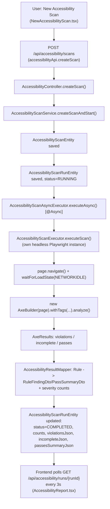

# Accessibility Testing — Complete Flow

> This module was read fresh in full for this documentation pass (not previously investigated in this session's prior work). All claims below are sourced directly from the files listed.

## 1. What this module actually does

Kortex's Accessibility Testing runs **one real axe-core scan** (via the official `com.deque.html.axecore` Java bindings, `AxeBuilder`, driven against a Playwright `Page`) against a single URL, using a **dedicated, isolated, headless Chromium instance** — completely separate from the shared `BrowserManager` session Recording/Playback/Data-Driven all share. This is a first-class peer capability, not a sub-feature of UI Automation: it has its own top-level controller base path (`/api/accessibility`, not nested under `/api/ui-automation`) and no dependency on any recorded `TestScenarioEntity`.

## 2. End-to-end chain

## 3. Creating and starting a scan

**Frontend:** `NewAccessibilityScan.tsx` collects `name`, optional `description`, `targetUrl` (auto-prefixed with `https://` if no scheme given), `scanScope` (`FULL_PAGE` or `SELECTOR`), an optional CSS `selector` (required when scope is `SELECTOR`), and a `standards` set (checkboxes, defaulting to all three: `WCAG_A`, `WCAG_AA`, `BEST_PRACTICES`). Client-side validation rejects a non-http(s) scheme (`looksLikeUnsupportedProtocol`) before the request is even sent. Submits via `accessibilityApi.createScan()` → `POST /api/accessibility/scans`.

**Backend:** `AccessibilityController.createScan()` → `AccessibilityScanService.createScanAndStart()` (`backend/src/main/java/com/miniautomation/backend/accessibility/AccessibilityScanService.java:46-72`):
1. Requires a non-blank `name`.
2. `validateAndNormalizeUrl()` (`:250-268`) — parses the URL with `java.net.URI`, requires scheme to be exactly `http` or `https` and a non-blank host; anything else throws `AccessibilityException` (→ `400`, presumably via a shared exception handler — see `14-ERROR-HANDLING.md`). The code comment explicitly notes there is **no** localhost/internal-IP blocklist here, deliberately, for consistency with every other browser-driven feature in this app (Recording/Playback already navigate wherever the user points them, including internal/staging hosts).
3. Normalizes `scanScope` to exactly `"SELECTOR"` or `"FULL_PAGE"` (anything else defaults to `FULL_PAGE`); if `SELECTOR` and no selector was given, throws.
4. Defaults `standards` to `["WCAG_A","WCAG_AA","BEST_PRACTICES"]` if the caller sent none.
5. Builds and saves a new `AccessibilityScanEntity` (the reusable **configuration** — analogous to `TestScenarioEntity` for UI Automation).
6. Calls the private `startRun(scan)` (`:80-92`): creates an `AccessibilityScanRunEntity` with `status="RUNNING"`, saves it, then fires `AccessibilityScanAsyncExecutor.executeAsync(runId, scan)` — again via a **separate Spring bean** for the same `@Async` self-invocation reason documented throughout this codebase (Data-Driven, standard Playback runs) — and returns the `RUNNING` run entity immediately.

**Re-run**: `POST /api/accessibility/scans/{id}/rerun` → `AccessibilityScanService.rerunScan(scanId)` — loads the existing `AccessibilityScanEntity` and calls the same `startRun()`, producing a brand-new `AccessibilityScanRunEntity` (history is preserved; the config is never overwritten).

## 4. Scan execution — `AccessibilityScanExecutor`

`backend/src/main/java/com/miniautomation/backend/accessibility/AccessibilityScanExecutor.java`, `executeScan(targetUrl, scanScope, selector, tags)`:

1. `Playwright.create()` then `playwright.chromium().launch(new BrowserType.LaunchOptions().setHeadless(true))` — a **brand-new, fully isolated** browser instance per scan call, launched and torn down (`finally { browser.close(); playwright.close(); }`) within this single method. The class's own comment is explicit about why this must never reuse `BrowserManager`'s shared session: doing so could navigate the browser out from under an in-progress recording or playback (or vice versa).
2. `context.newPage()` → `page.navigate(targetUrl, ... .setWaitUntil(DOMCONTENTLOADED).setTimeout(30_000))`. A `TimeoutError` becomes `"The page did not finish loading within the configured timeout."`; any other `PlaywrightException` becomes `"Unable to load the target URL."` — both wrapped in `AccessibilityScanExecutionException`.
3. `page.waitForLoadState(NETWORKIDLE, timeout=10_000)` — best-effort; swallowed if it never fires (polling widgets/analytics/websockets that never go idle are explicitly anticipated in the comment, not treated as a failure), followed by a fixed `page.waitForTimeout(1_000)` settle wait.
4. `new AxeBuilder(page).withTags(tags)` — `tags` come from `AccessibilityScanService.resolveAxeTags(standardsJson)` (`:270-290`), which maps the UI-facing standard keys to real axe-core tag names: `WCAG_A → {wcag2a, wcag21a}`, `WCAG_AA → {wcag2aa, wcag21aa}`, `BEST_PRACTICES → {best-practice}`. If somehow no recognised standard produced any tags, it falls back to a fixed default set (`wcag2a, wcag2aa, wcag21a, wcag21aa, best-practice`).
5. If `scanScope == "SELECTOR"` and a selector was given, `axeBuilder.include(selector)` scopes the analysis to that CSS selector only; otherwise the whole page is analyzed.
6. `axeBuilder.analyze()` — this is the actual axe-core engine run, returning `AxeResults` with `getViolations()`, `getIncomplete()`, `getPasses()` (all `List<Rule>`). A failure here becomes `"The accessibility engine could not complete the scan."`.
7. Returns an `AccessibilityScanOutcome` (duration + three mapped lists — see §5).

**What this architecture can and cannot detect (verified from the actual call shape, not assumed):**
- ✅ A genuine, real axe-core static analysis of the fully-rendered DOM at one point in time, for whatever CSS selector scope was requested.
- ✅ Distinguishes `violations` (confirmed problems), `incomplete` (axe could not determine pass/fail automatically — needs human judgment), and `passes`.
- ❌ **No multi-page crawl** — one `targetUrl`, one scan. Testing a whole site means creating one scan per page.
- ❌ **No interaction simulation** — the page is never clicked, focused, tabbed through, or otherwise interacted with beyond the initial navigation + settle wait. Anything that only becomes visible/reachable after a user action (a modal, a second step of a form, content behind a click) is not scanned. This is exactly why the "Manual & Guided Testing Checklist" feature exists (§7) — its first two items are literally "Keyboard navigation" and "Focus order & visibility," which axe-core's static pass cannot verify at all.
- ❌ **No screen-reader or assistive-technology simulation** — axe-core can confirm an `alt` attribute exists; it cannot judge whether its wording is meaningful, and it cannot operate a real screen reader. Also delegated to the manual checklist.
- The scan is **headless** by design (no visible browser window for the user to watch, unlike Record/Play).

## 5. Result mapping — `AccessibilityResultMapper`

`backend/src/main/java/com/miniautomation/backend/accessibility/AccessibilityResultMapper.java`:

- **`mapFindings(List<Rule>)`** → `List<RuleFindingDto>` — used for both `violations` and `incomplete` (they share axe's exact same `Rule` shape). Each `RuleFindingDto` carries `ruleId`, `description`, `help`, `helpUrl`, `impact` (critical/serious/moderate/minor, or `null` for some `incomplete` results — axe doesn't always assign impact before a human confirms the finding), `tags`, and a `List<RuleNodeDto>` — one entry per **affected DOM element**, each with `html` (the offending markup), `target` (a flattened CSS selector path — `flattenTarget()` collapses axe's loosely-typed nested-list "target" shape, which can nest when the element lives inside an iframe, into one `" > "`-joined string), and `failureSummary` (axe's own plain-English explanation).
- **`mapPasses(List<Rule>)`** → `List<PassSummaryDto>` — deliberately lighter: `ruleId`, `description`, `impact`, `tags`, `nodeCount` only — **no per-node HTML/selector detail**, since (per the class comment) a page can pass dozens of rules across hundreds of elements and nothing in the product needs to inspect an individual passing check.
- **`countSeverity(List<RuleFindingDto>)`** → `SeverityCounts {critical, serious, moderate, minor}` — a **rule count** (how many distinct axe rules were violated at each level), not a sum of affected elements. Any finding with a missing or unrecognised `impact` string falls into `moderate` by default (`AccessibilityResultMapper.java:85-91`) — the frontend's `severity.ts` (`impactToSeverityKey`) mirrors this exact same fallback-to-moderate rule.

## 6. Async persistence — `AccessibilityScanAsyncExecutor`

`executeAsync(runId, scan)` (`@Async(AsyncConfig.DD_TASK_EXECUTOR)`):
1. Loads the `AccessibilityScanRunEntity`.
2. Resolves axe tags from `scan.getStandardsJson()`, calls `AccessibilityScanExecutor.executeScan(...)`.
3. On success: `status="COMPLETED"`, `completedAt`, `durationMs`, `totalViolations` (= `violations.size()` — a **rule** count), `criticalCount`/`seriousCount`/`moderateCount`/`minorCount` (from `countSeverity`), `needsReviewCount` (= `incomplete.size()`), `passedCount` (= `passes.size()`), and the three full JSON payloads (`violationsJson`, `incompleteJson`, `passesSummaryJson`), each serialized via `AccessibilityResultMapper.toJson(value, "[]")` (falls back to an empty JSON array string on any serialization error).
4. On any exception: `status="FAILED"`, `completedAt`, `errorMessage` set from the exception (or its class name if the message is null).
5. `runRepository.save(run)` — always executed, success or failure, exactly mirroring the Data-Driven and standard-run async-executor pattern used elsewhere in this codebase.

Reuses the shared `AsyncConfig.DD_TASK_EXECUTOR` thread pool bean — the same one Data-Driven runs use (**Not verified from source** whether this is a deliberate shared-pool design decision or incidental; `AsyncConfig.java` itself was not read in this pass — see `15-CONFIGURATION.md`/`02-ARCHITECTURE.md` for that file's own documentation).

## 7. Manual / guided testing checklist

A deliberately **hybrid** design, confirmed from both sides:

- The **item definitions** (`id`, `label`, `description`, `wcagRef`) are a static, hard-coded array in the frontend only — `frontend_FIXED_v2/frontend/src/data/manualAccessibilityChecklist.ts`, `MANUAL_ACCESSIBILITY_CHECKLIST`, 10 fixed items: keyboard navigation, focus order & visibility, screen reader pass, meaningful alt text, color contrast in context, zoom & reflow, form errors & instructions, captions & transcripts, motion & animation control, consistent/predictable navigation. Each cites its relevant WCAG success criterion. This list never round-trips through the backend — the backend has no knowledge of what the items even *are*.
- The **tester's answers** (`status`: `PASS`/`FAIL`/`NOT_APPLICABLE`/`NOT_CHECKED`, plus free-text `notes`), keyed by checklist item id, **are** persisted server-side, per run: `ManualChecklist.tsx` calls `accessibilityApi.saveManualChecks(runId, checks)` → `PUT /api/accessibility/runs/{runId}/manual-checks` → `AccessibilityController.saveManualChecks()` → `AccessibilityScanService.saveManualChecks(runId, checks)` (`AccessibilityScanService.java:224-228`) → serializes the map to JSON and stores it in `AccessibilityScanRunEntity.manualChecksJson` (a `TEXT` column, null/blank until the first save).
- These manual answers are explicitly **not** part of the automated severity/violation counts — the UI copy in `ManualChecklist.tsx` states this directly: *"Answers are saved per run and are not part of the automated score above."*

## 8. Dashboard summary & trend

- **`GET /api/accessibility/dashboard/summary`** → `AccessibilityScanService.getDashboardSummary()` (`:127-159`) — `totalScans` (all scan configs), `totalRuns` (all runs across all scans), and a `latestScan` block sourced from the single most-recently-`startedAt` run **across the whole system** (not per-scan). Violation/severity/passed counts on that block are populated **only if** that latest run's `status == "COMPLETED"` — a still-`RUNNING` or `FAILED` latest run leaves those counts at their zero defaults. The method's own comment is explicit that these numbers reflect only the **latest completed run**, never a lifetime sum across re-runs (summing would inflate a number that represents nothing real).
- **`GET /api/accessibility/scans/{id}/trend`** → `AccessibilityScanService.getScanTrend(scanId)` (`:171-212`) — every run for one scan, oldest-first, each as a `ScanTrendPoint`. For each point that is `COMPLETED` and has a **prior completed point**, computes `criticalDelta`, `seriousDelta`, `totalViolationsDelta` against that previous completed run, and derives `regression` (`criticalDelta > 0 || seriousDelta > 0`) and `improvement` (`!regression && totalViolationsDelta < 0`) booleans. `RUNNING`/`FAILED` runs are still included in the point list (so a flaky run doesn't silently vanish from history) but carry no counts and are skipped when computing deltas.

## 9. Persistence — entities & repositories

`AccessibilityScanEntity` (`backend/src/main/java/com/miniautomation/backend/entity/AccessibilityScanEntity.java`), table `accessibility_scans` — the reusable **configuration**: `name`, `description` (TEXT), `targetUrl`, `scanScope` (`FULL_PAGE`/`SELECTOR`), `selector` (TEXT, only set when scope is `SELECTOR`), `standardsJson` (TEXT, JSON array of axe tag-group keys), `createdAt`.

`AccessibilityScanRunEntity`, table `accessibility_scan_runs` — one **execution**:
- `@ManyToOne(EAGER) @JsonIgnoreProperties({"hibernateLazyInitializer","handler"}) scan` — eager fetch matches this codebase's established convention (`spring.jpa.open-in-view=false` means a lazy relation touched outside an active Hibernate session throws `LazyInitializationException` during JSON serialization — the same pattern documented for `DataDrivenRunEntity.scenario` and `TestRunEntity.scenario` elsewhere in this codebase).
- `status` (RUNNING/COMPLETED/FAILED), `targetUrl` (a **snapshot** of the scan's URL at run-start time, independent of whether the parent scan config is later edited — though no edit endpoint exists at all currently, per the controller's endpoint list in §10), `startedAt`/`completedAt`, `durationMs`, `errorMessage` (TEXT).
- Summary counts: `totalViolations`, `criticalCount`, `seriousCount`, `moderateCount`, `minorCount`, `needsReviewCount`, `passedCount` — all rule-level counts, per §5/§6.
- `violationsJson`, `incompleteJson`, `passesSummaryJson` — all `LONGTEXT`, full serialized `List<RuleFindingDto>`/`List<PassSummaryDto>`.
- `manualChecksJson` — `TEXT`, serialized `Map<String, ManualCheckEntry>`.

The class's own comment states the JSON-text-column design choice explicitly mirrors `DataDrivenRowResultEntity`'s `rowDataJson`/`stepResultsJson` pattern, for the same reason: axe results are read-only report detail, never queried relationally, so a small dedicated JSON payload is simpler than a full `Violation`/`Node`/`Check` entity graph for no real benefit.

`AccessibilityScanRepository extends JpaRepository<AccessibilityScanEntity, Long>` — no custom methods.
`AccessibilityScanRunRepository extends JpaRepository<AccessibilityScanRunEntity, Long>` — `findByScanIdOrderByStartedAtDesc(Long)`, `findAllByOrderByStartedAtDesc()`.

## 10. REST endpoints (`AccessibilityController`, base path `/api/accessibility`)

| Method | Path | Purpose |
|---|---|---|
| POST | `/scans` | Create a scan config **and** immediately start its first run. Returns the `RUNNING` run entity. |
| POST | `/scans/{id}/rerun` | Re-run an existing scan's saved config. |
| GET | `/scans` | All scan configs. |
| GET | `/scans/{id}` | One scan config. |
| GET | `/scans/{id}/runs` | All runs for one scan, newest first. |
| GET | `/runs` | Every run across every scan, newest first — backs the Scan History table. |
| GET | `/runs/{runId}` | Poll one run (frontend polls every 3s while `RUNNING`). |
| GET | `/dashboard/summary` | Dashboard snapshot (§8). |
| GET | `/scans/{id}/trend` | Run-to-run trend with regression/improvement deltas (§8). |
| PUT | `/runs/{runId}/manual-checks` | Save the manual checklist answers for one run (§7). |

No update/delete endpoint exists for a scan config, and no delete endpoint exists for a run — **Not verified from source** whether this is intentional (append-only history) or simply not yet built; no comment addresses it either way.

## 11. Frontend components

- **`NewAccessibilityScan.tsx`** (`/accessibility/new`) — the create form described in §3.
- **`AccessibilityDashboard.tsx`** (`/accessibility`) — fetches `accessibilityApi.getDashboardSummary()` and `getAllRuns()` in parallel on mount; supports triggering a re-run (`rerunScan`) directly from the list.
- **`AccessibilityReport.tsx`** (`/accessibility/runs/{runId}`) — polls `accessibilityApi.getRun()` every 3s while `RUNNING`; renders the violation/incomplete/passes breakdown, embeds `ManualChecklist` (passing `run.id` and the run's already-saved `manualChecksJson` parsed into `initialChecks`), offers `EmailReportButton` with `reportType="ACCESSIBILITY"` once the run leaves `RUNNING`, and a re-run action.
- **`AccessibilityScanTrend.tsx`** — renders the `ScanTrend` history (chart/table — page content not read in full detail during this pass beyond confirming it calls `accessibilityApi.getScanTrend()`; **Not verified from source** beyond the API call shape).
- **`utils/severity.ts`** — `impactToSeverityKey()` (the frontend mirror of the backend's impact→severity fallback rule, §5), `getSeverityMeta()`, `SEVERITY_ORDER`. Used for badge styling/icons across the accessibility pages.

## 12. PDF reporting

`ReportPdfService.generateAccessibilityRunPdf(AccessibilityScanRunEntity run)` (`backend/src/main/java/com/miniautomation/backend/report/ReportPdfService.java:246-247`) exists and is wired specifically for this run type (confirmed by direct grep of the file — the full PDF-generation pipeline, shared across all report types, is documented in `12-REPORT-PDF-EMAIL.md`, written by a different pass of this documentation effort). One accessibility-specific detail confirmed directly in this pass: the PDF includes a genuine **"WCAG Conformance Summary"** section (`wcagConformanceSection()`, `ReportPdfService.java:841-865`) — a VPAT/ACR-style table, one row per WCAG Success Criterion, built from a static `WCAG_SC_REFERENCE` map (axe-core `wcagXXX` tag → WCAG 2.0/2.1 Success Criterion number + name) that the file's own comment says covers WCAG 2.0 + 2.1 Level A and AA criteria, matching this app's own `WCAG_A`/`WCAG_AA` scan options.

## 13. Not verified from source

- The exact rendering/interaction of `AccessibilityScanTrend.tsx` (chart library, if any) — only its API call was confirmed in this pass; the file's full body was not read.
- Whether `AsyncConfig.DD_TASK_EXECUTOR`'s thread pool is deliberately shared between Data-Driven and Accessibility async execution, or just reused as the only executor bean available — `AsyncConfig.java` was not opened in this pass.
- Whether any scan-config edit or run/scan deletion capability exists anywhere else in the codebase outside `AccessibilityController` — none was found in the controller itself.
