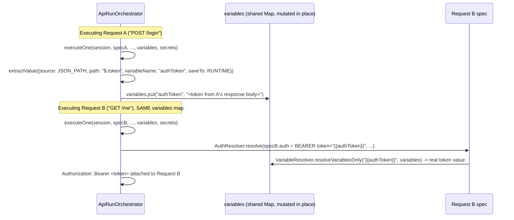

# API Testing — Complete Flow

> Verified against source on the current working tree. All file paths are relative to the repo root `F:\mini\Mini_Automation_DataDriven`. Backend package root: `backend/src/main/java/com/miniautomation/backend/`. Frontend root: `frontend_FIXED_v2/frontend/src/`.

API Testing is a first-class Kortex module, architecturally parallel to UI Automation/Data-Driven/Accessibility, but with its own domain model. It reuses two things from the rest of the app rather than reinventing them: Playwright (for HTTP execution, not browser automation) and `DatasetParser` (for data-driven dataset upload).

## 1. Domain model

```
ApiCollectionEntity  (api_collections)
 ├─ ApiFolderEntity     (api_folders)      — one level deep only
 └─ ApiRequestEntity    (api_requests)     — under the collection root OR a folder

ApiEnvironmentEntity (api_environments)    — independent of collections; a run picks one

ApiRunEntity (api_runs)
 └─ ApiRequestRunResultEntity (api_request_run_results)  — one row per (request × iteration)
```

- `ApiCollectionEntity` (`entity/ApiCollectionEntity.java`): id, name, description, `authConfigJson` (collection-default auth), `variablesJson` (collection-level `{key,value,secret}` list), `createdAt`. `folders`/`requests` are `@OneToMany(fetch = LAZY)` **and** `@JsonIgnore` — never serialized inline; dedicated endpoints serve them. Comment in source explains this directly: without `@JsonIgnore`, serializing a collection fetched outside an active Hibernate session throws `LazyInitializationException` because `spring.jpa.open-in-view=false`.
- `ApiFolderEntity` (`entity/ApiFolderEntity.java`): id, `collection` (`@ManyToOne(EAGER)` + `@JsonIgnoreProperties({"hibernateLazyInitializer","handler","folders","requests"})`), name, `sortOrder`, `createdAt`. EAGER (not LAZY) specifically because it *does* need to appear in its own endpoint's JSON — same open-in-view constraint, opposite fix.
- `ApiRequestEntity` (`entity/ApiRequestEntity.java`): id, `collection` (EAGER), `folder` (EAGER, nullable — null means "sits at collection root"), `name`, `method`, `url`, and **every structured sub-part stored as a JSON text column**: `paramsJson`, `headersJson`, `bodyType` + `bodyContent` + `formFieldsJson`, `authType` + `authConfigJson`, `assertionsJson`, `preRequestVarsJson`, `extractionsJson`, plus `sortOrder`, `createdAt`, `updatedAt`. This matches the codebase's established convention (see `AccessibilityScanRunEntity.violationsJson`) for "always read/written as a whole" configuration.
- `ApiEnvironmentEntity` (`entity/ApiEnvironmentEntity.java`): id, name, `variablesJson` (list of `{key, value, secret}`), `createdAt`. Independent of any collection — any run can pick any environment.
- `ApiRunEntity` (`entity/ApiRunEntity.java`): id, `collection` (EAGER, nullable — null for a fully ad-hoc send of an unsaved request), `environment` (EAGER, nullable), `runName`, `scope` (`REQUEST`/`FOLDER`/`COLLECTION`), `folderId`, `requestId`, `status` (`RUNNING`/`PASSED`/`FAILED`), `iterationCount`, `stopOnFailure`, `delayMs`, `datasetFilename`, `totalRequests`/`passedRequests`/`failedRequests`, `totalDurationMs`, `errorMessage`, `startedAt`/`completedAt`, and `requestResults` (`@OneToMany(mappedBy="apiRun", cascade=ALL, orphanRemoval=true, fetch=EAGER)`, ordered by `id ASC`).
- `ApiRequestRunResultEntity` (`entity/ApiRequestRunResultEntity.java`): id, `apiRun` (`@ManyToOne(LAZY)` + `@JsonIgnore` — the back-reference is never serialized, and this is the one relation in the whole module that stayed LAZY, because nothing ever needs to walk from a result row back up to its run via JSON), `requestOrder` (1-based, across all iterations), `iterationIndex` (0-based, always 0 for an ad-hoc send), `requestId` (nullable — null when the request was never saved), `requestName`, `method`, `resolvedUrl` (already masked), `status` (`PASSED`/`FAILED`/`NETWORK_ERROR`/`TIMEOUT`/`SKIPPED` — the doc comment lists `SKIPPED` though no current code path sets it; **not verified from source that SKIPPED is ever actually assigned in this module**), `httpStatus`/`httpStatusText`, `durationMs`, `responseSizeBytes`, `responseTruncated`, `responseHeadersJson`, `responseBody` (already truncated per `ApiHttpExecutor.MAX_STORED_BODY_BYTES`), `assertionResultsJson`, `errorMessage`.

## 2. Request execution pipeline (the core: `ApiRunOrchestrator.executeOne`)

Every single HTTP call in this module — ad-hoc "Send" or one iteration of a Collection Runner request — funnels through `ApiRunOrchestrator.executeOne(RunSession, ApiRequestSpec, AuthConfig collectionAuth, Map<String,String> variables, Set<String> secretValues)` (`apitesting/ApiRunOrchestrator.java:62`).

```mermaid
flowchart TD
    A["executeOne(session, spec, collectionAuth, variables, secretValues)"] --> B["Apply spec.preRequestVars\n(VariableResolver.resolve, written into variables map)"]
    B --> C["Resolve URL: VariableResolver.resolve(spec.url, variables)"]
    C --> D{valid http/https URL?}
    D -- no --> D1["return FAILED, masked url"]
    D -- yes --> E["Resolve headers + query params\n(each key/value through VariableResolver)"]
    E --> F["AuthResolver.resolve(requestAuth, collectionAuth, variables)\n-> AppliedAuth{headerName/Value, queryParamName/Value}"]
    F --> G["effectiveSecrets = secretValues (+ appliedAuth.queryParamValue if present)"]
    G --> H["Resolve body (JSON/RAW/FORM_URLENCODED/MULTIPART)"]
    H --> I["result.resolvedUrl = mask(withQueryString(url, params), effectiveSecrets)"]
    I --> J["ApiHttpExecutor.execute(session, ResolvedRequest)\n-> ExecutionOutcome"]
    J --> K{outcome.isError()?}
    K -- yes --> K1["status = TIMEOUT or NETWORK_ERROR\n(SSL_ERROR/INVALID_URL fold into NETWORK_ERROR here)\nerrorMessage masked; RETURN"]
    K -- no --> L["Resolve assertion targets/expected via\nresolveVariablesOnly, then AssertionEngine.evaluate()"]
    L --> M["status = PASSED iff every assertion passed"]
    M --> N["For each ExtractionRule: extractValue(rule, outcome)\n-> variables.put(name, value) [mutates the shared map]\nif saveTo=ENVIRONMENT also add to result.environmentUpdates"]
    N --> O["return RequestExecutionResult"]
```

Key verified details:

- **URL/header/param/body resolution** all go through `VariableResolver.resolve()` (`apitesting/VariableResolver.java`), which first expands built-in dynamic tokens then named `{{variable}}` tokens.
- **Auth is resolved AFTER headers/params are built**, and its header/query-param output is appended to the already-built maps (`ApiRunOrchestrator.java:112-118`).
- **Query-string persistence bug fix (verified present)**: `withQueryString()` (`ApiRunOrchestrator.java:267`) rebuilds and URL-encodes the query string onto `resolvedUrl` for persistence/display, even though Playwright is given query params separately via `RequestOptions.setQueryParam()` (`ApiHttpExecutor.java:84-88`). The method's own comment states this was added because, without it, the persisted/displayed URL silently omitted every query parameter, including ones injected by auth (e.g. an `API_KEY` added as a query param).
- **Secret masking (verified present, and verified to mask unconditionally)**: `ApiRunOrchestrator.mask(String text, Set<String> secretValues)` (`ApiRunOrchestrator.java:285`) replaces **every occurrence of every value in `secretValues`** with the fixed literal `"••••••••"` — never reveals length. `effectiveSecrets` is `secretValues` (the environment's variables flagged `secret`) **plus**, if auth resolved to a query-param value, that value too (`ApiRunOrchestrator.java:126-130`) — so an API key typed directly into a request's own Auth tab (no variable, no "secret" flag anywhere) is still masked in the persisted `resolvedUrl` once it lands in the query string. Request headers themselves are never persisted at all (`ApiRequestRunResultEntity` has no headers-sent column), so the query-string case is the only place this matters.
- **Assertion targets/expected values are variable-resolved before evaluation** (`ApiRunOrchestrator.java:184-185`, via `resolveVariablesOnly` — dynamic `{{$...}}` tokens are deliberately *not* re-resolved here, so an assertion doesn't compare against a freshly-generated timestamp/GUID different from the one actually sent).
- **Extraction mutates the same `variables` map the caller passed in** — this is what makes request chaining work across a multi-request Collection Runner loop: `ApiRunAsyncExecutor` builds one `variables` map per iteration and passes the *same* map into every request in that iteration's `specs` loop (`apitesting/ApiRunAsyncExecutor.java:74-86`).

### HTTP execution (`ApiHttpExecutor`)

`apitesting/ApiHttpExecutor.java` executes via Playwright's `APIRequestContext` — **not** a browser. Verified facts:

- `openSession()` creates its **own fully isolated `Playwright` instance** per run (`Playwright.create()`), separate from `BrowserManager`'s shared recording/playback browser session. No Chromium process is launched — `APIRequestContext` is a lightweight HTTP client. The class javadoc states this mirrors `AccessibilityScanExecutor`'s isolation philosophy.
- `RunSession` wraps one `APIRequestContext`, opened **once per run** (not per request) — `ApiExecutionService.execute()` opens one for the single ad-hoc send; `ApiRunAsyncExecutor.executeAsync()` opens one for the *entire* Collection Runner run (`try (RunSession session = httpExecutor.openSession())` wraps the whole iteration loop). This is what makes cookies set by one response available to later requests in the same run — a real session-cookie login-then-authenticated-call chain works because of this, not because of any explicit cookie-copying code.
- `ignoreHTTPSErrors(true)` is set unconditionally at context creation (`ApiHttpExecutor.java:66-67`) — self-signed/expired certs are accepted by default, consistent with this app having no host allowlist anywhere (comment cites `AccessibilityScanService`'s same reasoning).
- **All 7 HTTP methods are genuinely supported**, not special-cased: `RequestOptions.setMethod(request.method())` (`ApiHttpExecutor.java:75`) passes the method string straight to Playwright's generic `fetch()`, which accepts any method. `ApiCollectionService.VALID_METHODS` restricts what can be *saved* to `GET, POST, PUT, PATCH, DELETE, HEAD, OPTIONS` (`ApiCollectionService.java:34`), but the executor itself has no method-specific branching beyond that validation.
- **Body handling by `bodyType`** (`ApiHttpExecutor.applyBody`, `ApiHttpExecutor.java:105-140`): `JSON` and `RAW` both call `options.setData(bodyContent)`, differing only in the default `Content-Type` header applied when the request doesn't already set one (`application/json` vs `text/plain`). `FORM_URLENCODED` and `MULTIPART` both build a Playwright `FormData` from enabled `formFields`, differing only in whether it's attached via `options.setForm(form)` or `options.setMultipart(form)`. `NONE` sends no body.
- **Response body truncation**: `MAX_STORED_BODY_BYTES = 2 * 1024 * 1024` (2MB, `ApiHttpExecutor.java:36`). A response larger than this has its body truncated to exactly that many bytes before being stored/returned (`outcome.setTruncated(true)`); `responseSizeBytes` still records the *full*, untruncated size.
- **Error classification** (`classifyError`, `ApiHttpExecutor.java:190-198`) is string-matching against Playwright's exception message (Playwright exposes no structured error-code enum for `fetch()` failures): `"timeout"` → `TIMEOUT`; `"ssl"`/`"certificate"`/`"cert_"` → `SSL_ERROR`; `"invalid url"`/`"net::err_invalid_url"`/`"malformed"` → `INVALID_URL`; DNS-related or connection-refused phrases → `NETWORK_ERROR`; anything unrecognised also falls back to `NETWORK_ERROR`. At the `ApiRunOrchestrator` level, only `TIMEOUT` is distinguished — `SSL_ERROR` and `INVALID_URL` both collapse into the persisted `NETWORK_ERROR` status (`ApiRunOrchestrator.java:166`). A genuine 4xx/5xx HTTP response is explicitly **not** treated as an error at this layer (`ExecutionOutcome.isError()` is only true when `errorType != null`, i.e., no response was ever received) — assertions are what judge a 4xx/5xx.

## 3. Variable resolution (`VariableResolver`)

`apitesting/VariableResolver.java`. Pattern: `\{\{\s*([^{}]+?)\s*\}\}`.

- **`resolve(template, variables)`**: dynamic tokens first (`resolveDynamicTokens`), then named-variable substitution (`resolveVariablesOnly`) on the result.
- **Dynamic tokens** (verified exhaustive list, `dynamicTokenValue`, `VariableResolver.java:70-77`): `$timestamp` → `Instant.now().getEpochSecond()`; `$isoTimestamp` → `Instant.now().toString()`; `$guid` and `$uuid` (both map to the same behavior) → `UUID.randomUUID().toString()`; `$randomInt` → `ThreadLocalRandom.current().nextInt(0, 1_000_000)`. Each `{{$...}}` occurrence in the template is resolved independently via the same regex `Matcher` loop, so two occurrences of `{{$randomInt}}` in the same string get two different values.
- **Unresolved variable behavior**: a `{{name}}` with no entry in the `variables` map is left as its literal text (`matcher.appendReplacement(..., value != null ? value : matcher.group(0))`), not blanked to empty string — the class javadoc states this is deliberate, so a misconfigured variable is visibly obvious rather than silently swallowed.
- **Precedence** is established by *build order*, not by any explicit priority field: `ApiExecutionService.mergeVariables()` (`ApiExecutionService.java:225-236`) builds the map by first putting every collection variable, then `merged.putAll(environmentService.resolveVariableMap(environment))` — so an environment variable with the same key **overwrites** a collection variable with that key. `ApiRunAsyncExecutor.executeAsync()` then, per iteration, starts from a **copy** of that base map and does `variables.putAll(datasetRows.get(iter))` — so a dataset column with the same name as a collection/environment variable overwrites it for that iteration only. Extraction-rule writes during execution (`variables.put(rule.getVariableName(), value)`) happen after all of the above and persist for the rest of that run. So the effective precedence, lowest to highest, is: **collection variables < environment variables < dataset row (data-driven only) < runtime extraction**. Pre-request variables (`ApiRunOrchestrator.java:69-74`) are applied per-request, immediately before URL resolution, and also write into the same shared map — so they can override anything set before them for that request and every request after it in the same run.
- **`hasUnresolvedVariable`** exists as a helper (used for UI-side validation — not traced further here since it is frontend-facing, not part of execution).

## 4. Authentication (`AuthResolver`)

`apitesting/AuthResolver.java`. Types: `NONE | INHERIT | BEARER | BASIC | API_KEY | CUSTOM_HEADER`.

- `resolve(requestAuth, collectionAuth, variables)`: if `requestAuth` is null or its type is `INHERIT`, `effective` becomes `collectionAuth` — and if *that* is itself null or also `INHERIT`/null-typed, `effective` falls back to a plain `new AuthConfig()` (i.e., `NONE`). This means INHERIT never recurses more than one level — a collection auth that is itself `INHERIT` is treated as "no auth" rather than an error or an infinite lookup.
- `BEARER`: sets header `Authorization: Bearer <resolved token>`, only if the resolved token is non-blank.
- `BASIC`: always sets `Authorization: Basic <base64(username:password)>` (even if both are blank — no non-blank guard on this branch, unlike BEARER).
- `API_KEY`: resolves `apiKeyName`/`apiKeyValue`; if `apiKeyAddTo` is `QUERY` (case-insensitive), sets `queryParamName`/`queryParamValue` instead of a header — this is exactly the path that produces the masked-query-param scenario described above.
- `CUSTOM_HEADER`: sets an arbitrary `headerName`/`headerValue` pair, only if the header name is non-blank.
- Every field is passed through `VariableResolver.resolveVariablesOnly` before use — so a token like `{{authToken}}` set by a prior request's extraction rule resolves correctly.
- Returns a single `AppliedAuth` (nested static class: `headerName`/`headerValue`/`queryParamName`/`queryParamValue`) — a request has exactly one auth mechanism, never both a header and a query param simultaneously (the switch statement only ever sets one pair).

## 5. Assertions (`AssertionEngine`)

`apitesting/AssertionEngine.java`. **13 assertion types are supported** (verified exhaustively from the `switch` in `evaluateOne`, `AssertionEngine.java:40-56`) — more than the "5 quick patterns" the UX surfaces as one-click shortcuts (`RequestEditorTabs.tsx`'s `QUICK_ASSERTIONS`, not independently re-verified in this pass — the 5 quick-add buttons are a subset UX affordance, not the engine's actual limit):

| Type | Behavior |
|---|---|
| `STATUS_CODE_EQUALS` / `STATUS_CODE_NOT_EQUALS` | Integer comparison against `outcome.getStatus()`. |
| `STATUS_CODE_ONE_OF` | `expected` is a comma-separated list; passes if the actual status matches any entry. |
| `RESPONSE_TIME_LESS_THAN` / `RESPONSE_TIME_GREATER_THAN` | Compares `outcome.getDurationMs()` against a parsed long. |
| `HEADER_EXISTS` / `HEADER_EQUALS` / `HEADER_CONTAINS` | Case-insensitive header-name lookup (`TreeMap` with `CASE_INSENSITIVE_ORDER`). |
| `BODY_CONTAINS` | Raw substring match on the response body text. |
| `BODY_EQUALS` | Trimmed exact-string match on the whole body. |
| `JSON_PATH_EXISTS` / `JSON_PATH_EQUALS` / `JSON_PATH_NOT_EQUALS` / `JSON_PATH_CONTAINS` | Uses Jayway JsonPath (`com.jayway.jsonpath:json-path:2.9.0`, confirmed in `backend/pom.xml`) to evaluate `def.getTarget()` as a JSONPath expression against the body. `JSON_PATH_CONTAINS` special-cases a `List` result (checks if any element contains the expected substring) vs. any other value (stringifies then substring-checks). |

- A malformed assertion (bad JSONPath, non-JSON body, unparsable expected number) is caught and reported as a **failed assertion result**, never thrown up to abort the whole request (`evaluateOne`'s outer `try/catch`, plus per-type `PathNotFoundException`/`InvalidJsonException` handling that distinguishes "path not found" from "body isn't JSON" in the displayed actual value).
- `JSON_PATH_NOT_EQUALS` reuses the same `jsonPathEquals` method with a `negate` flag (`AssertionEngine.java:53,147-161`): a *missing* path trivially "passes" NOT_EQUALS (since a missing value can never equal the expected one) — verified directly in `jsonPathEquals`'s `PathNotFoundException` branch, which returns `passed = negate`.
- Assertion results (`dto/AssertionResult.java`, constructor fields: `description, passed, expected, actual`) become `RequestExecutionResult.assertionResults`, then JSON-serialized into `ApiRequestRunResultEntity.assertionResultsJson` via `ApiResultMapper`.
- **A request's overall PASSED/FAILED status is entirely assertion-driven**: `ApiRunOrchestrator.java:191-192` — `allAssertionsPassed = assertionResults.stream().allMatch(AssertionResult::isPassed)`; `status = allAssertionsPassed ? "PASSED" : "FAILED"`. A request with **zero configured assertions** has an empty `assertionResults` list, and `Stream.allMatch` on an empty stream is vacuously `true` — so **a request with no assertions at all is always reported PASSED** (as long as an HTTP response was received), regardless of its actual status code. This is a real, verified behavior, not an inference.

## 6. Extraction & request chaining

`ExtractionRule` (`dto/ExtractionRule.java`): `source` (`JSON_PATH` default | `HEADER` | `STATUS_CODE`), `path`, `variableName`, `saveTo` (`RUNTIME` default | `ENVIRONMENT`).

`ApiRunOrchestrator.extractValue()` (`ApiRunOrchestrator.java:214-238`):
- `HEADER` — case-insensitive lookup of `path` as a header name in the response headers.
- `STATUS_CODE` — `String.valueOf(outcome.getStatus())`, ignoring `path` entirely.
- default (`JSON_PATH`) — `JsonPath.read(outcome.getBody(), rule.getPath())`, stringified.
- A failed extraction (`PathNotFoundException`/`InvalidJsonException`/any other exception) is logged to stdout and **silently skipped** (`return null` → the rule contributes nothing) — it never fails the request or the run.

**Chaining example, traced through real code** (Request A extracts a token; Request B uses it):



If the extraction rule's `saveTo` is `ENVIRONMENT`, the value is *additionally* placed into `result.environmentUpdates`, and — after the whole run finishes — `ApiExecutionService`/`ApiRunAsyncExecutor` call `ApiEnvironmentService.applyVariableUpdates(environmentId, environmentUpdatesAccum)` (`ApiExecutionService.java:115-117`; `ApiRunAsyncExecutor.java:138-140`), which updates an existing variable's value in place (preserving its `secret` flag) or appends a new non-secret variable — persisted onto the environment, so it survives for future runs, not just the rest of the current one.

## 7. Two ways a request executes

### Ad-hoc "Send" — synchronous (`ApiExecutionService.execute`, `apitesting/ApiExecutionService.java:72-120`)

`POST /api/api-testing/execute` → `ApiExecutionController.execute()` → `ApiExecutionService.execute(ExecuteRequest)`:

1. Loads the `collection`/`environment` if IDs were supplied (both optional — a request can be sent with neither, e.g. from the no-setup "New Request" playground).
2. Builds `variables` (`mergeVariables`) and `secretValues` (`environmentService.secretValues`).
3. Creates an `ApiRunEntity` with `scope="REQUEST"`, `iterationCount=1`, `totalRequests=1`.
4. Opens a `RunSession`, calls `orchestrator.executeOne()` **once**, closes the session (try-with-resources).
5. Sets `run.status` from the single result, `addRequestResult(...)`, saves the run — **already `COMPLETED`** (no RUNNING intermediate state; the HTTP response is returned to the caller directly).
6. If the extraction produced environment updates, applies them.

### Collection Runner — asynchronous (`ApiExecutionService.startRun` → `ApiRunAsyncExecutor.executeAsync`)

`POST /api/api-testing/collections/{id}/run` (multipart: `config` JSON string + optional `file`) → `ApiExecutionController.startRun()` deserializes `config` into `StartRunRequest`, calls `ApiExecutionService.startRun(id, config, file)`:

1. `resolveScope()` (`ApiExecutionService.java:181-216`) expands `scope` (`REQUEST`/`FOLDER`/`COLLECTION`) into an ordered `List<ApiRequestEntity>` — `COLLECTION` scope orders root-level requests first (by `sortOrder`), then each folder's requests (also by `sortOrder`), folder-by-folder.
2. If a dataset file was uploaded, parses it via **`DatasetParser`** — the exact same class UI Automation's Data-Driven feature uses (`datadriven/DatasetParser.java`, injected into `ApiExecutionService` as `private final DatasetParser datasetParser`). **Verified: there is no separate API-Testing-specific dataset parser.**
3. Converts each `ApiRequestEntity` to an `ApiRequestSpec` (`collectionService.toSpec`).
4. Creates the `ApiRunEntity` with `status="RUNNING"` and saves it **immediately** — the frontend can start polling `GET /runs/{runId}` right away.
5. Calls `asyncExecutor.executeAsync(...)` (fire-and-forget, `@Async(AsyncConfig.DD_TASK_EXECUTOR)` — same named executor bean the Data-Driven module uses for its own async runs) and returns the RUNNING entity immediately.

`ApiRunAsyncExecutor.executeAsync()` (`apitesting/ApiRunAsyncExecutor.java:50-145`):
- `totalIterations = datasetRows.isEmpty() ? max(1, iterationCount) : datasetRows.size()` — **a dataset, if present, always determines the iteration count**; `iterationCount` only applies when there is no dataset (a "repeat N times" run with no data).
- Opens **one** `RunSession` for the whole run.
- Nested loop: for each iteration, build `variables` from `baseVariables` + (if present) that iteration's dataset row; for each request `spec` in order, call `orchestrator.executeOne()`, map+append the result, accumulate pass/fail counts.
- **`stopOnFailure`**: if a request fails and this flag is true, breaks out of *both* loops immediately (labeled `iterationLoop:` break) — the run stops mid-iteration, not just mid-request.
- **`delayMs`**: `Thread.sleep(delayMs)` between requests (skipped after the very last request of the very last iteration) — an `InterruptedException` here also stops the run early.
- On completion: `status = failedCount == 0 ? PASSED : FAILED`; `errorMessage` is set to a human-readable summary either way there's a failure (stopped-early vs. some-failed phrasing differs).
- Any uncaught exception during the whole run is caught, logged (`e.printStackTrace()`), and the run is marked `FAILED` with that exception's message — the run is **still saved**, never left dangling in `RUNNING` state.

**How data-driven API Testing differs architecturally from UI Automation's Data-Driven feature** (verified, not inferred): UI Automation maps individual recorded *steps* to dataset *columns* via `FieldMappingService` (see `07-DATA-DRIVEN.md`) because a recorded browser step has no inherent name. API Testing has no equivalent mapping step at all — a dataset column becomes directly usable as `{{ColumnName}}` anywhere in the request (URL, headers, body, auth, assertions) simply because `variables.putAll(datasetRows.get(iter))` merges the row in by column name. There is no `StartRunRequest` field for column-to-field mapping — confirmed absent from `dto/StartRunRequest.java`.

## 8. Persistence — `ApiResultMapper`

`apitesting/ApiResultMapper.java` converts one `ApiRunOrchestrator.RequestExecutionResult` into a persistable `ApiRequestRunResultEntity`, and is called from **both** `ApiExecutionService` and `ApiRunAsyncExecutor` — the class javadoc states this was extracted specifically so the two execution paths (sync ad-hoc vs. async Collection Runner) can never independently drift on how a result is stored. This resolves a circular-dependency concern: `ApiExecutionService` depends on `ApiRunAsyncExecutor` (to kick off async runs) and both need the same mapping logic, so the mapping logic lives in a third, shared component instead of one service depending on the other for it.

Response headers and assertion results are serialized to JSON text (`objectMapper.writeValueAsString`, falling back to the literal string `"null"` on any serialization failure) before being stored on the entity's `*Json` columns.

## 9. Import — Postman & OpenAPI

Both live in `apitesting/`, both construct real collections through `ApiCollectionService` (no separate import-specific persistence path), and both are deliberately partial-fidelity by design (per their own class javadocs):

**`PostmanImportService.importCollection()`** (Postman v2.1 export):
- Imports method, URL, headers, body (`raw`/`urlencoded`/`formdata`), and `bearer`/`basic`/`apikey` auth types.
- Does **not** import Postman's pre-request/test JavaScript (this app's extension points are the structured pre-request-variable/extraction mechanism, not arbitrary JS).
- Skips `file`-type form-data fields (a portable collection export never embeds actual file bytes).
- **Flattens nested folders**: Postman allows arbitrary folder nesting; this app's one-level model means a folder encountered while already inside another folder contributes its requests to that *same* parent folder rather than creating a deeper one (`importItem`, `PostmanImportService.java:67-89`).
- Collection-level `variable[]` array becomes `EnvironmentVariable` collection variables (never marked secret from import).

**`OpenApiImportService.importSpec()`** (OpenAPI 3.0, **JSON only — no YAML parser dependency exists in this app**, verified via the exception thrown on parse failure explicitly saying "JSON expected"):
- One request per path+method operation; requests are grouped into a folder named after each path's first non-parameter segment (`folderIdFor`, `OpenApiImportService.java:80-92`).
- Only `servers[0].url` is used as the base URL — additional server entries are ignored.
- Only the `application/json` request-body media type is imported; other media types produce a `NONE` body.
- A body with no explicit `example` gets a **shallow placeholder** built from the schema's top-level `properties` only (`exampleOrPlaceholder`/`placeholderForType`, `OpenApiImportService.java:145-173`) — not a fully-resolved schema (deliberately avoids potential recursive/circular schema resolution).
- OpenAPI's `{param}` path-template syntax is rewritten to this app's `{{param}}` syntax (`convertPathTemplate`) so imported path parameters resolve through the same environment/pre-request variable mechanism as everything else — they are **not** auto-populated with example values by this rewrite; only `query`/`header` parameters get example-derived values via `collectParameters`.

## 10. API endpoints (module summary — full detail in `11-API-ENDPOINTS.md`)

All under `@RequestMapping("/api/api-testing")`, `@CrossOrigin(origins = "*")`.

| Controller | Endpoints |
|---|---|
| `ApiCollectionController` | Collections: `GET/POST /collections`, `GET/PUT /collections/{id}`, `POST /collections/{id}/duplicate`, `DELETE /collections/{id}`, `GET /collections/{id}/auth`. Folders: `GET/POST /collections/{id}/folders`, `PUT/DELETE /folders/{folderId}`. Requests: `GET /collections/{id}/requests`, `GET /requests/{id}/spec`, `POST /collections/{id}/requests`, `PUT /requests/{id}`, `POST /requests/{id}/duplicate`, `PUT /requests/{id}/move`, `DELETE /requests/{id}`. Import: `POST /import/postman`, `POST /import/openapi`. |
| `ApiEnvironmentController` | `@RequestMapping("/api/api-testing/environments")` — full CRUD: `GET`, `GET/{id}`, `POST`, `PUT/{id}`, `DELETE/{id}`. |
| `ApiExecutionController` | `POST /execute` (sync ad-hoc), `POST /collections/{id}/run` (async Collection Runner, multipart), `GET /runs/{runId}`, `GET /runs` (all, for Execution History), `GET /collections/{id}/runs`. |

`ApiTestingException` (`apitesting/ApiTestingException.java`) is caught by `GlobalExceptionHandler.handleApiTestingException` (`controller/GlobalExceptionHandler.java:31-36`) and turned into an HTTP 400 with `{"error": "<message>"}`.

## 11. Frontend

- `services/apiTestingApi.ts` — thin axios wrapper, one function per backend endpoint above, base URL `http://localhost:8080/api/api-testing` (hardcoded, not an env var — see `15-CONFIGURATION.md`). **Verified fix present**: `startRun()` sends `form.append('config', JSON.stringify(config))` — a **plain string**, not a `Blob`. (A prior version used a `Blob`, which browsers send as a file-like multipart part with an implicit filename, breaking Spring's `@RequestParam("config") String` binding with a silent 500 — this is now fixed and matches the same plain-string pattern used elsewhere in this codebase for multipart JSON config.)
- Pages: `pages/ApiTestingDashboard.tsx` (module landing page — collections list, "New Request"/example-API guided entry), `pages/ApiPlayground.tsx` (no-collection-required single-request editor + Send, route `/api-testing/new`), `pages/ApiWorkspace.tsx` (full collection workspace: tree sidebar of folders/requests, request editor, response viewer), `pages/ApiEnvironmentManager.tsx` (environment CRUD UI), `pages/ApiRunReport.tsx` (Collection Runner run report).
- Components: `components/RequestEditorTabs.tsx` (Params/Authorization/Headers/Body/Add Assertion/Extract Value/Pre-request tabs, plus a `QUICK_ASSERTIONS` quick-add UI), `components/ApiResponseViewer.tsx` (status pill, metrics, Pretty/Raw/Headers/Test Results tabs), `components/CollectionRunnerDialog.tsx` (scope/environment/iterations/dataset/stop-on-failure/delay config for `startRun`), `components/SaveRequestDialog.tsx`, `components/KeyValueEditor.tsx` (params/headers/form-fields editor), `components/JsonTreeView.tsx` (hand-built collapsible JSON viewer — no third-party JSON-view dependency), `components/MethodBadge.tsx` (exports `METHOD_COLOR`, reused to color-code the method `<select>` itself), `components/ResizableSplit.tsx` (drag-resizable request/response panes).
- `types/index.ts` defines the full TypeScript mirror of every backend DTO/entity used here: `HttpMethod`, `ApiBodyType`, `ApiAuthType`, `ApiRunStatus`, `ApiRequestResultStatus`, `ApiRunScope`, `KeyValueItem`, `ApiAuthConfig`, `AssertionType`, `AssertionDefinition`, `AssertionResult`, `ExtractionSource`, `ExtractionSaveTo`, `ExtractionRule`, `PreRequestVariable`, `ApiRequestSpec`, `emptyRequestSpec()` factory, `ApiEnvironmentVariable`, `ApiEnvironment`, `ApiCollection`, `ApiFolder`, `ApiRequestEntity`, `ApiRequestRunResult`, `ApiRun`, `ExecuteRequestPayload`, `StartRunConfig`, `ApiRunSummary`.

## 12. Reporting, dashboard, and history integration

- **PDF**: `report/ReportPdfService.java` has API-run-specific methods `generateApiRunPdf(ApiRunEntity)`, `buildApiRunHtml()`, `apiStatusBadge()`, `parseAssertionResults()` (confirmed present via grep; full PDF pipeline documented in `12-REPORT-PDF-EMAIL.md`, not re-derived here).
- **Email**: `report/ReportEmailService.java` has an `API_TESTING` case in its report-kind switch (confirmed present via grep), and `API_TESTING` is one of the values in the frontend's `EmailReportType` union (`types/index.ts`).
- **Dashboard**: `service/DashboardService.java` injects `ApiRunRepository`, calls `apiRunRepository.findAll()`, and includes API runs in both the aggregate summary counts and a dedicated `apiRuns: List<ApiRunSummary>` field on its `DashboardRuns` response (confirmed via grep at `DashboardService.java:37,43,73-78,104,308-320`; full detail in `13-DASHBOARD-HISTORY.md`).
- **Execution History**: API Testing runs are one of the unified run kinds the frontend's Execution History page merges in (see `03-FRONTEND-FLOWS.md` / `13-DASHBOARD-HISTORY.md`) — not re-verified line-by-line in this pass beyond confirming `GET /api/api-testing/runs` exists and returns `findAllByOrderByStartedAtDesc()`.

## 13. Things explicitly *not* verified in this pass

- The exact contents of `RequestEditorTabs.tsx`'s `QUICK_ASSERTIONS` array (which 5 assertion types get one-click buttons) were not re-read in this pass — referenced from prior session context only, not re-confirmed against current source. The engine-level list of 13 types above **is** freshly verified.
- `ApiRequestRunResultEntity.status`'s doc comment lists a `SKIPPED` value; no code path setting it to `SKIPPED` was found in `ApiRunOrchestrator`/`ApiRunAsyncExecutor`/`ApiExecutionService` in this pass. Marked "Not verified from source" above.
- Deep internals of `ReportPdfService`'s API-run HTML template and `ReportEmailService`'s SMTP delivery are intentionally out of scope for this file (owned by `12-REPORT-PDF-EMAIL.md`).
- Deep internals of `DashboardService`'s aggregation math and `ExecutionHistory.tsx`'s unified-run merge logic are intentionally out of scope for this file (owned by `13-DASHBOARD-HISTORY.md`).
