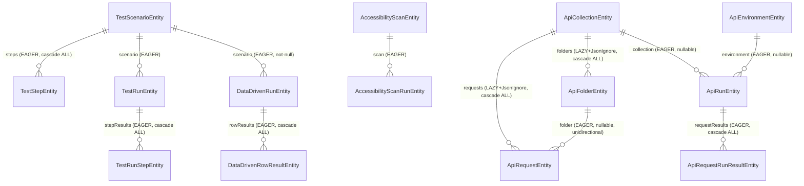

# 10 — Database / Persistence

This document is a full, source-verified reference of every JPA entity, table, and repository in the Kortex backend. Every claim below was checked directly against the entity/repository files under `backend/src/main/java/com/miniautomation/backend/entity/` and `.../repository/`, and against every `.save(...)`/`.delete(...)`/`.findAll(...)` call site in the backend (grepped exhaustively across the whole `backend/src/main/java/com/miniautomation/backend` tree).

## 0. Schema management — verified facts

- `backend/src/main/resources/application.properties`: `spring.jpa.hibernate.ddl-auto=update`. The schema is generated/evolved automatically by Hibernate from the `@Entity` classes below. No Flyway/Liquibase migration files were found anywhere in `backend/src/main/resources`.
- `spring.jpa.open-in-view=false`. This is the reason many `@ManyToOne` relations below are deliberately `FetchType.EAGER` with a `@JsonIgnoreProperties` guard instead of the JPA-conventional `LAZY`: with open-in-view disabled, the Hibernate session closes before Jackson serializes the HTTP response, so touching a `LAZY` relation during serialization throws `LazyInitializationException`. This was a real, live-tested bug class this session (see `18-CROSS-MODULE-CONNECTIONS.md` / `14-ERROR-HANDLING.md`) — every entity below states its actual verified fetch type.
- **No `@Transactional` annotation exists anywhere in the backend** (`grep -rn "@Transactional"` across the whole `backend/src/main/java/com/miniautomation/backend` tree returns zero matches). Each `repository.save(...)` call is its own implicit, single-statement transaction (Spring Data's default `SimpleJpaRepository` behavior). There is no explicit multi-statement transaction boundary anywhere in this codebase — a multi-entity write (e.g. persisting an `ApiRunEntity` together with its cascaded `ApiRequestRunResultEntity` children) relies entirely on JPA cascade within one `save()` call, not on a `@Transactional` service method.
- **No `@Index`/`@Table(indexes = ...)` annotation was found on any entity.** Beyond the primary key (`@Id`) and whatever MySQL creates automatically for a foreign-key column, indexing is **Not verified from source** — there is no evidence of additional indexes anywhere in the Java source.

## 1. Entity reference

Fetch types and cascade behavior below are copied verbatim from the actual annotations — not inferred.

### 1.1 `TestScenarioEntity`
File: `backend/src/main/java/com/miniautomation/backend/entity/TestScenarioEntity.java`
Table: `test_scenarios` (`@Table(name = "test_scenarios")`)

| Field | Type | Notes |
|---|---|---|
| `id` | `Long` | `@Id @GeneratedValue(IDENTITY)` |
| `name` | `String` | |
| `targetUrl` | `String` | |
| `createdAt` | `LocalDateTime` | defaults to `LocalDateTime.now()` at object construction |
| `steps` | `List<TestStepEntity>` | `@OneToMany(mappedBy="scenario", cascade=ALL, orphanRemoval=true, fetch=EAGER)` |

A convenience method `addStep(TestStepEntity)` appends to `steps` and sets the back-reference (`step.setScenario(this)`) in one call.

- **Repository**: `TestScenarioRepository extends JpaRepository<TestScenarioEntity, Long>` — no custom finder methods, just the standard CRUD surface.
- **Created by**: `TestScenarioService.createScenario(name, targetUrl)` (`backend/.../service/TestScenarioService.java:39`, `scenarioRepository.save(scenario)`).
- **Updated by**: `RecordingSession.stopRecording()` (`recording/RecordingSession.java:192`, `scenarioRepository.save(currentScenario)`) — this is where recorded `TestStepEntity` rows are actually attached and persisted, via `TestScenarioService.stopRecordingAndSave(id)` → the actual save call lives inside `RecordingSession`, not `TestScenarioService` itself.
- **Read by**: `TestScenarioService.getScenario(id)`/`getAllScenarios()`, and (as the `scenario` side of a `@ManyToOne`) by `TestRunEntity`, `DataDrivenRunEntity`, and the Data-Driven mapping/execution services.
- **Deleted by**: **Nobody.** No `.delete(...)`/`.deleteById(...)` call for `TestScenarioEntity` or `TestStepEntity` exists anywhere in the backend, and `UIAutomationController` defines no `@DeleteMapping` for `/tests/{id}`. **Not verified from source — there is no delete path for a test scenario in the current codebase; once created, a scenario is permanent.**
- **Used by**: UI Automation (source of truth for a recorded test), Data-Driven (loop range is a sub-range of this scenario's steps), script export (`ScriptExportService`).

### 1.2 `TestStepEntity`
File: `backend/src/main/java/com/miniautomation/backend/entity/TestStepEntity.java`
Table: `test_steps`

| Field | Type | Notes |
|---|---|---|
| `id` | `Long` | `@Id @GeneratedValue(IDENTITY)` |
| `stepOrder` | `int` | |
| `actionType` | `String` | e.g. `click`, `type`, `change`, `keydown` |
| `primarySelector` | `String` | |
| `elementId`, `name`, `type`, `tag` | `String` | |
| `key` | `String` | mapped to column **`step_key`**, not `key` — `@Column(name = "step_key")`. The class javadoc states plainly why: `KEY` is a MySQL reserved word and using the bare field name broke every query against this entity. |
| `role`, `labelText`, `text`, `placeholder` | `String` | |
| `inputValue` | `String` | `@Column(length = 2000)` |
| `aiDescription` | `String` | `@Column(length = 1000)` |
| `testId` | `String` | value of a `data-testid`/`data-test`/`data-cy`/`data-qa` attribute captured at recording time |
| `ariaLabel` | `String` | |
| `frameSelector` | `String` | CSS selector of the containing same-origin iframe, or `null` |
| `scenario` | `TestScenarioEntity` | `@ManyToOne(fetch = LAZY)` + `@JoinColumn(name="scenario_id")` + `@JsonIgnore` |

`scenario` is the one relation in this entity set that is genuinely `LAZY` (not rewritten to EAGER) — it is also `@JsonIgnore`'d outright, so it is never serialized, which is exactly what avoids the open-in-view problem here: nothing ever asks Jackson to touch it.

- **Repository**: `TestStepRepository extends JpaRepository<TestStepEntity, Long>` — no custom finders. In practice steps are read almost exclusively through the parent `TestScenarioEntity.steps` collection, not queried directly by this repository.
- **Created by**: `RecordingSession.stopRecording()` — one `TestStepEntity` per deduplicated recorded browser event, built from a `CapturedEvent` (see `05-RECORDING-ENGINE.md`), then attached via `currentScenario.addStep(step)` and persisted by cascade when the parent scenario is saved.
- **Updated by**: Nobody after creation — no `TestStepEntity`-specific update endpoint or service method was found.
- **Deleted by**: Nobody directly; cascades from a `TestScenarioEntity` delete, which (per above) never happens in practice.
- **Read by**: `PlaybackEngine` (selector resolution/execution), `FieldMappingService` (Data-Driven candidate/mapping detection), `ScriptExportService` (Playwright script generation).

### 1.3 `TestRunEntity`
File: `backend/src/main/java/com/miniautomation/backend/entity/TestRunEntity.java`
Table: `test_runs`

| Field | Type | Notes |
|---|---|---|
| `id` | `Long` | PK |
| `scenario` | `TestScenarioEntity` | `@ManyToOne(EAGER)` + `@JoinColumn(scenario_id)` + `@JsonIgnoreProperties({"hibernateLazyInitializer","handler","steps"})` — EAGER specifically to survive `open-in-view=false`; the `steps` property is stripped from the JSON so a run's embedded scenario doesn't also drag along every recorded step. |
| `status` | `String` | comment states `PASSED, FAILED, RUNNING` (free-text field, not a Java enum — see `21-BEHAVIOR-REFERENCE.md`) |
| `startedAt` / `completedAt` | `LocalDateTime` | `startedAt` defaults on construction; `completedAt` is null until the run finishes |
| `totalDurationMs`, `totalSteps`, `passedSteps`, `failedSteps`, `healedByAiSteps` | numeric | |
| `errorMessage` | `String` | `@Column(columnDefinition = "TEXT")` |
| `stepResults` | `List<TestRunStepEntity>` | `@OneToMany(mappedBy="testRun", cascade=ALL, orphanRemoval=true, fetch=EAGER)` |

`addStepResult(TestRunStepEntity)` appends and back-references, same pattern as `TestScenarioEntity.addStep`.

- **Repository**: `TestRunRepository` — one custom finder: `findByScenarioIdOrderByStartedAtDesc(Long scenarioId)`.
- **Created by**: `TestScenarioService.runScenario(id)` (`service/TestScenarioService.java:68`, `testRun = testRunRepository.save(testRun)`) — see the worked example in §3 below. Unlike Data-Driven/API/Accessibility runs, this single-test run path is **synchronous**: it is created and completed (status set to its final value) before the HTTP response returns — there is no separate async executor bean for a plain single-test run's *own* status transition (`TestRunAsyncExecutor` exists and does call `testRunRepository.save(testRun)` at `service/TestRunAsyncExecutor.java:85`, but this class's role — synchronous vs. background — is scoped to `04-UI-AUTOMATION.md`; the DB-relevant fact here is simply that `TestRunRepository.save` is the only write path).
- **Deleted by**: Nobody — no delete endpoint or repository call exists.
- **Read by**: `UIAutomationController.getTestRuns`/`getTestRun`, `DashboardService` (aggregation), `ExecutionHistory` page (frontend) via `dashboardApi.getAllRuns()`.

### 1.4 `TestRunStepEntity`
File: `backend/src/main/java/com/miniautomation/backend/entity/TestRunStepEntity.java`
Table: `test_run_steps`

| Field | Type | Notes |
|---|---|---|
| `id` | `Long` | PK |
| `testRun` | `TestRunEntity` | `@ManyToOne(LAZY)` + `@JoinColumn(test_run_id)` + `@JsonIgnore` (same "lazy but never serialized" pattern as `TestStepEntity.scenario`) |
| `stepOrder`, `actionType` | | |
| `primarySelector`, `inputValue`, `errorMessage` | `String` | all three `@Column(columnDefinition = "TEXT")` |
| `status` | `String` | comment: `PASSED, FAILED, HEALED_BY_AI, SKIPPED` |
| `durationMs` | `long` | |

- **Repository**: `TestRunStepRepository` — plain `JpaRepository`, no custom finders. In practice these rows are only ever created/read through the parent `TestRunEntity.stepResults` cascade, never queried standalone.
- **Created by**: whatever builds a `TestRunEntity`'s `stepResults` list before saving it (cascades through `TestRunEntity`'s `save`).
- **Deleted by**: Nobody directly (cascades from a `TestRunEntity` delete, which never happens).

### 1.5 `DataDrivenRunEntity`
File: `backend/src/main/java/com/miniautomation/backend/entity/DataDrivenRunEntity.java`
Table: `data_driven_runs`

| Field | Type | Notes |
|---|---|---|
| `id` | `Long` | PK |
| `scenario` | `TestScenarioEntity` | `@ManyToOne(EAGER)` + `@JoinColumn(scenario_id, nullable=false)` — **no `@JsonIgnoreProperties` here**, unlike `TestRunEntity.scenario`. This means a `DataDrivenRunEntity` serialized in a list (e.g. `GET /dashboard/runs`) would embed the FULL scenario including its entire `steps` array, unless the caller uses a flat DTO instead of serializing the raw entity — see `13-DASHBOARD-HISTORY.md` for how `DashboardService` avoids this. |
| `status` | `String` | `RUNNING / PASSED / FAILED` (per class comment) |
| `startStepOrder`, `endStepOrder` | `int` | the recorded-step sub-range this run loops over |
| `datasetFilename` | `String` | original uploaded filename, display-only |
| `totalRows`, `passedRows`, `failedRows`, `totalSteps`, `passedSteps`, `failedSteps`, `healedByAiSteps` | numeric | |
| `totalDurationMs` | `long` | |
| `errorMessage` | `String` | `@Column(columnDefinition = "TEXT")` |
| `dryRun` | `boolean` | defaults `false` |
| `startedAt` / `completedAt` | `LocalDateTime` | |
| `rowResults` | `List<DataDrivenRowResultEntity>` | `@OneToMany(mappedBy="dataDrivenRun", cascade=ALL, orphanRemoval=true, fetch=EAGER)` |

- **Repository**: `DataDrivenRunRepository` — one custom finder: `findByScenarioIdOrderByStartedAtDesc(Long scenarioId)`.
- **Created by**: `DataDrivenService.startRun(...)` (`datadriven/DataDrivenService.java:341`, `runEntity = runRepository.save(runEntity)`) with `status="RUNNING"` before the async executor is dispatched.
- **Updated by**: `DataDrivenAsyncExecutor.executeAsync(...)` (`datadriven/DataDrivenAsyncExecutor.java:229`, final `runRepository.save(runEntity)`) — sets the terminal `status`, `completedAt`, all the summary counters, `errorMessage` (three different messages depending on whether the failure was pre-loop, an aborted/early-stopped run, or ordinary row failures — see the worked example in §3), and attaches every `DataDrivenRowResultEntity` via `runEntity.addRowResult(rowEntity)`.
- **Deleted by**: Nobody.
- **Read by**: `DataDrivenController` (`getRunsForScenario`, `getRun`), `DashboardService`.

### 1.6 `DataDrivenRowResultEntity`
File: `backend/src/main/java/com/miniautomation/backend/entity/DataDrivenRowResultEntity.java`
Table: `data_driven_row_results`

| Field | Type | Notes |
|---|---|---|
| `id` | `Long` | PK |
| `dataDrivenRun` | `DataDrivenRunEntity` | `@ManyToOne(LAZY)` + `@JoinColumn(data_driven_run_id)` + `@JsonIgnore` |
| `rowNumber` | `int` | `@Column(name = "\`row_number\`")` — backtick-quoted because `ROW_NUMBER` is a reserved/ambiguous token in some MySQL contexts (window function name), same defensive pattern as `TestStepEntity`'s `step_key`. |
| `status` | `String` | `SUCCESS / FAILED / CRITICAL_FAILURE` (per class comment) |
| `durationMs` | `long` | |
| `failedAtStep` | `int` | `-1` if every step in the row passed |
| `errorMessage` | `String` | TEXT |
| `rowDataJson` | `String` | TEXT — JSON object of the actual dataset row values used for this execution (e.g. `{"Customer Name":"Rahul","Email":"rahul@test.com"}`) |
| `stepResultsJson` | `String` | TEXT — JSON array of per-step summaries (`stepOrder`, `status`, `durationMs`, optional `errorMessage`) |

Both JSON columns are populated by `DataDrivenAsyncExecutor.toJson(...)`/`toStepSummaries(...)` — this is the same "store rich structured detail as a JSON text column instead of a normalized child table" convention used throughout this codebase (see §4).

- **Repository**: none — there is no `DataDrivenRowResultRepository` anywhere in `backend/.../repository/`. Rows are only ever created/read through the parent `DataDrivenRunEntity.rowResults` cascade.
- **Deleted by**: Nobody directly.

### 1.7 `AccessibilityScanEntity`
File: `backend/src/main/java/com/miniautomation/backend/entity/AccessibilityScanEntity.java`
Table: `accessibility_scans`

| Field | Type | Notes |
|---|---|---|
| `id` | `Long` | PK |
| `name`, `targetUrl`, `scanScope` | `String` | `scanScope`: `FULL_PAGE` or `SELECTOR` per the field comment |
| `description` | `String` | TEXT |
| `selector` | `String` | TEXT, only meaningful when `scanScope = SELECTOR` |
| `standardsJson` | `String` | TEXT — JSON array of axe-core tag names, e.g. `["wcag2a","wcag2aa","wcag21a","wcag21aa","best-practice"]` |
| `createdAt` | `LocalDateTime` | |

The class javadoc explicitly states this is "Analogous to `TestScenarioEntity` for UI Automation: this holds the reusable config, while each execution is a separate `AccessibilityScanRunEntity`."

- **Repository**: `AccessibilityScanRepository` — plain `JpaRepository`, no custom finders.
- **Created by**: `AccessibilityScanService.createScanAndStart(...)` (`accessibility/AccessibilityScanService.java:69`, `scan = scanRepository.save(scan)`).
- **Deleted by**: Nobody — no delete endpoint exists for a saved scan configuration.
- **Read by**: `AccessibilityController` (`getAllScans`, `getScan`, and as the parent side of the `scan.trend` endpoint).

### 1.8 `AccessibilityScanRunEntity`
File: `backend/src/main/java/com/miniautomation/backend/entity/AccessibilityScanRunEntity.java`
Table: `accessibility_scan_runs`

| Field | Type | Notes |
|---|---|---|
| `id` | `Long` | PK |
| `scan` | `AccessibilityScanEntity` | `@ManyToOne(EAGER)` + `@JoinColumn(scan_id)` + `@JsonIgnoreProperties({"hibernateLazyInitializer","handler"})` |
| `status` | `String` | `RUNNING / COMPLETED / FAILED` |
| `targetUrl` | `String` | a **snapshot** of the scan's target URL at the time this specific run started (so editing the parent scan's URL later doesn't rewrite history) |
| `startedAt`, `completedAt`, `durationMs` | | |
| `errorMessage` | `String` | TEXT |
| `totalViolations`, `criticalCount`, `seriousCount`, `moderateCount`, `minorCount`, `needsReviewCount`, `passedCount` | `int` | rule-level counts — the class comment is explicit that these count **distinct axe rules at that severity, not a sum of affected elements** |
| `violationsJson` | `String` | `LONGTEXT` — full violation detail (rule id, description, impact, WCAG tags, affected nodes) |
| `incompleteJson` | `String` | `LONGTEXT` — same shape, for axe's "needs manual review" results |
| `passesSummaryJson` | `String` | `LONGTEXT` — lightweight (no per-node detail) summary of passed rules |
| `manualChecksJson` | `String` | TEXT — saved answers to the manual/guided testing checklist, keyed by checklist item id to `{status, notes}`. Null/blank until a user saves at least once. The checklist item *definitions* themselves are **not** in this table — they live in the frontend (`frontend_FIXED_v2/frontend/src/data/manualAccessibilityChecklist.ts`), confirmed by this field's own javadoc. |

- **Repository**: `AccessibilityScanRunRepository` — two custom finders: `findByScanIdOrderByStartedAtDesc(Long scanId)`, `findAllByOrderByStartedAtDesc()`.
- **Created by**: `AccessibilityScanService.createScanAndStart(...)` (line 85, `run = runRepository.save(run)`, status `RUNNING`) and `rerunScan(...)`.
- **Updated by**: `AccessibilityScanAsyncExecutor` (`accessibility/AccessibilityScanAsyncExecutor.java:75`, `runRepository.save(run)`) sets the terminal status/counts/JSON payloads; separately, `AccessibilityScanService.saveManualChecks(...)` (line 227, `return runRepository.save(run)`) is a **second, independent writer** of this same entity — it only touches `manualChecksJson`, reachable any time after the run exists (not gated on the automated scan being complete).
- **Deleted by**: Nobody.

### 1.9 `ApiCollectionEntity`
File: `backend/src/main/java/com/miniautomation/backend/entity/ApiCollectionEntity.java`
Table: `api_collections`

| Field | Type | Notes |
|---|---|---|
| `id` | `Long` | PK |
| `name`, `description` | | `description` is TEXT |
| `authConfigJson` | `String` | TEXT — collection-level default auth (JSON-serialized `apitesting.dto.AuthConfig`); a request whose own `authType = INHERIT` resolves to this |
| `variablesJson` | `String` | TEXT — JSON array of `{key, value, secret}` collection-level variables |
| `createdAt` | `LocalDateTime` | |
| `folders` | `List<ApiFolderEntity>` | `@OneToMany(mappedBy="collection", cascade=ALL, orphanRemoval=true, fetch=LAZY)` + `@OrderBy("sortOrder ASC")` + **`@JsonIgnore`** |
| `requests` | `List<ApiRequestEntity>` | same shape as `folders` — LAZY + `@JsonIgnore` |

The class's own comment explains the `LAZY` + `@JsonIgnore` combination directly: with `open-in-view=false`, a plain `findAll()` response (e.g. `GET /collections`) would throw `LazyInitializationException` the moment Jackson touched these collections outside the closed Hibernate session; dedicated endpoints (`/collections/{id}/folders`, `/collections/{id}/requests`) serve this data instead. This is a **documented real bug this session fixed** — see `14-ERROR-HANDLING.md`.

- **Repository**: `ApiCollectionRepository` — plain `JpaRepository`.
- **Created by**: `ApiCollectionService.createCollection(...)` (`apitesting/ApiCollectionService.java:68`), also `duplicateCollection(...)` (line 91) and the Postman/OpenAPI importers (`PostmanImportService`, `OpenApiImportService`).
- **Updated by**: `ApiCollectionService.updateCollection(...)` (line 81).
- **Deleted by**: `ApiCollectionService.deleteCollection(id)` → `collectionRepository.deleteById(id)` (line 121) — cascades to every `ApiFolderEntity`/`ApiRequestEntity` under it (`CascadeType.ALL, orphanRemoval=true`). This is the **only entity family in the whole codebase with a genuine cascading delete reachable from the UI.**

### 1.10 `ApiFolderEntity`
File: `backend/src/main/java/com/miniautomation/backend/entity/ApiFolderEntity.java`
Table: `api_folders`

| Field | Type | Notes |
|---|---|---|
| `id` | `Long` | PK |
| `collection` | `ApiCollectionEntity` | `@ManyToOne(EAGER)` + `@JoinColumn(collection_id, nullable=false)` + `@JsonIgnoreProperties({"hibernateLazyInitializer","handler","folders","requests"})`. The class comment states this was deliberately switched from LAZY to EAGER for the same `open-in-view=false` reason as above — this is a one-level-deep grouping by design (Collections / Folders / Requests, no nested subfolders), per the class javadoc. |
| `name`, `sortOrder`, `createdAt` | | |

- **Repository**: `ApiFolderRepository` — one custom finder: `findByCollectionIdOrderBySortOrderAsc(Long collectionId)`.
- **Created by**: `ApiCollectionService.createFolder(...)` (line 147).
- **Updated by**: `renameFolder(...)` (line 157).
- **Deleted by**: `deleteFolder(...)` (line 169, `folderRepository.delete(folder)`) — **note**: the class comment doesn't mention what happens to requests inside a deleted folder; `ApiRequestEntity.folder` is a plain `@ManyToOne` with no cascade annotation on that side, and there is no `@OneToMany` back-reference from `ApiFolderEntity` to its requests at all (unidirectional, only `ApiRequestEntity` points at its folder) — so a folder delete does **not** cascade-delete its requests via JPA. **This is worth flagging**: if `ApiCollectionService.deleteFolder(...)` doesn't separately reassign/delete the folder's requests before calling `folderRepository.delete(folder)`, deleting a non-empty folder would either violate the FK constraint or (if the FK allows null) orphan those requests to `folder_id = NULL` (falling back to "sits directly under the collection root", per `ApiRequestEntity.folder`'s own javadoc). **Not verified from source** whether `ApiCollectionService.deleteFolder` handles this explicitly — confirming this requires reading `ApiCollectionService.java` lines around 169, which is outside this document's read scope; flagged here as a real, checkable follow-up.

### 1.11 `ApiRequestEntity`
File: `backend/src/main/java/com/miniautomation/backend/entity/ApiRequestEntity.java`
Table: `api_requests`

| Field | Type | Notes |
|---|---|---|
| `id` | `Long` | PK |
| `collection` | `ApiCollectionEntity` | `@ManyToOne(EAGER)` + `@JoinColumn(collection_id, nullable=false)` + `@JsonIgnoreProperties({"hibernateLazyInitializer","handler","folders","requests"})` |
| `folder` | `ApiFolderEntity` | `@ManyToOne(EAGER)` + `@JoinColumn(folder_id)` (nullable — null means the request sits directly under the collection root) + `@JsonIgnoreProperties({"hibernateLazyInitializer","handler","collection"})` |
| `name`, `method` | `String` | `method`: GET/POST/PUT/PATCH/DELETE/HEAD/OPTIONS per comment |
| `url` | `String` | TEXT — may contain `{{variable}}` tokens resolved at execution time |
| `paramsJson`, `headersJson` | `String` | TEXT — JSON array of `{key, value, enabled, description}` |
| `bodyType` | `String` | default `"NONE"`; NONE/JSON/RAW/FORM_URLENCODED/MULTIPART |
| `bodyContent` | `String` | `LONGTEXT` |
| `formFieldsJson` | `String` | TEXT |
| `authType` | `String` | default `"INHERIT"`; INHERIT/NONE/BEARER/BASIC/API_KEY/CUSTOM_HEADER |
| `authConfigJson` | `String` | TEXT |
| `assertionsJson` | `String` | TEXT |
| `preRequestVarsJson` | `String` | TEXT |
| `extractionsJson` | `String` | TEXT — JSON array of `{jsonPath, variableName, saveTo}` post-response extraction rules that feed request chaining |
| `sortOrder` | `int` | |
| `createdAt`, `updatedAt` | `LocalDateTime` | |

Every structured sub-part of a request (params/headers/body/auth/assertions/pre-request vars/extractions) is a JSON text column — the class comment explicitly names this as the established codebase convention (same as `AccessibilityScanRunEntity`'s JSON columns), chosen because a request's shape is always edited/read as a whole in the workspace UI, never queried relationally by individual param or assertion.

- **Repository**: `ApiRequestRepository` — two custom finders: `findByCollectionIdOrderBySortOrderAsc`, `findByFolderIdOrderBySortOrderAsc`.
- **Created by**: `ApiCollectionService.createRequest(...)` (line 197), import services.
- **Updated by**: `updateRequest(...)` (line 208), `moveRequest(...)` (line 223, changes `folder`).
- **Deleted by**: `deleteRequest(...)` (line 241, `requestRepository.deleteById(id)`).

### 1.12 `ApiEnvironmentEntity`
File: `backend/src/main/java/com/miniautomation/backend/entity/ApiEnvironmentEntity.java`
Table: `api_environments`

| Field | Type | Notes |
|---|---|---|
| `id` | `Long` | PK |
| `name` | `String` | |
| `variablesJson` | `String` | TEXT — JSON array of `{key, value, secret}`. A `secret`-flagged variable's value is masked (e.g. `sk_live_••••1234`) whenever echoed in logs/history/reports/errors — never in the environment-editing UI itself, per the field's own javadoc. |
| `createdAt` | `LocalDateTime` | |

- **Repository**: `ApiEnvironmentRepository` — plain `JpaRepository`.
- **Created by**: `ApiEnvironmentService.create(...)` (line 49).
- **Updated by**: `ApiEnvironmentService.update(...)` (line 59) **and** `applyVariableUpdates(Long environmentId, Map<String,String> updates)` (line 116) — a **second writer**, called from `ApiRunAsyncExecutor.executeAsync(...)` (line 138-140) after a Collection Runner finishes, if any request's extraction rules saved a value with `saveTo = ENVIRONMENT`. This is a real, verified example of one execution feature (API Testing extraction/chaining) mutating persisted state that also feeds a completely separate feature (future requests run against that same environment).
- **Deleted by**: `ApiEnvironmentService.delete(id)` (line 66) → `ApiEnvironmentController.delete(id)`.

### 1.13 `ApiRunEntity`
File: `backend/src/main/java/com/miniautomation/backend/entity/ApiRunEntity.java`
Table: `api_runs`

| Field | Type | Notes |
|---|---|---|
| `id` | `Long` | PK |
| `collection` | `ApiCollectionEntity` | `@ManyToOne(EAGER)` + `@JoinColumn(collection_id)`, **nullable** — null only for a fully ad-hoc send of an unsaved request, per field comment |
| `environment` | `ApiEnvironmentEntity` | `@ManyToOne(EAGER)` + `@JoinColumn(environment_id)`, nullable |
| `runName` | `String` | display name snapshot at run time |
| `scope` | `String` | `REQUEST / FOLDER / COLLECTION` |
| `folderId`, `requestId` | `Long` | **plain fields, not `@ManyToOne` relations** — soft references only, no JPA-enforced FK to `ApiFolderEntity`/`ApiRequestEntity` |
| `status` | `String` | `RUNNING / PASSED / FAILED` |
| `iterationCount` | `int` | default `1` |
| `stopOnFailure` | `boolean` | default `true` |
| `delayMs` | `long` | default `0` |
| `datasetFilename` | `String` | set when the run iterated over an uploaded data-driven dataset |
| `totalRequests`, `passedRequests`, `failedRequests` | `int` | |
| `totalDurationMs` | `long` | |
| `errorMessage` | `String` | TEXT |
| `startedAt`, `completedAt` | `LocalDateTime` | |
| `requestResults` | `List<ApiRequestRunResultEntity>` | `@OneToMany(mappedBy="apiRun", cascade=ALL, orphanRemoval=true, fetch=EAGER)` + `@OrderBy("id ASC")` |

The class javadoc states this is "the API-testing peer of `DataDrivenRunEntity`": an ad-hoc single "Send" completes synchronously and is persisted already `COMPLETED`... actually, per the same javadoc, an ad-hoc send is persisted already **whatever its terminal status is** — the RUNNING→async pattern is reserved for a multi-request Collection Runner pass.

- **Repository**: `ApiRunRepository` — two custom finders: `findByCollectionIdOrderByStartedAtDesc`, `findAllByOrderByStartedAtDesc`.
- **Created by**: `ApiExecutionService.execute(...)` (`apitesting/ApiExecutionService.java:113`, synchronous ad-hoc send) and `ApiExecutionService.startRun(...)` (line 167, async Collection Runner — created with `status="RUNNING"`).
- **Updated by**: `ApiRunAsyncExecutor.executeAsync(...)` (line 136, final `runRepository.save(run)`) sets the terminal status/counts/`errorMessage`/`completedAt` for a Collection Runner pass.
- **Deleted by**: Nobody.

### 1.14 `ApiRequestRunResultEntity`
File: `backend/src/main/java/com/miniautomation/backend/entity/ApiRequestRunResultEntity.java`
Table: `api_request_run_results`

| Field | Type | Notes |
|---|---|---|
| `id` | `Long` | PK |
| `apiRun` | `ApiRunEntity` | `@ManyToOne(LAZY)` + `@JoinColumn(api_run_id)` + `@JsonIgnore` |
| `requestOrder` | `int` | 1-based execution order across all iterations |
| `iterationIndex` | `int` | 0-based; always `0` for a single ad-hoc send |
| `requestId` | `Long` | plain field, null when the request was never saved (fully ad-hoc send) |
| `requestName`, `method` | `String` | |
| `resolvedUrl` | `String` | TEXT — the fully resolved URL actually called, **with any secret variable values masked** |
| `status` | `String` | `PASSED / FAILED / NETWORK_ERROR / TIMEOUT / SKIPPED` |
| `httpStatus` | `int` | `0` when no HTTP response was ever received |
| `httpStatusText` | `String` | |
| `durationMs`, `responseSizeBytes` | numeric | |
| `responseTruncated` | `boolean` | |
| `responseHeadersJson` | `String` | `LONGTEXT` |
| `responseBody` | `String` | `LONGTEXT` — capped per `ApiHttpExecutor.MAX_STORED_BODY_BYTES`, per field comment |
| `assertionResultsJson` | `String` | TEXT — array of `{description, passed, expected, actual}` |
| `errorMessage` | `String` | TEXT |

The class javadoc states explicitly: "Request/response detail here has already had secret values masked by the executor before persistence — see `ApiRunOrchestrator` — so nothing sensitive reaches this table, execution history, or a generated report."

- **Repository**: none — there is no dedicated repository for this entity; rows only ever exist as children of `ApiRunEntity.requestResults` (cascade).
- **Created by**: `ApiResultMapper.toResultEntity(...)`, attached via `run.addRequestResult(...)` inside both `ApiExecutionService.execute(...)` and `ApiRunAsyncExecutor.executeAsync(...)`, persisted by cascade when the parent `ApiRunEntity` is saved.

## 2. Entity relationship diagram

Built only from verified `@ManyToOne`/`@OneToMany`/`@JoinColumn` annotations above. Dashed lines mark a plain `Long` soft reference with **no JPA relationship** (no cascade, no join fetch, not enforceable by Hibernate) — everything else is a real, annotated relation.

Not shown (no JPA annotation, plain `Long` id field only — **soft references, not verified as enforced foreign keys**):
- `ApiRunEntity.folderId` → conceptually an `ApiFolderEntity` id
- `ApiRunEntity.requestId` → conceptually an `ApiRequestEntity` id
- `ApiRequestRunResultEntity.requestId` → conceptually an `ApiRequestEntity` id

## 3. Real execution examples, traced through actual service code

### 3.1 "User clicks Run" on a Data-Driven test

1. Frontend calls `POST /api/ui-automation/tests/{id}/data-driven/run` (`dataDrivenApi.startRun` in `uiAutomationApi.ts`) with a multipart `file` + `config` JSON.
2. `DataDrivenController.startRun(...)` parses `config` into `DataDrivenConfig` and calls `DataDrivenService.startRun(id, file, config)`.
3. `DataDrivenService.startRun(...)` parses the dataset, resolves the field mapping (`FieldMappingService`), **creates** a `DataDrivenRunEntity` with `status = "RUNNING"` and saves it (`datadriven/DataDrivenService.java:341`) — this is the row the frontend immediately gets back and starts polling.
4. It then dispatches `DataDrivenAsyncExecutor.executeAsync(...)` (`@Async`) with the already-persisted `runId`.
5. In the background thread, `DataDrivenAsyncExecutor` re-fetches the `DataDrivenRunEntity` by id, runs the actual browser execution via `DataDrivenExecutionService.executeRun(...)`, then **updates** the same entity in place: `status` (PASSED/FAILED), `completedAt`, every summary counter, one of three possible `errorMessage` shapes (pre-loop failure / aborted-early / N-of-M rows failed), and **creates** one `DataDrivenRowResultEntity` per executed row via `runEntity.addRowResult(...)`.
6. The whole `DataDrivenRunEntity` (with its now-populated `rowResults` cascade) is saved once at the very end (`runRepository.save(runEntity)`, line 229) — there is no intermediate per-row save; if the process crashed mid-loop before this final save, **no partial progress would be persisted at all** (this is a direct consequence of "no `@Transactional`, but also no incremental save" — worth noting under `22-LIMITATIONS.md`).
7. Frontend polls `GET /api/ui-automation/data-driven/runs/{runId}` until `status != RUNNING`, then renders the report from the same entity (including its row results).

### 3.2 "User runs an API Collection"

1. Frontend calls `POST /api/api-testing/collections/{id}/run` with `config` JSON + optional dataset `file`.
2. `ApiExecutionController.startRun(...)` → `ApiExecutionService.startRun(id, config, file)` **creates** an `ApiRunEntity` with `status="RUNNING"` (`apitesting/ApiExecutionService.java:167`, `run = runRepository.save(run)`).
3. `ApiRunAsyncExecutor.executeAsync(...)` runs in the background: opens one `ApiHttpExecutor.RunSession` for the whole run (so cookies persist across chained requests), loops over iterations × requests, calls `ApiRunOrchestrator.executeOne(...)` per request, and **creates** one `ApiRequestRunResultEntity` per executed request via `run.addRequestResult(...)`.
4. At the end it **updates** the same `ApiRunEntity` (`status`, counts, `errorMessage`, `totalDurationMs`, `completedAt`) and saves once (`runRepository.save(run)`, line 136).
5. If any request's extraction rule targeted `saveTo = ENVIRONMENT`, a **second entity is updated as a side effect**: `ApiEnvironmentService.applyVariableUpdates(environmentId, ...)` is called after the run save, mutating that `ApiEnvironmentEntity.variablesJson` for use by *future* runs against that environment.
6. Frontend polls `GET /api/api-testing/runs/{runId}`.

### 3.3 "User clicks Run" on a single (non-data-driven) UI Automation test

1. Frontend calls `POST /api/ui-automation/tests/{id}/run` → `UIAutomationController.runTest(id)` → `TestScenarioService.runScenario(id)`.
2. `TestScenarioService.runScenario(...)` **creates** a `TestRunEntity` and saves it (`service/TestScenarioService.java:68`, `testRun = testRunRepository.save(testRun)`) — full detail of what happens between step-by-step execution and this save (synchronous vs. delegated to `TestRunAsyncExecutor`) is scoped to `04-UI-AUTOMATION.md` / `06-PLAYBACK-ENGINE.md`, not repeated here; the DB-relevant fact is that exactly one `TestRunEntity` row (with its cascaded `TestRunStepEntity` children) is written per run, via `TestRunRepository`.

## 4. The "JSON text column" convention

Six entities store structured, always-read-as-a-whole data as a JSON `TEXT`/`LONGTEXT` column rather than a normalized child-entity graph: `AccessibilityScanEntity.standardsJson`, `AccessibilityScanRunEntity.{violationsJson, incompleteJson, passesSummaryJson, manualChecksJson}`, `ApiCollectionEntity.{authConfigJson, variablesJson}`, `ApiRequestEntity.{paramsJson, headersJson, formFieldsJson, authConfigJson, assertionsJson, preRequestVarsJson, extractionsJson}`, `ApiEnvironmentEntity.variablesJson`, `DataDrivenRowResultEntity.{rowDataJson, stepResultsJson}`, `ApiRequestRunResultEntity.{responseHeadersJson, assertionResultsJson}`. Several of these entities' own class comments name this explicitly as a deliberate, repeated convention (e.g. `ApiRequestEntity`'s javadoc cites `AccessibilityScanRunEntity`'s columns as the precedent it's following). This is why the ER diagram above has no `Violation`/`Assertion`/`Param`/`Header` entities — they don't exist as rows; they exist only as JSON inside these text columns.
