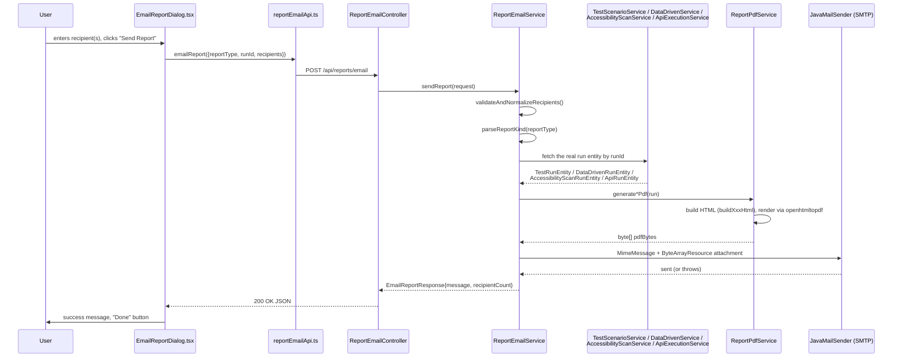

# PDF Generation & Email Reporting

This document explains, end to end, how a finished execution/scan turns into a PDF and how that PDF is emailed. Every claim below was verified against the actual source listed next to it.

Primary source files:
- `backend/src/main/java/com/miniautomation/backend/report/ReportPdfService.java`
- `backend/src/main/java/com/miniautomation/backend/report/ReportEmailService.java`
- `backend/src/main/java/com/miniautomation/backend/report/EmailReportRequest.java`
- `backend/src/main/java/com/miniautomation/backend/report/EmailReportResponse.java`
- `backend/src/main/java/com/miniautomation/backend/report/ReportEmailException.java`
- `backend/src/main/java/com/miniautomation/backend/report/ReportEmailDeliveryException.java`
- `backend/src/main/java/com/miniautomation/backend/controller/ReportEmailController.java`
- `backend/src/main/resources/application.properties` (mail config keys)
- `frontend_FIXED_v2/frontend/src/services/reportEmailApi.ts`
- `frontend_FIXED_v2/frontend/src/components/EmailReportButton.tsx`
- `frontend_FIXED_v2/frontend/src/components/EmailReportDialog.tsx`
- Tests: `backend/src/test/java/com/miniautomation/backend/report/ReportPdfServiceTest.java`, `ReportEmailServiceTest.java`

---

## 1. There is no "Download PDF" feature — only "Email Report"

This is important and easy to assume incorrectly: Kortex has **one** report-delivery action, `Email Report`, which generates a PDF in memory and immediately attaches it to an outgoing email. There is no endpoint that returns raw PDF bytes to the browser for a local download, and no persisted PDF file on disk.

Verified by:
- `ReportEmailController` exposes exactly one endpoint: `POST /api/reports/email`, returning `EmailReportResponse` (a JSON success message + recipient count), never PDF bytes.
- `reportEmailApi.ts` has exactly one function, `emailReport()`, calling that one endpoint.
- Nothing in `ReportPdfService` writes to disk — `renderHtmlToPdf()` returns a `byte[]` built entirely in an in-memory `ByteArrayOutputStream`, and `ReportEmailService.sendEmail()` attaches that `byte[]` directly via `ByteArrayResource` — the PDF only ever exists as request-scoped memory. It is generated fresh on every "Email Report" click and discarded after the email send completes.

## 2. Complete lifecycle: click → PDF → email

## 3. Which report type maps to which data and PDF method

`ReportEmailService` has a private `ReportKind` enum with exactly **four** values: `STANDARD`, `DATA_DRIVEN`, `ACCESSIBILITY`, `API_TESTING`. `sendReport()` switches on it:

| `reportType` string | Entity fetched via | `ReportPdfService` method | PDF filename pattern |
|---|---|---|---|
| `STANDARD` | `TestScenarioService.getTestRun(runId)` → `TestRunEntity` | `generateStandardRunPdf(TestRunEntity)` | `Kortex-UI-Automation-Report-Run-{id}.pdf` |
| `DATA_DRIVEN` | `DataDrivenService.getRun(runId)` → `DataDrivenRunEntity` | `generateDataDrivenRunPdf(DataDrivenRunEntity)` | `Kortex-Data-Driven-Report-Run-{id}.pdf` |
| `ACCESSIBILITY` | `AccessibilityScanService.getRun(runId)` → `AccessibilityScanRunEntity` | `generateAccessibilityRunPdf(AccessibilityScanRunEntity)` | `Kortex-Accessibility-Report-Run-{id}.pdf` |
| `API_TESTING` | `ApiExecutionService.getRun(runId)` → `ApiRunEntity` | `generateApiRunPdf(ApiRunEntity)` | `Kortex-API-Test-Report-Run-{id}.pdf` |

`reportType` is matched case-insensitively (`ReportKind.valueOf(reportType.trim().toUpperCase())`), confirmed by `ReportEmailServiceTest.sendReport_reportTypeIsCaseInsensitive`. An unrecognized value throws `ReportEmailException` ("Unsupported report type: …"), mapped to HTTP 400.

Frontend side: `EmailReportButton`/`EmailReportDialog` take a `reportType: EmailReportType` prop, where `EmailReportType = 'STANDARD' | 'DATA_DRIVEN' | 'ACCESSIBILITY' | 'API_TESTING'` (`types/index.ts:356`). `EmailReportButton` is rendered on all four report pages: `TestReport.tsx`, `DataDrivenReport.tsx`, `AccessibilityReport.tsx`, `ApiRunReport.tsx`, and also in `ApiWorkspace.tsx`.

> ⚠️ **INCONSISTENCY (comments only, not behavior):** Several comments describe this as a 3-report-type feature, stale from before API Testing reporting was added:
> - `ReportEmailController`'s class javadoc: "shared by all three testing capabilities (UI Automation, Data Driven, Accessibility)".
> - `reportEmailApi.ts`'s comment: "Shared by all three report pages (UI Automation, Data Driven, Accessibility)".
> - `EmailReportRequest.java`'s field comment: `/** "STANDARD" | "DATA_DRIVEN" | "ACCESSIBILITY" */`.
>
> The actual code (the `ReportKind` enum, the `switch`, the frontend's `EmailReportType` union, and its use in `ApiRunReport.tsx`/`ApiWorkspace.tsx`) all correctly support a fourth type, `API_TESTING`. Only the prose comments are out of date — there is no functional bug here.

## 4. PDF generation internals (`ReportPdfService`)

### 4.1 Rendering pipeline

- **Library:** [openhtmltopdf](https://github.com/danfickle/openhtmltopdf) (`com.openhtmltopdf.pdfboxout.PdfRendererBuilder`, confirmed via the import and `pom.xml`'s dependency on `openhtmltopdf-pdfbox`/`openhtmltopdf-core`). The service builds a complete HTML document as a Java `String` (inline `<style>` + hand-built HTML fragments), then hands it to `PdfRendererBuilder.withHtmlContent(...)`. No PDFBox is used directly for layout — only via openhtmltopdf's PDF-output backend.
- **Entry points** (`ReportPdfService`, all `public`): `generateStandardRunPdf(TestRunEntity)`, `generateDataDrivenRunPdf(DataDrivenRunEntity)`, `generateAccessibilityRunPdf(AccessibilityScanRunEntity)`, `generateApiRunPdf(ApiRunEntity)`. Each delegates to a private `buildXxxHtml(...)` method that returns the full HTML string, then to the shared `renderHtmlToPdf(String html)`.
- **`renderHtmlToPdf(String html)`**: registers the bundled Roboto font once via `builder.useFont(...)`, writes to a `ByteArrayOutputStream`, calls `builder.run()`, returns `out.toByteArray()`. Any failure (bad HTML, font load failure, etc.) is wrapped and rethrown as `ReportEmailDeliveryException`.

### 4.2 Fonts and branding — lazy, cached, once per JVM

- `FONT_RESOURCE = "fonts/Roboto-Regular.ttf"` and `LOGO_RESOURCE = "branding/kortex_logo_small.png"` are read from the classpath (`backend/src/main/resources/fonts/Roboto-Regular.ttf`, `backend/src/main/resources/branding/kortex_logo_small.png`).
- Both are cached in `static volatile` fields (`cachedFontBytes`, `cachedLogoDataUri`), populated lazily on first use (not a static initializer), so a missing/corrupt resource degrades gracefully — a missing logo silently produces a text-only header (`logoDataUri()` returns `null` on any exception, and `htmlShell()` skips the `` tag entirely when `logo == null`), rather than failing the whole report.
- Only one font weight is registered (`400`, i.e. regular) — there is no separate bold `.ttf` bundled. CSS `font-weight:700` in the stylesheet still renders as a synthetic bold; the code comment explicitly notes registering the same bytes a second time at weight 700 would have doubled the embedded-font size in every PDF for no visual gain.
- The logo is embedded as a base64 `data:image/png;base64,...` URI directly in the HTML — confirmed 160×160px, chosen specifically to avoid the cost of decoding the app's much larger (1254×1254, ~936KB) favicon-sized PNG on every single "Email Report" click (see the field's doc comment).

### 4.3 A real openhtmltopdf CSS limitation this code works around

`apiRequestBlock()`'s comment states plainly that `word-break: break-all` is **not supported** by openhtmltopdf (confirmed via a build-time "unrecognized CSS property" warning the author observed) and was removed. A long resolved URL in an API Testing report instead wraps only at existing `/` and `?` characters — acceptable for realistic URLs, but a single unbroken long string (no separators) would not wrap and could overflow the page width. This is the only documented CSS-engine limitation in this file; no other unsupported-property workaround is called out in the source.

### 4.4 What each report type includes

All four report types share the same visual shell (`htmlShell()`): a full-bleed header band (Kortex logo + wordmark + tagline, report-type eyebrow/title), an info bar with a colored status chip, one or more four-up "summary card" grids, a results section specific to the report type, a two-panel "Test Information" / "Result" footer, and a full-bleed dark closing band. Real page numbers ("Page X of Y") come from a CSS `@page { @bottom-center { content: "... counter(page) ... counter(pages)" } }` rule, not from any Java-side pagination logic.

- **`buildStandardRunHtml(TestRunEntity)`** — UI Automation run. Summary cards: Status, Started, Duration, "Steps Passed" (`passedSteps / totalSteps`). Main table: one row per `TestRunStepEntity` in `run.getStepResults()`, each row's "Step Name" column built by `describeStep()` (see §4.5) rather than the raw selector. Failed steps get a red row + an expanded error row underneath. A "Technical Reference" appendix (raw selector + value per step) is appended only if at least one step has selector/value detail (`technicalAppendixForStandard()`).
- **`buildDataDrivenRunHtml(DataDrivenRunEntity)`** — Data-Driven run. Extra summary card: "Data Source" (dataset filename) and "Rows Passed" with a computed pass rate (`passedRows*100/totalRows`, `0` when `totalRows` is `0`). One `.row-block` card per `DataDrivenRowResultEntity` in `run.getRowResults()`: shows the row's input data (parsed from `row.getRowDataJson()` as a `Map<String,Object>`, rendered as key:value chips), then a nested step-results table (parsed from `row.getStepResultsJson()` as `List<Map<String,Object>>`), then a row-level error box if `row.getErrorMessage()` is set.
- **`buildAccessibilityRunHtml(AccessibilityScanRunEntity)`** — Accessibility scan. Two summary-card rows: overall Status/Started/Duration/Violations, then a Critical/Serious/Moderate/Minor/Needs-Review/Passed breakdown (six of `AccessibilityScanRunEntity`'s own severity-count fields, verbatim). If the scan completed, includes:
  - A **WCAG Conformance Summary** table (see §4.6) — one row per WCAG Success Criterion this app can scan for.
  - "Violations (N)" — one `findingBlock()` per parsed `RuleFindingDto` from `run.getViolationsJson()`.
  - "Needs Review (N)" — same, from `run.getIncompleteJson()`.
  - "Passed Checks (N)" — a plain table (rule id, description, elements checked) from `run.getPassesSummaryJson()` parsed as `List<PassSummaryDto>`.
  - If the scan did **not** complete, none of the above sections render — only the status chip and an error box (`run.getErrorMessage()`).
- **`buildApiRunHtml(ApiRunEntity)`** — API Testing run. Summary cards: Status/Started/Duration/Requests (first row), Passed/Failed/Iterations/Scope (second row — "Iterations" shows a "Data-driven" subtitle when `run.getDatasetFilename()` is set). One `apiRequestBlock()` per `ApiRequestRunResultEntity` in `run.getRequestResults()`, each showing: a status badge (`apiStatusBadge()`), method + request name, duration, HTTP status (only if `httpStatus > 0`), iteration index (only shown when `run.getIterationCount() > 1` or a dataset was used), the **resolved URL**, a network-error message if `httpStatus == 0` and an error is set, and every parsed `AssertionResult` (from `assertionResultsJson`) with a colored pass/fail dot and, for a failure, the expected vs. actual value.

### 4.5 Human-readable step naming (never raw selectors in the main table)

`describeStep(TestStepEntity meta, String actionType)` builds phrases like "Enter Username", "Click Sign In", "Select Country", "Press Enter" from the step's **originally recorded** metadata — never from `TestRunStepEntity` (the per-run result row), which carries no label/placeholder/role data itself. The lookup path: `stepMetadataByOrder(scenario)` builds a `Map<Integer, TestStepEntity>` keyed by `stepOrder` from `TestScenarioEntity.getSteps()` (EAGER-fetched, so this is query-free), and each result row is matched back to its original recorded step by `stepOrder`.

`elementName(TestStepEntity meta)` picks the first non-blank of: `labelText`, `ariaLabel`, `placeholder`, `text` — then falls back to a "prettified" form of the HTML `name` attribute or `elementId` (`prettifyIdentifier()` turns `"txtUserId"` into `"Txt User Id"`, keeping short all-caps acronyms like `"ID"`/`"URL"`/`"OTP"` as-is). If `meta` is `null` (a scenario edited/deleted since the run, or a stepOrder that no longer matches), every branch of `describeStep()` degrades to a generic phrase (e.g. "Enter a value", "Click") — it never surfaces a raw CSS selector in the main table. Raw selector + value detail is preserved, not discarded — it moves to the "Technical Reference" appendix (standard runs only; Data-Driven and API Testing reports have no equivalent appendix — **not verified whether this is intentional or simply not yet built**, the source gives no comment either way for those two report types).

### 4.6 WCAG Conformance Summary — a real, source-computed rollup

`wcagConformanceSection()` (Accessibility reports only) is **not** a static template — it is computed per-report from the run's own violation/incomplete/pass data:

1. A static `WCAG_SC_REFERENCE` map (`wcagXXX` axe-core tag → human "1.4.3 Contrast, Minimum (AA)"-style label) covers WCAG 2.0 + 2.1 Level A and AA criteria — the same scope the scan options themselves cover (comment cross-references `AccessibilityScanService.resolveAxeTags`). AAA is out of scope.
2. For each Success Criterion in that reference table, `collectWcagTags()` checks whether any violation/incomplete/pass finding in this run carries that tag, with an explicit precedence: a real **violation** ("Does Not Support") always wins over a **needs-review** flag, which always wins over a clean **pass** ("Supports") — never letting an unrelated passing rule hide a known failure for the same criterion. A criterion with no matching finding at all is "Not Evaluated".
3. The report body explicitly states this is the tool's **own** rollup, "not an official VPAT/ACR filing" — this framing exists verbatim in the generated HTML, not just in code comments.

### 4.7 Sensitive-data masking in API Testing PDFs

`ReportPdfService` does not perform any masking itself — it renders whatever `ApiRequestRunResultEntity` already contains. Per the API Testing execution engine (`ApiRunOrchestrator`, documented in `09-API-TESTING.md`), auth credential values are masked (`"••••••••"`) **before** being persisted to the entity — masking happens at execution/persistence time, not at report-render time. Confirmed indirectly: `apiRequestBlock()` prints `r.getResolvedUrl()` and `r.getErrorMessage()` verbatim with no masking logic anywhere in `ReportPdfService`, meaning the PDF is only as safe as what was already stored — there is no second, independent masking layer at the reporting stage. If a future change to the execution engine ever stored an unmasked secret, this reporting code would faithfully reproduce it in the PDF with no safety net.

## 5. Email delivery internals (`ReportEmailService`)

### 5.1 Recipient validation

`validateAndNormalizeRecipients()`:
- Rejects an empty/null recipient list with `ReportEmailException`.
- Validates each entry with `jakarta.mail.internet.InternetAddress(...).validate()` — a real RFC-address syntax check, not just a regex. An invalid entry throws `ReportEmailException` naming the exact bad address.
- Deduplicates via a `LinkedHashSet<String>` (preserves first-seen order, drops exact duplicates).
- Caps at `MAX_RECIPIENTS = 20` — more than 20 normalized recipients throws `ReportEmailException`.

The frontend (`EmailReportDialog.tsx`) does a **fast, client-side-only** format pre-check (`EMAIL_FORMAT` regex) purely for immediate UI feedback; its own comment states the backend's `InternetAddress`-based check is the authoritative one.

### 5.2 SMTP mechanics

- Uses Spring's `JavaMailSender` (`org.springframework.mail.javamail.JavaMailSender`), auto-configured by Spring Boot from `spring.mail.*` properties.
- `sendEmail()` builds a `MimeMessage` via `MimeMessageHelper(message, true)` (the `true` enables multipart, required for an attachment), sets `to`/`from`/`subject`, a fixed plain-text body ("Attached is the automated execution report generated by Kortex. … This is an automated message …"), and attaches the PDF via `helper.addAttachment(filename, new ByteArrayResource(pdfBytes))`.
- **Not configured → clear error, never a silent failure or a stack trace leak:** before attempting to send, `sendEmail()` checks `mailHost`/`fromAddress` (bound from `${spring.mail.host:}` / `${mini.automation.mail.from:${spring.mail.username:}}`); if either is blank, it throws `ReportEmailDeliveryException` with an explicit message naming the three environment variables to set.
- Any other SMTP-layer exception (auth failure, connection timeout, etc.) is caught and rethrown as `ReportEmailDeliveryException("The PDF report was generated, but sending the email failed: " + e.getMessage(), e)` — the message is deliberately worded to make clear PDF generation succeeded and only the send failed.

### 5.3 Error taxonomy and HTTP mapping

| Exception | Thrown when | HTTP status (via `GlobalExceptionHandler`) |
|---|---|---|
| `ReportEmailException` | Invalid **request**: no/invalid recipients, too many recipients, missing `runId`, unrecognized `reportType` | 400 (explicit handler, `GlobalExceptionHandler.handleReportEmailException`) |
| `ReportEmailDeliveryException` | Request was valid but **fulfillment** failed: font/resource load failure, PDF render failure, mail not configured, or SMTP send failure | **Not explicitly handled** — falls through to the generic `RuntimeException` handler, returning HTTP 500 with the exception's own message. Confirmed by reading `GlobalExceptionHandler` in full: there is no `@ExceptionHandler(ReportEmailDeliveryException.class)`; its own class javadoc explicitly states this is intentional ("intentionally NOT handled here — it falls through to the generic RuntimeException handler … which already returns 500 with its message intact"). |
| Underlying run-not-found exception (from `TestScenarioService`/`DataDrivenService`/`AccessibilityScanService`/`ApiExecutionService`) | `runId` doesn't correspond to a real run for the requested `reportType` | Propagates as whatever `RuntimeException` those services throw — falls through to the same generic 500 handler. Confirmed by `ReportEmailServiceTest.sendReport_whenRunNotFound_propagatesTheUnderlyingServiceException`. |

### 5.4 Response shape

`EmailReportResponse` (JSON): `{ "message": string, "recipientCount": number }`. `message` is built server-side, e.g. `"Report sent to 2 recipients."` — the frontend dialog displays this string verbatim as the success message, it does not construct its own.

## 6. Configuration (key names only — see `15-CONFIGURATION.md` for the full picture)

From `backend/src/main/resources/application.properties` (lines ~39–60):

| Property | Bound Java field / env var | Default |
|---|---|---|
| `spring.mail.host` | `ReportEmailService.mailHost` | `${MINI_AUTOMATION_MAIL_HOST:}` — empty if unset |
| `spring.mail.port` | (Spring Boot auto-config) | `${MINI_AUTOMATION_MAIL_PORT:587}` |
| `spring.mail.username` | (Spring Boot auto-config) | `${MINI_AUTOMATION_MAIL_USERNAME:}` |
| `spring.mail.password` | (Spring Boot auto-config) | `${MINI_AUTOMATION_MAIL_PASSWORD:}` |
| `spring.mail.properties.mail.smtp.auth` | (Spring Boot auto-config) | `true` (hardcoded) |
| `spring.mail.properties.mail.smtp.starttls.enable` | (Spring Boot auto-config) | `true` (hardcoded) |
| `spring.mail.properties.mail.smtp.connectiontimeout` / `.timeout` | (Spring Boot auto-config) | `8000` ms (hardcoded) |
| `mini.automation.mail.from` | `ReportEmailService.fromAddress` | `${MINI_AUTOMATION_MAIL_FROM:${MINI_AUTOMATION_MAIL_USERNAME:}}` — falls back to the username if not set separately |

No actual credential value is present in this documentation or was echoed from the properties file — only key names, exactly as the source rules require. Leaving `MINI_AUTOMATION_MAIL_HOST`/`MINI_AUTOMATION_MAIL_USERNAME`/`MINI_AUTOMATION_MAIL_PASSWORD` unset is a supported, intentional "email disabled" state (confirmed by the explicit blank-check in `sendEmail()` and the properties file's own comment: "Leave the environment variables unset to leave email disabled").

## 7. Test coverage observed

`ReportPdfServiceTest.java` (11 tests) covers: a standard run PDF actually containing the real step/error data and being byte-valid; Kortex branding (not a stale old product name); human-readable step names never leaking raw selectors; a run with zero steps still producing a valid PDF; Data-Driven PDFs surviving unparseable row/step JSON without throwing; Accessibility PDFs escaping embedded HTML from a violation's captured `node.html` and correctly rolling up WCAG tags; a failed scan showing only the error (no violation sections); and an API Testing PDF containing real request/assertion detail, including the network-error-shows-message-not-status-code case.

`ReportEmailServiceTest.java` (16 tests) covers: every recipient-validation edge case (empty, null, one bad address among good ones, over the cap, dedup+trim); missing `runId`; unknown/case-insensitive `reportType`; each of the STANDARD/DATA_DRIVEN/ACCESSIBILITY kinds fetching via the right service and generating the right PDF method; the attachment/addressing mechanics; mail-not-configured, PDF-generation-failure, and SMTP-failure error paths; and run-not-found propagation.

> ⚠️ **Observation (not a bug):** no test in `ReportEmailServiceTest.java` explicitly exercises the `API_TESTING` kind's `sendReport()` switch branch by name (no `sendReport_apiTestingKind_...` test), even though `apiExecutionService` is wired into the test's constructor setup. The other three kinds each have a dedicated test; API Testing does not. This is a test-coverage gap, not a functional gap — the production `switch` branch for `API_TESTING` is identical in shape to the other three and is exercised by `ReportPdfServiceTest.generateApiRunPdf_*` at the PDF layer, just not through `ReportEmailService.sendReport()` itself.
