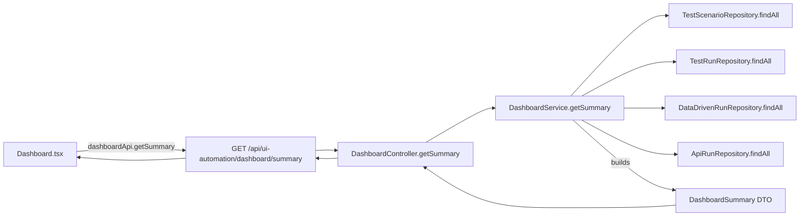
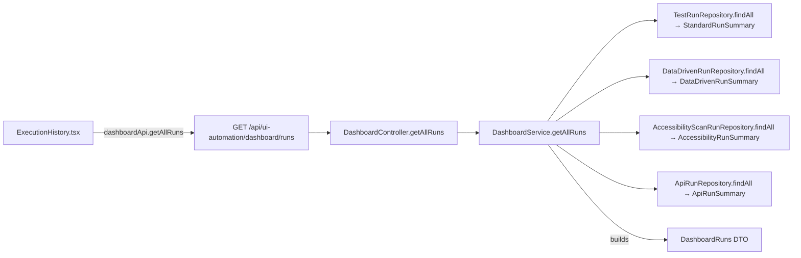
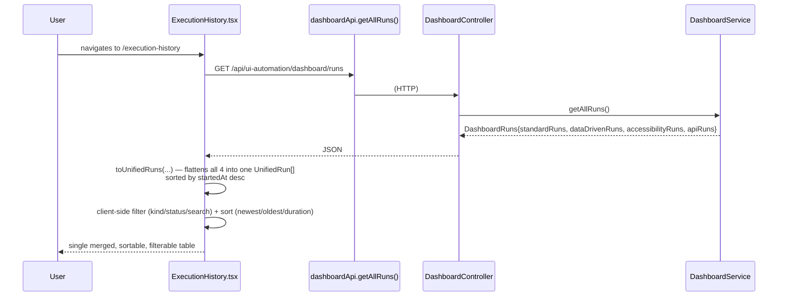

# Dashboard & Execution History

This document traces every metric shown on the Dashboard page and the Execution History page back to its exact source. It also documents two real, source-verified gaps between what the backend computes and what the frontend actually displays — flagged explicitly per the documentation's cross-verification requirement, not silently glossed over.

Primary source files:
- `backend/src/main/java/com/miniautomation/backend/service/DashboardService.java`
- `backend/src/main/java/com/miniautomation/backend/controller/DashboardController.java`
- `backend/src/test/java/com/miniautomation/backend/service/DashboardServiceTest.java`
- `frontend_FIXED_v2/frontend/src/pages/Dashboard.tsx`
- `frontend_FIXED_v2/frontend/src/pages/ExecutionHistory.tsx`
- `frontend_FIXED_v2/frontend/src/services/uiAutomationApi.ts` (`dashboardApi`)
- `frontend_FIXED_v2/frontend/src/components/StatCard.tsx`, `DonutChart.tsx`
- `backend/src/main/java/com/miniautomation/backend/controller/AccessibilityController.java` (separate accessibility dashboard endpoint)

---

## 1. Two backend endpoints, one controller

`DashboardController` (`@RequestMapping("/api/ui-automation")`) exposes exactly two `GET`-only, side-effect-free endpoints, both delegating straight to `DashboardService`:

| Method | Path | Delegates to | Returns |
|---|---|---|---|
| GET | `/api/ui-automation/dashboard/summary` | `DashboardService.getSummary()` | `DashboardSummary` |
| GET | `/api/ui-automation/dashboard/runs` | `DashboardService.getAllRuns()` | `DashboardRuns` |

Both methods aggregate via **in-memory Java streams/loops over `repository.findAll()`** for every run-bearing repository (`TestScenarioRepository`, `TestRunRepository`, `DataDrivenRunRepository`, `AccessibilityScanRunRepository`, `ApiRunRepository`) — there is no custom SQL aggregation query anywhere in `DashboardService`. The class's own doc comment states this is an intentional scale decision ("appropriate at this app's data scale (a QA tool's own test/run history, not a high-volume production table)"), not an oversight.

## 2. `GET /dashboard/summary` → `DashboardSummary`



`DashboardSummary` fields, and exactly how each is computed in `DashboardService.getSummary()`:

| Field | Computation |
|---|---|
| `totalTests` | `scenarios.size()` — every row in `TestScenarioRepository` |
| `recordedTests` | Count of scenarios where `s.getSteps() != null && !s.getSteps().isEmpty()` |
| `draftTests` | `totalTests - recordedTests` |
| `totalRuns` | `standardRuns.size() + ddRuns.size() + apiRuns.size()` — **Accessibility scan runs are NOT included** (see §5) |
| `passedRuns` | Count across `standardRuns` + `ddRuns` + `apiRuns` where `status.equals("PASSED")` — again, no Accessibility runs |
| `failedRuns` | Same set, where `status.equals("FAILED")` |
| `runningRuns` | `totalRuns - passedRuns - failedRuns` (anything not PASSED/FAILED, e.g. `RUNNING`) |
| `successRatePercent` | `0` if `(passedRuns + failedRuns) == 0`; otherwise `Math.round(passedRuns * 100f / (passedRuns + failedRuns))` — a real zero-division guard, verified in source |
| `recentActivity` | See §3 below |

## 3. `recentActivity` construction

For every scenario, standard run, data-driven run, and API run (in that order), `getSummary()` appends one `ActivityItem` to a list, then sorts the whole list descending by timestamp (`Comparator.nullsLast(Comparator.reverseOrder())`) and truncates to the first 10 (`activity.size() > 10 ? activity.subList(0, 10) : activity`).

| `kind` | Source | `timestamp` |
|---|---|---|
| `"TEST_CREATED"` | Every `TestScenarioEntity` | `s.getCreatedAt()` |
| `"STANDARD_RUN"` | Every `TestRunEntity` with a non-null `scenario` | `runTimestamp(startedAt, completedAt)` — `completedAt` if present, else `startedAt` (so a still-`RUNNING` run still sorts sensibly) |
| `"DATA_DRIVEN_RUN"` | Every `DataDrivenRunEntity` with a non-null `scenario` | same `runTimestamp()` rule |
| `"API_RUN"` | Every `ApiRunEntity` (label = `runName` or `"API Test"` if null) | same `runTimestamp()` rule |

There is **no** `"ACCESSIBILITY_RUN"` (or similar) activity kind anywhere in this method — Accessibility scan completions never appear in `recentActivity` (same gap as §5).

## 4. `GET /dashboard/runs` → `DashboardRuns`



Unlike `getSummary()`, `getAllRuns()` **does** include Accessibility (`AccessibilityScanRunRepository.findAll()` → `AccessibilityRunSummary`) alongside the other three run kinds. Each raw entity is mapped to a small, flat, hand-built DTO (`StandardRunSummary`, `DataDrivenRunSummary`, `AccessibilityRunSummary`, `ApiRunSummary`) — **never serialized as a raw JPA entity**. This is a deliberate mitigation: the class comment and `DashboardServiceTest`'s existence both confirm this was added specifically because `DataDrivenRunEntity.scenario` (unlike `TestRunEntity.scenario`) has no `@JsonIgnoreProperties` trimming its back-references — serializing it raw across every run in a global list would have multiplied payload size by embedding each run's full `scenario.steps` array repeatedly. Using flat DTOs sidesteps that entirely, for all four run kinds, not just the one where the bug was originally found.

A run whose parent (`scenario` for standard/data-driven, `scan` for accessibility) is `null` is silently skipped (`if (r.getScenario() == null) continue;` / `if (r.getScan() == null) continue;`) rather than producing a broken row — confirmed directly by `DashboardServiceTest.getAllRuns_skipsRunsWithNoScan_ratherThanThrowing`. API runs have no such guard — an `ApiRunEntity` with a null `collection` (an ad-hoc "Send", not part of a saved collection) is still included, with `collectionId` simply `null`.

DTO field-by-field mapping (all four; `id`/`status`/`startedAt`/`completedAt`/`totalDurationMs`-equivalent fields are common, plus type-specific counters):

| DTO | Type-specific fields | Sourced from |
|---|---|---|
| `StandardRunSummary` | `totalSteps`, `passedSteps`, `failedSteps` | `TestRunEntity` |
| `DataDrivenRunSummary` | `datasetFilename`, `totalRows`, `passedRows`, `failedRows` | `DataDrivenRunEntity` |
| `AccessibilityRunSummary` | `scanId`/`scanName` (not `testId`/`testName`), `targetUrl`, `totalViolations`, `criticalCount`, `seriousCount`, `needsReviewCount`, `passedCount` | `AccessibilityScanRunEntity` + its `scan` |
| `ApiRunSummary` | `collectionId` (nullable), `runName`, `totalRequests`, `passedRequests`, `failedRequests` | `ApiRunEntity` |

## 5. ⚠️ INCONSISTENCY — Accessibility runs are excluded from summary stats but included in history

Verified directly in `DashboardService.java`: `AccessibilityScanRunRepository` is constructor-injected and used inside `getAllRuns()`, but is **never referenced anywhere inside `getSummary()`**. This means:

- The Dashboard's own `totalRuns`, `passedRuns`, `failedRuns`, `runningRuns`, and `successRatePercent` (from `/dashboard/summary`) reflect only UI Automation, Data-Driven, and API Testing runs — an Accessibility scan run never counts toward any of these numbers, regardless of its status.
- The Execution History page (from `/dashboard/runs`, via `getAllRuns()`) correctly lists Accessibility runs alongside the other three.

`DashboardServiceTest`'s own class-level comment states plainly: "Standard/data-driven aggregation itself is unchanged and untested here (pre-existing behavior)" — confirming this asymmetry was never revisited when Accessibility scan-run tracking was added to `getAllRuns()`. **This is a real, current gap in the source, not a misreading** — whether it is intentional (Accessibility "scans" are conceptually different from a "run") or an oversight is **not verified from source**; no comment in the file states a reason.

## 6. ⚠️ INCONSISTENCY — most of `DashboardSummary` is computed but never rendered

This is the most significant finding in this document. Searching the entire frontend `src/` tree for every field `DashboardSummary` exposes (`recentActivity`, `passedRuns`, `failedRuns`, `runningRuns`, `successRatePercent`, `recordedTests`, `draftTests`) turns up **zero usages in any page component** — the only two matches outside `types/index.ts` are `Dashboard.tsx` itself and an unrelated same-named local variable in `NewDataDrivenTest.tsx` (a `useMemo` computing which tests have recorded steps — nothing to do with the dashboard API).

Reading `Dashboard.tsx` in full confirms exactly what it actually does with the summary response:

```ts
dashboardApi.getSummary().catch(() => null)   // stored as `summary`
...
<StatCard ... value={summary?.totalTests ?? 0} />   // the ONLY field of DashboardSummary actually rendered
```

That is the single line in the entire frontend that reads anything off `DashboardSummary`. `recordedTests`, `draftTests`, `totalRuns`, `passedRuns`, `failedRuns`, `runningRuns`, `successRatePercent`, and `recentActivity` are all computed by the backend on every request and sent over the wire, but **no component displays them**. Everything else the Dashboard page shows as a "stat" or "analytics" widget is instead computed **client-side** from the separate `/dashboard/runs` response (see §7) or from Accessibility's own separate summary endpoint (see §8) — none of it reuses `getSummary()`'s pre-computed pass/fail/success-rate numbers.

This does not mean the numbers shown are wrong — §7 shows they are independently and correctly derived from real run data — but it does mean `DashboardService.getSummary()`'s aggregation work (activity feed included) is currently dead weight from the frontend's point of view. Whether this reflects a planned-but-unbuilt "Recent Activity" UI section or a page redesign that moved on from it is **not verified from source** — no comment anywhere states an intention either way.

## 7. What `Dashboard.tsx` actually renders, and where each number really comes from

`Dashboard.tsx` fetches three things in parallel on mount, each independently allowed to fail (`.catch(() => null)`), with a shared loading/`loadFailed` state:

```ts
Promise.all([
  dashboardApi.getSummary(),          // → summary   (only .totalTests used)
  dashboardApi.getAllRuns(),          // → allRuns   (drives almost everything below)
  accessibilityApi.getDashboardSummary(), // → a11ySummary (Accessibility's OWN endpoint)
])
```

| UI element | Real source | Notes |
|---|---|---|
| "UI Automation Tests" `StatCard` | `summary.totalTests` | The one field of `/dashboard/summary` actually used |
| "Data Driven Tests" `StatCard` | `dataDrivenTestCount` — client-computed: `new Set(dataDrivenRuns.map(r => r.testId)).size` | Counts **distinct tests** that have at least one data-driven run, not total runs; derived from `allRuns.dataDrivenRuns` (from `/dashboard/runs`) |
| "Accessibility Scans" `StatCard` | `a11ySummary?.totalScans` | From a **separate** endpoint, `GET /api/accessibility/dashboard/summary` (`AccessibilityController.getDashboardSummary()` → `AccessibilityScanService.getDashboardSummary()`) — see §8. Not part of `DashboardService` at all. |
| "Total Executions" `StatCard` | `standardRuns.length + dataDrivenRuns.length + accessibilityRuns.length` | Client-computed from `allRuns`. **`allRuns.apiRuns` is fetched but not included in this sum** — see §9. |
| "Execution Type" donut chart | `typeDistribution` — counts of `standardRuns`/`dataDrivenRuns`/`accessibilityRuns` | Same client-side `allRuns` data; API Testing runs excluded here too |
| "Execution Status" donut chart | `statusDistribution` — loops the same three arrays, bucketing by status (`PASSED`/`COMPLETED` → ok, `FAILED` → failed, else → running) | API Testing runs excluded here too |
| "Last 7 Days" bar chart | `last7Days` — buckets each run's `startedAt` into one of the last 7 calendar days (client's local timezone) | Built from the same three arrays (again, no `apiRuns`); only rendered at all when `last7DaysTotal > 0` |

The four `CapabilityCard`s at the top of the page (UI Automation / Data Driven Testing / Accessibility Testing / API Testing) are pure navigation links (`<Link to="...">`) — they carry no metric data at all.

The "Performance Testing" and "Security Testing" cards at the bottom are static, non-functional placeholders (`opacity: 0.6`, a `"Coming Soon"` badge) — confirmed no live data, API call, or route backs them; they are honestly presented as unbuilt rather than showing fabricated numbers.

## 8. Accessibility's own dashboard summary endpoint

`GET /api/accessibility/dashboard/summary` (`AccessibilityController.getDashboardSummary()`, delegating to `AccessibilityScanService.getDashboardSummary()`, returning `AccessibilityScanService.DashboardSummary`) is a **separate aggregation path**, entirely independent of `DashboardService`. `Dashboard.tsx` uses exactly one field from it, `totalScans`. The full shape of `AccessibilityScanService.DashboardSummary` and how it is computed belongs to the Accessibility module and is documented in `08-ACCESSIBILITY.md`, not here — out of this document's scope.

## 9. ⚠️ INCONSISTENCY — API Testing runs are fetched by `Dashboard.tsx` but excluded from its own analytics

`Dashboard.tsx` destructures `allRuns` into `{ standardRuns, dataDrivenRuns, accessibilityRuns }` via a `useMemo` — `allRuns.apiRuns` (present in the `DashboardRuns` response and used correctly elsewhere) is never read anywhere in this file. Every metric derived from that destructured trio — `totalExecutions`, `typeDistribution`, `statusDistribution`, `last7Days` — therefore silently omits API Testing runs, even though the same `/dashboard/runs` response used to compute them already contains `apiRuns`.

This is specific to the **Dashboard page's own client-side analytics**. It does **not** affect Execution History: `ExecutionHistory.tsx` correctly merges all four kinds via `toUnifiedRuns(standard, dataDriven, accessibility, apiRuns)`, and its "All types" filter dropdown explicitly lists `"api-testing"` as one of four options.

One more small, user-visible instance of the same "documentation lagged behind the API Testing addition" pattern seen in `12-REPORT-PDF-EMAIL.md`: `ExecutionHistory.tsx`'s own page subtitle text reads *"Every execution across UI Automation, Data Driven, and Accessibility Testing."* — a static string that, unlike the actual filter/merge logic beneath it, was never updated to mention API Testing.

## 10. Execution History — complete flow



`toUnifiedRuns()` (pure function, no side effects) maps each of the four DTO arrays into a common shape (`id`, `kind`, `testId`, `testName`, `status`, `totalDurationMs`, `startedAt`, `resultLabel`), where `resultLabel` is type-specific text built client-side:

| Kind | `resultLabel` |
|---|---|
| `standard` | `"{passedSteps} / {totalSteps} steps"` |
| `data-driven` | `"{passedRows} / {totalRows} rows"` |
| `accessibility` | `"{totalViolations} violation(s)"` if `status === 'COMPLETED'`, else `"—"` |
| `api-testing` | `"{passedRequests} / {totalRequests} requests"` |

Every table row's "View Report" link is built by `reportPathFor(run)`, routing by `kind`:

| Kind | Report route |
|---|---|
| `data-driven` | `/ui-automation/data-driven/runs/{id}` |
| `accessibility` | `/accessibility/runs/{id}` |
| `api-testing` | `/api-testing/runs/{id}` |
| `standard` (default) | `/ui-automation/runs/{id}` |

The test/scan **name** link (separate from "View Report") routes differently — to the *owning test/collection/scan*, not the run: `/ui-automation/tests/{testId}` for standard/data-driven, `/accessibility/runs/{id}` for accessibility (note: this one links to the run itself, not a distinct scan-detail page — confirmed directly in the JSX ternary), `/api-testing/collections/{testId}` for API Testing.

All filtering (`kindFilter`, `statusFilter`, `search`), and sorting (`newest` / `oldest` / `duration-desc`) happens entirely client-side over the single fetched `unifiedRuns` array — there is no server-side filtering/pagination endpoint; the whole run history is fetched in one request every time the page loads. Search (`search` state) matches against `testName`, the numeric `id` (as a substring), or `resultLabel`, case-insensitively.

The `kindFilter` can be pre-set from a `?type=` query parameter (e.g. a deep link from elsewhere in the app), re-synced on every `searchParams` change via a `useEffect` (necessary because React Router keeps the same component instance mounted across a query-param-only navigation, so the initial `useState` lazy initializer alone would not react to it).

## 11. Supported execution kinds — the authoritative list

Confirmed by `ExecutionHistory.tsx`'s own `RunKind` union and `KIND_LABEL` map — the complete, current set of execution kinds Kortex tracks anywhere in its history/dashboard surface is exactly these four, no more, no fewer:

1. `standard` → "UI Automation"
2. `data-driven` → "Data Driven"
3. `accessibility` → "Accessibility"
4. `api-testing` → "API Testing"

No other execution kind (e.g. a hypothetical future "Performance Testing" or "Security Testing", both shown only as inert "Coming Soon" placeholders on the Dashboard) has any backing data path in `DashboardService`, `AccessibilityController`, or any repository — confirmed by the full backend source survey underlying this documentation set.
