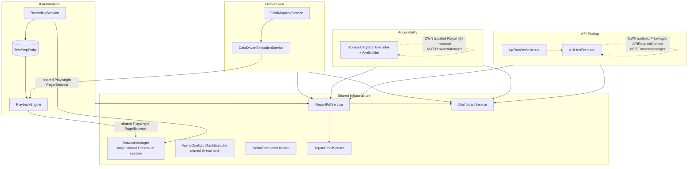

# 18 — Cross-Module Connections

This document explains how Kortex's four testing capabilities (UI Automation, Data-Driven, Accessibility, API Testing) and their supporting infrastructure (Dashboard/Execution History, PDF/Email reporting) actually connect to one another in source — not how they conceptually *could* connect. Every relationship below was verified against the round-1 documentation set (`00`–`17`) and, where noted, the underlying source files directly. Where two files disagree or one has fallen behind another, that is flagged explicitly rather than resolved silently, per this documentation project's cross-verification rule.

## 1. The module map

Four independent execution engines exist — this is the single most load-bearing architectural fact for understanding cross-module behavior (see `02-ARCHITECTURE.md §Backend architecture`): `PlaybackEngine` (shared by UI Automation and Data-Driven — the *only* real code-sharing relationship between two of the four), `AccessibilityScanExecutor`, `ApiRunOrchestrator`/`ApiHttpExecutor`. They do not call each other, do not share entities, and — except for `PlaybackEngine`'s dual use — do not share execution code.

## 2. Shared infrastructure vs. module-specific infrastructure

### Genuinely shared across all four modules

| Component | File | What it shares |
|---|---|---|
| `GlobalExceptionHandler` | `controller/GlobalExceptionHandler.java` | One `@RestControllerAdvice` translates every controller's exceptions to HTTP responses — `DataDrivenException`/`AccessibilityException`/`ApiTestingException`/`ReportEmailException` → 400, `IllegalStateException` → 409, catch-all `RuntimeException` → 500. See `14-ERROR-HANDLING.md`. |
| `AsyncConfig.ddTaskExecutor` (bean name `"ddTaskExecutor"`) | `config/AsyncConfig.java` | The one named `@Async` thread pool (core 2 / max 4 / queue 50) backing `TestRunAsyncExecutor` (UI Automation), `DataDrivenAsyncExecutor` (Data-Driven), `ApiRunAsyncExecutor` (API Testing), and — per `08-ACCESSIBILITY.md §6` — apparently `AccessibilityScanAsyncExecutor` too, though that module's own doc explicitly flags this as **not independently verified**: `AsyncConfig.java` was not opened by the fork that wrote `08-ACCESSIBILITY.md`. Treat "all four share this pool" as highly likely but not 100% source-confirmed for the accessibility leg specifically. |
| `ReportPdfService` + `ReportEmailService` | `report/ReportPdfService.java`, `report/ReportEmailService.java` | One PDF pipeline, one email pipeline, four report kinds (`STANDARD`/`DATA_DRIVEN`/`ACCESSIBILITY`/`API_TESTING`) inside a single `ReportKind` enum — not four separate services. See §5. |
| `DashboardService` | `service/DashboardService.java` | The one place, alongside `ExecutionHistory.tsx`, where all four run types are read together. See §6. |
| `@CrossOrigin(origins = "*")` | repeated on every controller class | Not a shared `@Configuration` bean — each of the 9 real controllers carries its own copy of this annotation (`CrawlerController` is the one exception — it has neither `@CrossOrigin` nor a class-level `@RequestMapping`, see `11-API-ENDPOINTS.md §7`). |
| `spring.jpa.open-in-view=false` consequence | every entity package | Every module independently works around the same Hibernate constraint (LAZY relations touched outside a transaction throw `LazyInitializationException`) using the same EAGER + `@JsonIgnoreProperties` pattern — `ApiFolderEntity.collection`, `ApiRequestEntity.collection`/`folder`, `AccessibilityScanRunEntity.scan`, `DataDrivenRunEntity.scenario`, `TestRunEntity.scenario` all independently apply this fix. It is a repeated *pattern*, not shared code. |

### Explicitly NOT shared — each module owns its own

| What | UI Automation / Data-Driven | Accessibility | API Testing |
|---|---|---|---|
| Playwright lifecycle | One persistent, headed, shared `BrowserManager` session — the browser the user actually watches | Its own fully isolated headless `Playwright.create()` per scan, launched and torn down within `AccessibilityScanExecutor.executeScan()` | Its own fully isolated `Playwright.create()` per run via `ApiHttpExecutor.openSession()` — no browser at all, just an `APIRequestContext` HTTP client |
| Execution/result entities | `TestRunEntity`+`TestRunStepEntity` / `DataDrivenRunEntity`+`DataDrivenRowResultEntity` | `AccessibilityScanEntity`+`AccessibilityScanRunEntity` | `ApiCollectionEntity`/`ApiRequestEntity`/`ApiRunEntity`+`ApiRequestRunResultEntity` |
| Async executor wrapper class | `TestRunAsyncExecutor`, `DataDrivenAsyncExecutor` | `AccessibilityScanAsyncExecutor` | `ApiRunAsyncExecutor` |
| Config/field-mapping engine | `FieldMappingService` (Data-Driven only — no browser-recorded "step" concept exists in the other two) | none needed (no data-driven concept in Accessibility) | none — see §4 |

Four independent entity object graphs exist with **zero cross-graph foreign keys** — a `DataDrivenRunEntity` never references an `ApiRunEntity`, `ApiCollectionEntity` never references a `TestScenarioEntity`, etc. (`02-ARCHITECTURE.md §Entity relationship summary`). The only place all four are combined is *in-memory, at read time*, inside `DashboardService` and `ExecutionHistory.tsx`.

## 3. UI Automation ↔ Data-Driven

A Data-Driven run is **not** a separate test type — it replays an existing `TestScenarioEntity`'s recorded `TestStepEntity` list, once per dataset row, over a chosen `[startStepOrder, endStepOrder]` sub-range (`07-DATA-DRIVEN.md §1`). There is no independent "data-driven scenario" entity; `DataDrivenRunEntity.scenario` is a `@ManyToOne` straight back to the same `TestScenarioEntity` UI Automation records and plays.

This means recording a test is a **hard prerequisite** for Data-Driven testing — `NewDataDrivenTest.tsx` either opens an existing recorded test's Data-Driven tab or creates a brand-new scenario and routes the user into the Recording Workspace first (`04-UI-AUTOMATION.md §5`, `07-DATA-DRIVEN.md §11`).

### 3.1 The field-mapping bridge — `FieldMappingService`

Because a recorded step has no inherent "field name," `FieldMappingService` (`datadriven/FieldMappingService.java`) is the module that translates dataset column headers into recorded steps. It has no equivalent anywhere in UI Automation itself — it exists purely to bridge "a `TestStepEntity` with a CSS selector" to "a dataset column with a name." Its candidate-detection logic (`isInputStep`, `looksLikeDropdownOptionSelector`, `isColumnDrivenCandidate`, `valueMatchedColumn`, `findPrecedingDescriptiveText`) is documented in full in `07-DATA-DRIVEN.md §4`.

### 3.2 ⚠️ Known divergence: the frontend maintains its own copy of this logic, and it had fallen behind (fixed same session)

**This was the single most important cross-module finding in the whole documentation project — it has since been fixed. The mechanism below is preserved as-written because it's the clearest explanation in this documentation set of exactly why this class of bug can recur; the "Status" note at the end reflects the current, fixed state.**

`frontend_FIXED_v2/frontend/src/components/DataDrivenPanel.tsx` (lines ~23–170) contains a hand-written TypeScript re-implementation of `FieldMappingService`'s matching functions — `looksLikeDropdownOptionSelector`, `isDropdownOptionStep`, `findPrecedingDescriptiveText`, `isColumnDrivenCandidate`, `valueMatchedColumn`, `normaliseHeader` — explicitly commented "Mirrors FieldMappingService.X on the backend EXACTLY." This is not incidental duplication: it exists because the **Configure Loop / Map Fields wizard screen decides which recorded steps to even display as mapping rows client-side, before the backend is consulted at all** (`inputSteps` filter, `DataDrivenPanel.tsx:190-216`). The backend's `FieldMappingService.resolveMapping()`/`buildCandidateSteps()` is only ever reached once the user has already advanced past this client-side gate.

Two real fixes were made to the backend copy of this logic in the same development session that produced this documentation, and **neither was mirrored to the frontend copy**:

1. **`looksLikeDropdownOptionSelector`** — the backend now recognizes PrimeNG's unhyphenated custom-element tag names (`dropdownitem`, `multiselectitem`, `selectitem`, `listboxitem` — e.g. the literal tag `<p-dropdownitem>`). The frontend copy (`DataDrivenPanel.tsx:43-51`) still only contains the hyphenated CSS-class forms (`dropdown-item`, `p-dropdown-item`, `p-multiselect-item`).
2. **`findPrecedingDescriptiveText`** — the backend now consults only the single *immediate* predecessor step (falling back to that same step's `labelText`/`ariaLabel`/`placeholder` if its own `text` is blank), rather than walking back to the nearest step with *any* non-blank text however far away. The frontend copy (`DataDrivenPanel.tsx:70-82`) still has the old, less-safe "walk back arbitrarily far" behavior.

**Net effect, verified directly against both files**: for a step recorded against a PrimeNG dropdown whose opening trigger captured blank text (exactly the "CGT RE" scenario that motivated the backend fix), the frontend's own `inputSteps` gate may still fail to offer that step as a mappable row in the browser — even though the backend, if it were ever asked, would now classify it correctly. The frontend's `isColumnDrivenCandidate`/`valueMatchedColumn` fallbacks (also present client-side) cover *some* of these cases, which is why this is not a universal failure — but the "is this even attempted" gate itself is out of sync between the two layers.

**This was independently confirmed three separate times** during this documentation project: directly by the orchestrating session (reading both files side by side), and independently by two different documentation forks (the ones that wrote `03-FRONTEND-FLOWS.md` and `07-DATA-DRIVEN.md §4.6`) while investigating unrelated assignments. All three arrived at the identical finding.

**Status: fixed.** Both gaps were closed by adding the same four unhyphenated substrings to `DataDrivenPanel.tsx`'s `looksLikeDropdownOptionSelector` and restricting its `findPrecedingDescriptiveText` to the immediate predecessor (with a `labelText`/`ariaLabel`/`placeholder` fallback) — mirroring `FieldMappingService.java`'s current state exactly. Verified with a clean `tsc -b --noEmit`. **This mechanism remains a standing risk, not a one-time bug**: there is no shared code or generated bridge between the frontend and backend copies, only paired comments in each file instructing a maintainer to keep them in sync — the next change to either side's matching logic can silently reintroduce this exact class of drift. Treat any future edit to `FieldMappingService.java`'s matching functions as incomplete until `DataDrivenPanel.tsx`'s mirror is updated to match in the same change.

### 3.3 Execution-time connection — `DataDrivenExecutionService` → `PlaybackEngine`

See §4 below — this is really "Data-Driven ↔ Playback," listed separately per the spec.

## 4. Data-Driven ↔ Playback

`DataDrivenExecutionService.executeLoopRow()` calls `PlaybackEngine.executeSingleStepWithOverride(page, step, valueOverride, previousStep)` once per step per row (`07-DATA-DRIVEN.md §7.1`, `06-PLAYBACK-ENGINE.md §3`). This is one of only two public entry points into `PlaybackEngine` — the other being `executeScenario()` for a standard, non-data-driven "Run Test" (`06-PLAYBACK-ENGINE.md §1`). Both entry points share the same lower-level locator-resolution/action-execution machinery but have **independently written outer per-step loops** — a real, documented inconsistency (`06-PLAYBACK-ENGINE.md §9`, `04-UI-AUTOMATION.md §9`): standard playback has a dedicated up-front MFA check that data-driven execution does not.

The 4th argument, `previousStep`, is this session's newest fix: the immediately preceding step in the loop range, threaded through purely so `PlaybackEngine`'s dropdown-override retry logic can re-click it to reopen a closed dropdown list if the first click attempt closes the list without actually selecting the mapped value (`06-PLAYBACK-ENGINE.md §4`). This is the *execution-time* counterpart to the *mapping-time* "immediate preceding step" convention `FieldMappingService.findPrecedingDescriptiveText` uses (§3.1) — both independently converged on the same "the step right before this one is very likely this dropdown's own trigger" heuristic, in two different files, for two different purposes (candidate detection vs. retry recovery).

Blank-value handling flows from Data-Driven through to Playback and back: a mapped-but-blank dataset cell produces a non-null-but-empty `valueOverride`, which `PlaybackEngine.executeSingleStepInternal` short-circuits to a `SKIPPED` `StepStatus` *before any locator resolution* — never replaying the recorded value, never touching the DOM (`06-PLAYBACK-ENGINE.md §3`).

## 5. UI Automation ↔ Reporting

Every UI Automation run (`TestRunEntity`) can be turned into a PDF via `ReportPdfService.generateStandardRunPdf(TestRunEntity)`, then emailed via `ReportEmailService.sendReport()` with `reportType="STANDARD"` (`12-REPORT-PDF-EMAIL.md §3`). `TestReport.tsx` is the only page that renders an `<EmailReportButton reportType="STANDARD">`. There is no separate "download PDF" path anywhere — see §"All execution types ↔ PDF/email" (§7) for why this is true of all four report kinds, not just this one.

One UI-Automation-specific reporting detail: `ReportPdfService.describeStep()` looks a run's step results back up against the *originally recorded* `TestScenarioEntity.getSteps()` (by `stepOrder`) to render human-readable phrases like "Enter Username" instead of raw CSS selectors — this is the one place in the reporting pipeline that reaches back into the UI Automation recording data model rather than working purely off the run/result entities (`12-REPORT-PDF-EMAIL.md §4.5`).

## 6. Accessibility ↔ Playwright

Accessibility scanning uses Playwright, but **not** `BrowserManager` — `AccessibilityScanExecutor.executeScan()` creates and tears down its own fully isolated headless `Playwright` instance per scan call (`08-ACCESSIBILITY.md §4`, `00-START-HERE.md §Browser automation stack`). The class's own comment states explicitly why: reusing the shared recording/playback session could navigate the visible browser out from under an in-progress recording or playback. `com.deque.html.axecore.playwright.AxeBuilder` is injected against this isolated `Page` — axe-core needs a live Playwright page to inject its analysis script into, but nothing about the *scan* touches `BrowserManager`, and nothing about `BrowserManager`'s playback guard applies to a concurrent accessibility scan (they can genuinely run at the same time without colliding, unlike a recording and a playback).

## 7. API Testing ↔ Playwright

Also uses Playwright, also **not** `BrowserManager`, and also **not a browser at all** — `ApiHttpExecutor.openSession()` creates its own isolated `Playwright.create()` instance but only ever calls `playwright.request().newContext(...)`, Playwright's lightweight `APIRequestContext` HTTP client (`09-API-TESTING.md §2`, `00-START-HERE.md`). No Chromium process is launched for API Testing at all. `RunSession` wraps one `APIRequestContext` per *run* (not per request) specifically so cookies set by one response are available to later requests in the same Collection Runner iteration — this is what makes a login-then-authenticated-call chain work without any explicit cookie-copying code.

## 8. API Testing ↔ Data-Driven

Architecturally **different** from UI Automation's Data-Driven feature, despite the similar name (`09-API-TESTING.md §7`). Both reuse the exact same `datadriven/DatasetParser.java` class for CSV/XLSX upload — confirmed by direct source inspection, `ApiExecutionService` injects `DatasetParser` directly, no API-Testing-specific parser exists. But API Testing has **no `FieldMappingService` equivalent, no field-mapping step, and no mapping UI at all** — a dataset column becomes usable simply as `{{ColumnName}}` in any request field (URL, headers, body, auth, assertions), because `ApiRunAsyncExecutor` merges `variables.putAll(datasetRows.get(iteration))` directly into the same variable-resolution map every other `{{...}}` token goes through. This works because API Testing's "steps" (requests) are already named, structured objects with their own fields — unlike a recorded browser click, a request field genuinely has no ambiguity about "which value goes where."

## 9. All execution types ↔ Execution History

`ExecutionHistory.tsx` is the one page that genuinely unifies all four run kinds — `standard`, `data-driven`, `accessibility`, `api-testing` — into one sortable, filterable table, sourced entirely from `DashboardService.getAllRuns()` (`GET /api/ui-automation/dashboard/runs`) and flattened client-side via `toUnifiedRuns()` (`13-DASHBOARD-HISTORY.md §10-11`). This is the authoritative list of execution kinds Kortex tracks anywhere — confirmed via `ExecutionHistory.tsx`'s own `RunKind` union; no other kind (e.g. the inert "Performance Testing"/"Security Testing" Dashboard placeholders) has any backing data path.

Each kind routes to its own report page and its own "owning entity" page differently (`13-DASHBOARD-HISTORY.md §10`, table of `reportPathFor()` routes) — this is real per-module divergence inside an otherwise-unified page, not an oversight.

## 10. All execution types ↔ PDF/email

`ReportEmailController` exposes exactly **one** endpoint, `POST /api/reports/email`, shared by all four report kinds — there is no per-module reporting controller (`11-API-ENDPOINTS.md §6`, `12-REPORT-PDF-EMAIL.md §1`). `ReportEmailService.sendReport()` switches on a `ReportKind` enum (`STANDARD`/`DATA_DRIVEN`/`ACCESSIBILITY`/`API_TESTING`) to decide which feature-specific service to fetch the run from (`TestScenarioService`/`DataDrivenService`/`AccessibilityScanService`/`ApiExecutionService`) and which `ReportPdfService` method to call. There is **no PDF download endpoint anywhere** — the PDF only ever exists as an in-memory `byte[]` for the duration of one "Email Report" request, attached directly to the outgoing SMTP message (`12-REPORT-PDF-EMAIL.md §1`).

> ⚠️ **Stale comments, not a functional bug**: `ReportEmailController`'s class javadoc, `reportEmailApi.ts`'s comment, and `EmailReportRequest.java`'s field comment all still describe this as covering "all three testing capabilities" — a description that predates API Testing's reporting integration. The actual `ReportKind` enum, `switch`, and frontend `EmailReportType` union all correctly support the fourth (`API_TESTING`) value; only the prose is out of date (`12-REPORT-PDF-EMAIL.md §3`).

## 11. Dashboard ↔ all run types

Two genuinely different aggregation code paths existed, and until a same-session fix did **not** cover the same run types:

| Endpoint | Includes UI Automation | Includes Data-Driven | Includes Accessibility | Includes API Testing |
|---|:---:|:---:|:---:|:---:|
| `GET /dashboard/summary` (`DashboardService.getSummary()`) — top Dashboard stat cards, `recentActivity` feed | ✅ | ✅ | ✅ **(fixed — see below)** | ✅ |
| `GET /dashboard/runs` (`DashboardService.getAllRuns()`) — feeds Execution History | ✅ | ✅ | ✅ | ✅ |

**Status: fixed.** `AccessibilityScanRunRepository` was constructor-injected into `DashboardService` and used inside `getAllRuns()`, but was never referenced inside `getSummary()` — confirmed directly in `DashboardService.java` (`13-DASHBOARD-HISTORY.md §5`), and clearly unintentional given the repository was already wired in. `getSummary()` now folds Accessibility scan runs into `totalRuns`/`passedRuns`/`failedRuns`/`successRatePercent`/`recentActivity`, mapping this run type's `COMPLETED` status to the pass-equivalent used by every other run type's `PASSED` (Accessibility runs never use the literal string `"PASSED"`). Verified with 2 new regression tests; full backend suite 252/252 passing.

A second, independent gap exists purely on the frontend: `Dashboard.tsx` fetches `allRuns.apiRuns` from the very same `/dashboard/runs` response `ExecutionHistory.tsx` uses correctly, but never reads that field anywhere in its own analytics — "Total Executions," both donut charts, and the 7-day trend all silently exclude API Testing runs on the Dashboard page specifically, while Execution History includes them correctly from the same underlying data (`13-DASHBOARD-HISTORY.md §9`).

A third gap: most of what `DashboardService.getSummary()` computes (`recordedTests`, `draftTests`, `totalRuns`, `passedRuns`, `failedRuns`, `runningRuns`, `successRatePercent`, `recentActivity`) is sent to the frontend but **rendered nowhere** — `Dashboard.tsx` reads exactly one field off that response (`summary.totalTests`); every other "stat" the Dashboard page shows is independently computed client-side from `/dashboard/runs` instead (`13-DASHBOARD-HISTORY.md §6-7`).

Accessibility additionally has its own, fully separate summary endpoint (`GET /api/accessibility/dashboard/summary` → `AccessibilityScanService.getDashboardSummary()`), used by `Dashboard.tsx` for exactly one field (`totalScans`) — entirely independent of `DashboardService`, not a shared code path (`13-DASHBOARD-HISTORY.md §8`).

## 12. Summary of every flagged cross-module inconsistency in this documentation set

| # | Finding | Severity | Where documented in full |
|---|---|---|---|
| 1 | `DataDrivenPanel.tsx`'s frontend mirror of `FieldMappingService` had fallen behind two real backend fixes (PrimeNG unhyphenated selectors, immediate-predecessor-only context lookup) | **Fixed, same session** — both fixes now mirrored to the frontend, `tsc` clean. Structural drift risk remains (no shared code between the two copies) | §3.2 above, `07-DATA-DRIVEN.md §4.6` |
| 2 | `runScenario` (standard playback) and `executeSingleStepInternal` (data-driven playback) are two independently-written per-step loops; only one has a dedicated up-front MFA check | Behavioral difference between the two entry points, not a crash | `06-PLAYBACK-ENGINE.md §9`, `04-UI-AUTOMATION.md §9` |
| 3 | `StepStatus.HEALED_BY_AI` fires for fully deterministic fallbacks (testId/id/name/label match), not only real LLM calls | Misleading status/label naming, not incorrect behavior | `06-PLAYBACK-ENGINE.md §7` |
| 4 | `DashboardService.getSummary()` excluded Accessibility runs from every top-level stat; `getAllRuns()` includes them | **Fixed, same session** — `getSummary()` now includes Accessibility runs (2 new regression tests). `Dashboard.tsx` still doesn't render `apiRuns`/most of `getSummary()`'s other fields — a separate, still-open frontend gap | §11 above, `13-DASHBOARD-HISTORY.md §5` |
| 5 | `Dashboard.tsx` fetches but never renders `allRuns.apiRuns` in its own client-side analytics | API Testing invisible on the Dashboard page specifically (not Execution History) | §11 above, `13-DASHBOARD-HISTORY.md §9` |
| 6 | Most of `DashboardSummary`'s computed fields are never read by any frontend component | Dead computation, not a correctness bug | `13-DASHBOARD-HISTORY.md §6` |
| 7 | Several comments (`ReportEmailController`, `reportEmailApi.ts`, `EmailReportRequest.java`, `ExecutionHistory.tsx`'s page subtitle) still describe "3 report types"/"3 execution types," predating API Testing | Documentation/comment staleness only — code is correct | §10 above, `12-REPORT-PDF-EMAIL.md §3`, `13-DASHBOARD-HISTORY.md §9` |
| 8 | `CrawlerController` and `ScriptExportService` are live, working backend endpoints with zero frontend callers | Backend-only capability, not reachable from the current UI | `00-START-HERE.md`, `11-API-ENDPOINTS.md §7` |
| 9 | A real plaintext MySQL password is committed in `application.properties`, a git-tracked file | Security hygiene issue, outside any single module | `15-CONFIGURATION.md`, `22-LIMITATIONS.md` |
| 10 | Most JPA entities are serialized as raw entities directly by controllers; `DashboardService` had to switch to flat DTOs specifically because `DataDrivenRunEntity.scenario` lacks the `@JsonIgnoreProperties` trimming `TestRunEntity.scenario` has | Inconsistent response-shaping convention across the codebase | `02-ARCHITECTURE.md`, `10-DATABASE.md` |

None of the above were fixed as part of *writing this documentation*, per its explicit "documentation only" scope. Findings #1 and #4 were subsequently fixed, in a separate follow-up request after this documentation was published — see their table rows above for current status. #2, #3, #5-#10 remain open as described.
