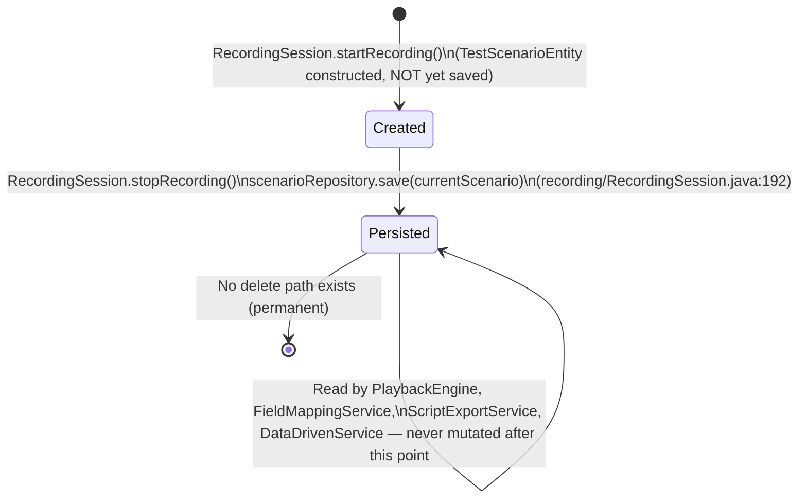
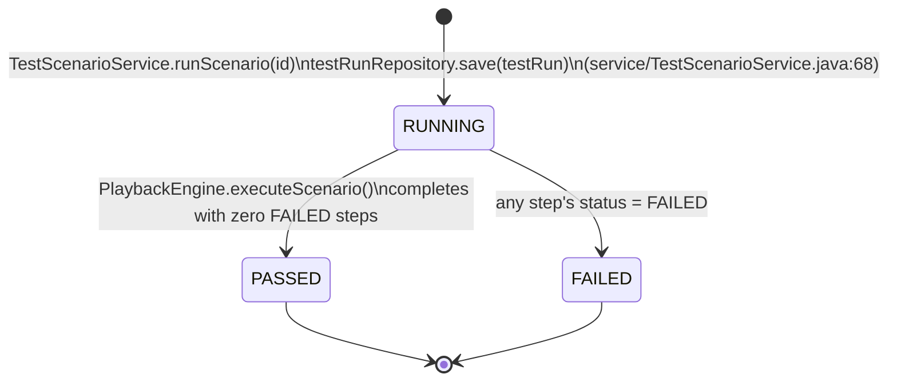
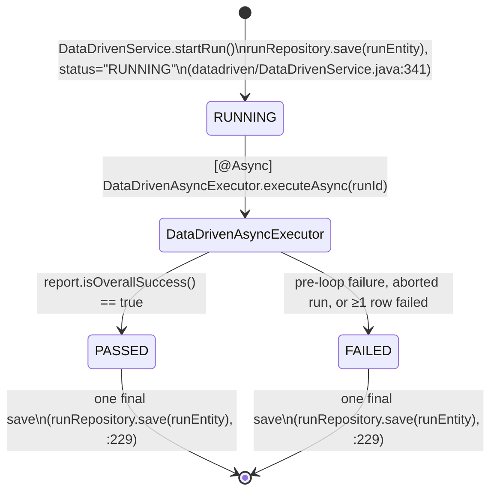
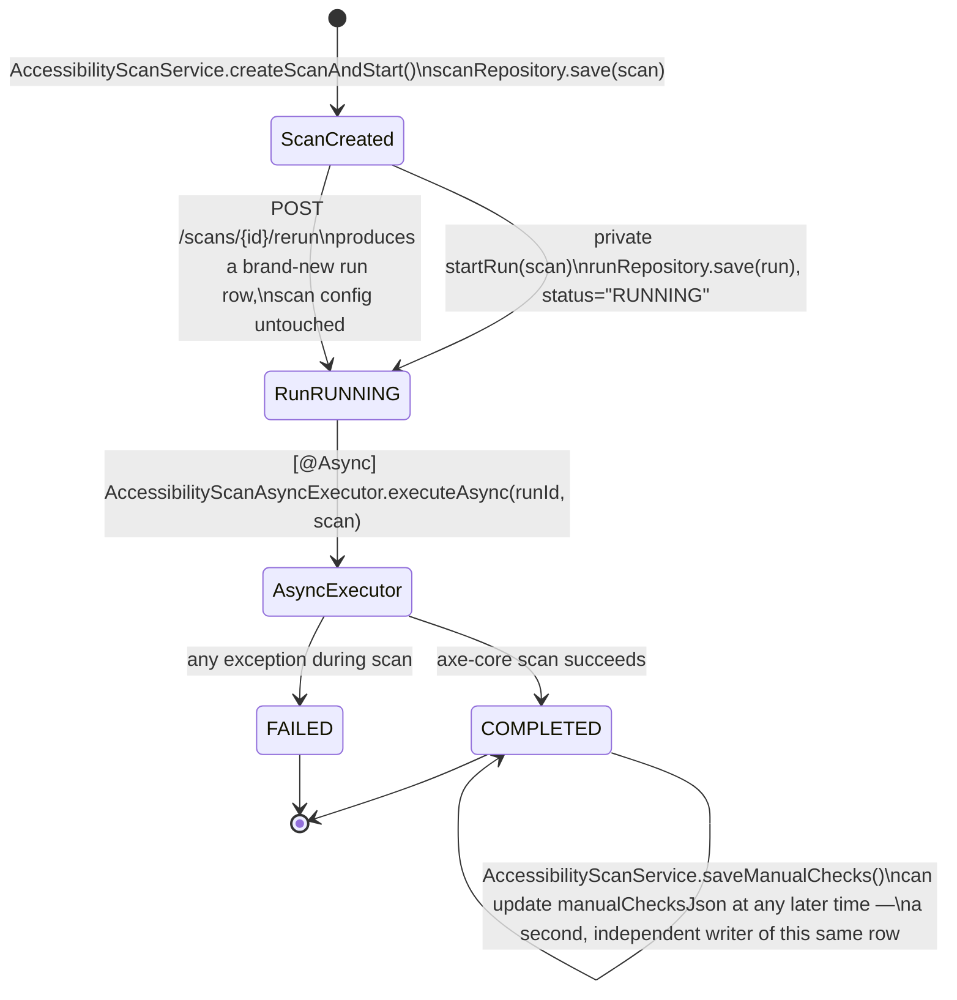
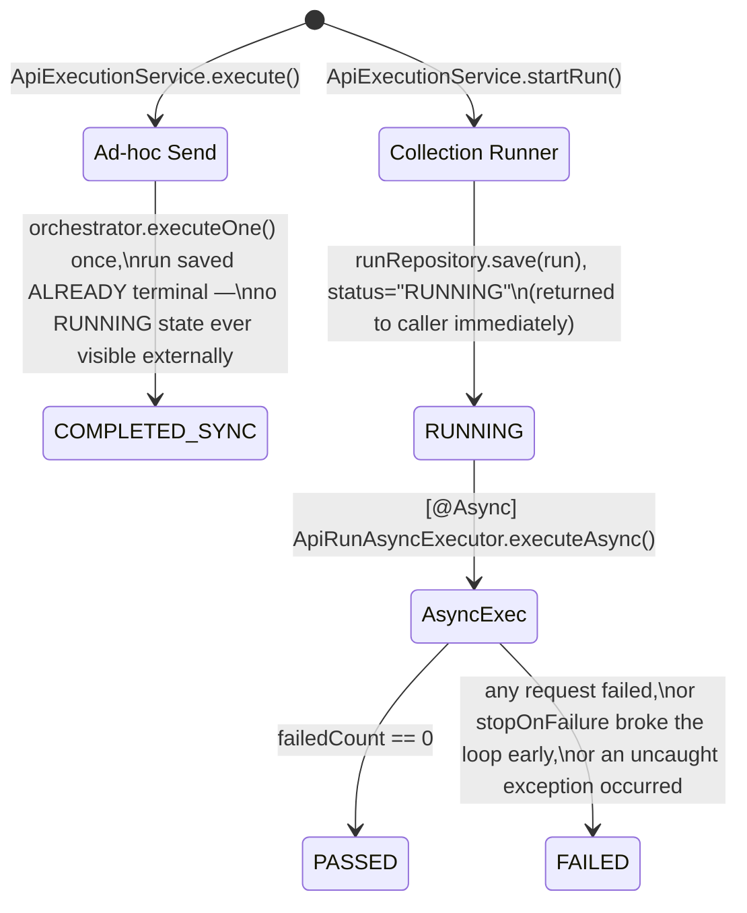

# 20 — Data Lifecycles

Traces each domain object from creation to its final displayed state, using only verified method/class names. This document narrates and cross-links the "who creates/updates/reads/deletes" facts already tabulated per-entity in [`10-DATABASE.md`](10-DATABASE.md) — read that file for the full field-level detail; this file focuses on the *sequence of events* each object goes through in a real run.

Every entity in this codebase whose lifecycle involves a background execution follows the same two-phase shape: **(1)** a row is created and saved *synchronously*, on the HTTP request thread, with a `RUNNING` status, so the frontend gets an id to poll immediately; **(2)** a `@Async` executor bean does the real work in the background and performs exactly one further save at the end, moving the status to its terminal value. No entity in this codebase is saved incrementally mid-execution — see the "no `@Transactional`, no partial-progress save" note in [`10-DATABASE.md §3.1`](10-DATABASE.md).

---

## 1. Test Scenario lifecycle

- **Created**: in-memory only, at the start of `RecordingSession.startRecording(scenarioName, targetUrl)` — `new TestScenarioEntity(scenarioName, targetUrl)`. Not yet in the database.
- **Persisted**: `RecordingSession.stopRecording()` deduplicates the raw captured browser events (see [`05-RECORDING-ENGINE.md`](05-RECORDING-ENGINE.md)), builds one `TestStepEntity` per resulting step, attaches each via `currentScenario.addStep(step)`, then `scenarioRepository.save(currentScenario)` persists the scenario **and** its steps in one call (cascade `ALL`, `orphanRemoval=true` on the `steps` collection).
- **Referenced by**: `TestRunEntity.scenario`, `DataDrivenRunEntity.scenario` (both `@ManyToOne`), `ScriptExportService` (Playwright script generation), `FieldMappingService`/`DataDrivenExecutionService` (loop-range sub-selection of `steps`).
- **Updated**: never, after the initial save — there is no scenario-edit endpoint.
- **Deleted**: never — no `.delete(...)` call for `TestScenarioEntity` exists anywhere in the backend, and `UIAutomationController` defines no delete mapping for it.
- **Displayed**: `UIAutomationDashboard.tsx` (list), `TestDetails.tsx` (detail + tabs into Data-Driven/Recording/Report), `RecordingWorkspace.tsx` (live, during recording).

## 2. Test Step lifecycle

- **Created**: one per deduplicated `CapturedEvent`, inside the same `RecordingSession.stopRecording()` call as above — never created any other way (no "add a step" endpoint exists).
- **Persisted**: by cascade from the parent `TestScenarioEntity` save — never saved independently.
- **Updated**: never — no update path exists for an individual step.
- **Read by**: `PlaybackEngine` (selector resolution, once per playback of the parent scenario), `FieldMappingService` (candidate/mapping detection for a Data-Driven run's loop range), `ScriptExportService` (script generation).
- **Deleted**: never directly; would only cascade from a scenario delete, which never happens.

## 3. Test Run (+ Test Run Step) lifecycle

- **Created & updated**: `TestScenarioService.runScenario(id)` drives `PlaybackEngine.executeScenario(scenario)` (see [`06-PLAYBACK-ENGINE.md §1`](06-PLAYBACK-ENGINE.md)) synchronously — this run type has **no separate async executor for its own status transition**; the HTTP request that starts the run is the same one that returns its final result. Each step's outcome becomes one `TestRunStepEntity` (`status`: `PASSED`/`FAILED`/`HEALED_BY_AI`/`SKIPPED`, matching `StepExecutionResult.StepStatus` exactly), attached via `testRun.addStepResult(...)`, and the whole `TestRunEntity` (with its now-populated `stepResults` cascade) is saved once via `TestRunRepository.save(testRun)`.
- **Read by**: `UIAutomationController.getTestRuns`/`getTestRun`, `DashboardService` (aggregation), `ExecutionHistory.tsx` (via `dashboardApi.getAllRuns()`), `TestReport.tsx` (single-run detail).
- **Deleted**: never.
- **Displayed**: `TestReport.tsx` (per-step timeline, `describeStep()`-humanized names — see [`12-REPORT-PDF-EMAIL.md §4.5`](12-REPORT-PDF-EMAIL.md)), `ExecutionHistory.tsx` (unified list), and (on request) the "Email Report" PDF (`reportType=STANDARD`).

## 4. Data-Driven Run (+ Row Result) lifecycle

A `DataDrivenRunEntity` never exists independently of a `TestScenarioEntity` — see [`07-DATA-DRIVEN.md §1`](07-DATA-DRIVEN.md): "there is no separate Data-Driven Test entity."

1. **Created**: `DataDrivenService.startRun(scenarioId, file, config)` — after re-parsing the dataset and re-resolving the field mapping (never trusting the client's mapping blindly — see [`07-DATA-DRIVEN.md §6`](07-DATA-DRIVEN.md)), a `DataDrivenRunEntity` is built and saved with `status="RUNNING"`, `startStepOrder`/`endStepOrder`, `datasetFilename`, `totalRows`. This save happens on the HTTP thread; the response returns immediately with this entity.
2. **Executed**: `DataDrivenAsyncExecutor.executeAsync()` (`@Async(AsyncConfig.DD_TASK_EXECUTOR)`) re-fetches the entity by id and calls `DataDrivenExecutionService.executeRun(...)`, which drives pre-loop → per-row loop (each row via `executeLoopRow()`) → post-loop, all pinned to `BrowserManager`'s single Playwright thread (see [`07-DATA-DRIVEN.md §7`](07-DATA-DRIVEN.md)).
3. **Row-level creation**: one `DataDrivenRowResultEntity` per executed row is built in-memory during the loop (`RowExecutionResult` → `status` SUCCESS/FAILED/CRITICAL_FAILURE, `rowDataJson`, `stepResultsJson`) — **not saved individually**.
4. **Finalized in one write**: back in `DataDrivenAsyncExecutor`, every `RowExecutionResult` is converted and attached via `runEntity.addRowResult(...)`, the run's own summary counters/`status`/`completedAt`/`errorMessage` are set, and the **entire graph is saved once** (`runRepository.save(runEntity)`, line 229) — if the process crashed mid-loop before this line, nothing about that run would be persisted at all.
5. **Read by**: `DataDrivenController` (`getRunsForScenario`, `getRun`), `DashboardService`.
6. **Deleted**: never.
7. **Displayed**: `DataDrivenReport.tsx` (polls every 3s while `RUNNING`; per-row expandable timeline parsed client-side from `rowDataJson`/`stepResultsJson`), `DataDrivenDashboard.tsx` (one row per test with ≥1 real run), and (on request) the "Email Report" PDF (`reportType=DATA_DRIVEN`).

## 5. Accessibility Scan (+ Scan Run) lifecycle

`AccessibilityScanEntity` is the reusable **configuration** (URL, scope, standards); `AccessibilityScanRunEntity` is one **execution** of it — explicitly analogous to the `TestScenarioEntity`/`TestRunEntity` split (see [`08-ACCESSIBILITY.md §9`](08-ACCESSIBILITY.md)).

1. **Config created**: `AccessibilityScanService.createScanAndStart()` validates/normalizes the URL, scope, and standards, then saves a new `AccessibilityScanEntity` — permanent, never edited (no update endpoint exists), never deleted.
2. **Run created**: the same call's private `startRun(scan)` immediately creates and saves an `AccessibilityScanRunEntity` with `status="RUNNING"`, then fires `AccessibilityScanAsyncExecutor.executeAsync(runId, scan)`.
3. **Executed**: `AccessibilityScanExecutor.executeScan(...)` launches its own fully isolated headless Chromium (never `BrowserManager`'s shared session — see [`08-ACCESSIBILITY.md §4`](08-ACCESSIBILITY.md)), navigates, runs `AxeBuilder(page).withTags(...).analyze()`, and returns violations/incomplete/passes.
4. **Finalized**: `AccessibilityScanAsyncExecutor` maps the result via `AccessibilityResultMapper`, sets `status="COMPLETED"` (or `"FAILED"` on exception), all severity counts, and the three JSON payloads, then `runRepository.save(run)` — always executed, success or failure.
5. **A second, independent writer exists for the SAME row**: `AccessibilityScanService.saveManualChecks(runId, checks)` can update `manualChecksJson` at any time after the run exists, completely decoupled from whether the automated scan itself has finished — a person can fill in the manual checklist while (or after, or theoretically before) the automated part is still running.
6. **Re-run**: `POST /scans/{id}/rerun` calls the same `startRun(scan)` against the *existing* config — produces a brand-new `AccessibilityScanRunEntity`; history is never overwritten.
7. **Read by**: `AccessibilityController` (all the GET endpoints in [`08-ACCESSIBILITY.md §10`](08-ACCESSIBILITY.md)), including the dashboard-summary and trend aggregations.
8. **Deleted**: never — no delete endpoint exists for either the scan config or a run.
9. **Displayed**: `AccessibilityReport.tsx` (polls every 3s while `RUNNING`; embeds `ManualChecklist`), `AccessibilityDashboard.tsx`, `AccessibilityScanTrend.tsx`, and (on request) the "Email Report" PDF (`reportType=ACCESSIBILITY`, including the WCAG Conformance Summary rollup).

## 6. API Collection lifecycle (+ Folder, Request, Environment)

Unlike every other entity family in this codebase, the API Collection family has **genuine CRUD**, including the only real cascading delete reachable from the UI (see [`10-DATABASE.md §1.9`](10-DATABASE.md)).

- **Collection**: created by `ApiCollectionService.createCollection(...)`, `duplicateCollection(...)`, or the Postman/OpenAPI importers; updated by `updateCollection(...)`; **deleted** by `deleteCollection(id)` → `collectionRepository.deleteById(id)`, which cascades (`CascadeType.ALL, orphanRemoval=true`) to every `ApiFolderEntity` and `ApiRequestEntity` under it.
- **Folder**: created by `createFolder(...)`, renamed by `renameFolder(...)`, deleted by `deleteFolder(...)` — **not verified from source** whether requests inside a deleted folder are reassigned or orphaned first (see the flagged gap in [`10-DATABASE.md §1.10`](10-DATABASE.md): `ApiFolderEntity` has no `@OneToMany` back-reference to its requests and no cascade on that side, so this is a real open question, not just a documentation gap).
- **Request**: created by `createRequest(...)` or an importer; updated by `updateRequest(...)`; moved between folders by `moveRequest(...)`; deleted by `deleteRequest(...)`.
- **Environment**: created/updated/deleted by `ApiEnvironmentService` CRUD methods — but has a **second, independent writer**: `applyVariableUpdates(environmentId, updates)`, called automatically after any Collection Runner pass whose extraction rules targeted `saveTo=ENVIRONMENT` (see §7 below). This means an environment's variables can silently drift from what a person last typed into the Environment Manager UI, as a side effect of running requests against it.
- **Read by**: `ApiWorkspace.tsx` (tree sidebar), `ApiPlayground.tsx`/`ApiEnvironmentManager.tsx`, and the execution services when a run references a collection/environment by id.
- **Displayed**: `ApiTestingDashboard.tsx`, `ApiWorkspace.tsx`, `ApiEnvironmentManager.tsx`.

## 7. API Run (+ Request Run Result) lifecycle

`ApiRunEntity` is, per its own class javadoc, "the API-testing peer of `DataDrivenRunEntity`" — but with a real branch in how it reaches its terminal state, since API Testing has two distinct execution paths ([`09-API-TESTING.md §7`](09-API-TESTING.md)):

1. **Ad-hoc "Send"** (`ApiExecutionService.execute`): creates the `ApiRunEntity` (`scope="REQUEST"`, `iterationCount=1`), opens one `RunSession`, calls `orchestrator.executeOne()` exactly once, sets the final status from that single result, and saves — **the run is created already in its terminal state**; the frontend never sees a `RUNNING` ad-hoc run.
2. **Collection Runner** (`ApiExecutionService.startRun` → `ApiRunAsyncExecutor.executeAsync`): creates the `ApiRunEntity` with `status="RUNNING"` and saves it immediately (frontend starts polling `GET /runs/{runId}` right away), then the async executor opens **one** `RunSession` for the whole run (cookies persist across chained requests), loops iterations × requests, and appends one `ApiRequestRunResultEntity` per executed request via `run.addRequestResult(...)`. `stopOnFailure` can break the loop early; `delayMs` paces requests. The whole entity (with its now-populated `requestResults`) is saved once at the end.
3. **Side effect on a different entity**: if any request's extraction rule had `saveTo=ENVIRONMENT`, `ApiEnvironmentService.applyVariableUpdates(...)` is called *after* the run's own save — mutating `ApiEnvironmentEntity.variablesJson` for use by future runs (see §6 above and [`09-API-TESTING.md §6`](09-API-TESTING.md)).
4. **Read by**: `ApiExecutionController` (`getRun`, `getAllRuns`, `getRunsForCollection`), `DashboardService`.
5. **Deleted**: never.
6. **Displayed**: `ApiRunReport.tsx` (Collection Runner reports), `ApiResponseViewer.tsx` (ad-hoc Send, rendered directly from the synchronous HTTP response — no polling needed), `ExecutionHistory.tsx`, and (on request) the "Email Report" PDF (`reportType=API_TESTING`).

## 8. Report lifecycle — generated fresh, never persisted

Every report type (`STANDARD`/`DATA_DRIVEN`/`ACCESSIBILITY`/`API_TESTING`) follows the identical, verified pattern documented in full in [`12-REPORT-PDF-EMAIL.md`](12-REPORT-PDF-EMAIL.md):

1. **No "download PDF" feature exists** — the only report action is "Email Report" (`POST /api/reports/email`).
2. **Created**: entirely on-demand, inside `ReportEmailService.sendReport(request)` — it fetches the real run entity by `runId` (via the appropriate feature service: `TestScenarioService`/`DataDrivenService`/`AccessibilityScanService`/`ApiExecutionService`), calls the matching `ReportPdfService.generateXxxPdf(...)` method, which builds an HTML string in memory and renders it via openhtmltopdf into a `byte[]` inside a `ByteArrayOutputStream`.
3. **Never persisted**: the `byte[]` is attached directly to an outgoing `MimeMessage` via `ByteArrayResource` and discarded once the SMTP send completes (or fails). Nothing about the PDF itself is ever written to disk or to a database row — a report is regenerated **from scratch, from the live entity state**, every single time "Email Report" is clicked, even for the exact same run twice in a row.
4. **Displayed**: never, within the app itself — the PDF only ever exists as an email attachment sent to the recipient(s) the user typed into `EmailReportDialog.tsx`.

## 9. Cross-cutting observation: the "create RUNNING → async finalize → one terminal save" shape

Every long-running execution in this codebase — Data-Driven runs, Accessibility scans, API Testing Collection Runner passes — follows the exact same two-step persistence shape, and the *reason* is consistent across all three (confirmed by comments in `DataDrivenAsyncExecutor`, `AccessibilityScanAsyncExecutor`'s class-level pattern, and `ApiRunAsyncExecutor`): a genuinely separate Spring bean is required for the `@Async` annotation to actually take effect, because calling an `@Async` method on `this` from inside the same class bypasses Spring's AOP proxy and would run synchronously on the HTTP thread instead. This is a real, repeated architectural pattern, not three independent inventions — see [`02-ARCHITECTURE.md`](02-ARCHITECTURE.md) / [`18-CROSS-MODULE-CONNECTIONS.md`](18-CROSS-MODULE-CONNECTIONS.md) for the cross-module view.

The one true exception is the standard (non-data-driven) UI Automation "Run Test," which completes synchronously on the HTTP thread with no async executor for its own status transition at all (§3 above) — the frontend never observes a `RUNNING` state for this run type, unlike every other execution kind in the app.
